# Advanced Calculus — Study Companion

*A chapter-by-chapter companion to* **Advanced Calculus** *(Revised Edition)* **by Lynn H. Loomis & Shlomo Sternberg** *(Jones & Bartlett, 1990; orig. Addison–Wesley, 1968).*

Each of the book's fourteen chapters (0–13) is presented as: a precise **Key Concepts** block, an explanation at **four levels** (Beginner → Intermediate → Advanced → Research), and **original exercises with worked solutions** at each level.

---

## HTML Implementation Guide (for a downstream model)

This Markdown file is authored to be mechanically converted into a house-style HTML topic page matching `topics/TEMPLATE.html` and the existing `topics/Math/*.html` pages. A model implementing the `.html` should apply the following deterministic mapping:

| Markdown element | HTML target |
|---|---|
| `# <title>` (H1) | `<header><h1>…</h1><p class="subtitle">…</p></header>` |
| `## Chapter N — Title` (H2) | a top-level `<section class="chapter" id="chapter-N">` with an `<h2>` |
| `### Beginner Level` / `Intermediate Level` / `Advanced Level` / `Research Level` (H3) | nested `<section id="chapter-N-beginner">` … using the **exact** ids `beginner` / `intermediate` / `advanced` / `research`, with `<h2>`/`<h3>` heading |
| `#### <subtopic>` (H4) | `<h3>`/`<h4>` subtopic heading inside the level section |
| `**Key Concepts**` block (numbered list) | a `<div class="key-concepts">` callout |
| `**Intuition**` / `**Formal Definition**` / `**Worked Example**` / `**Exercises**` labels | `<h4>` sub-headings (or `.example` divs for worked examples) |
| `\( … \)` inline math, `\[ … \]` display math | leave verbatim — rendered by MathJax 3 (already the project convention) |
| ` ```mermaid … ``` ` fenced block | `<div class="mermaid"> … </div>` |
| `<details><summary>Solution</summary> … </details>` | keep as-is (native collapsible; matches the "hidden solution" pattern in `AGENTS.md`) |
| `## Sources & References` | final `<section id="sources">` with the three `<h3>` subsections (Wikipedia / arXiv / Textbooks) |

Rules: (1) all mathematics uses MathJax delimiters `\( \)` / `\[ \]` — never `$…$`. (2) Every chapter has all four level sub-sections. (3) Each level carries at least one Mermaid diagram and about five exercises, every exercise immediately followed by its `<details>` solution. (4) Add per-page navigation (`Back to Home`, anchor links to the four levels, theme toggle) per `topics/TEMPLATE.html`. (5) Preserve dark-mode support via the template's CSS variables.

**Level calibration (used throughout):** *Beginner* = intuition, motivation, concrete low-dimensional cases. *Intermediate* = standard techniques and the general \(\mathbb{R}^n\) / normed-space statements. *Advanced* = the full abstract theorem–proof form as in Loomis–Sternberg. *Research* = generalizations and links to modern mathematics/physics (functional analysis, differential geometry, symplectic mechanics, cohomology, category theory).

---

## Chapter 0 — Introduction (Logic, Sets, Functions)

The book opens with the set-theoretic and logical substratum on which everything else is built: quantifiers, connectives, sets, relations, functions, Cartesian products, duality, the Boolean operations, and equivalence relations. None of it is "calculus" yet — it is the precise language in which the rest of the book states and proves theorems. The single most important habit to acquire here is reading and negating **strings of quantifiers**, because every definition of limit, continuity, compactness, and convergence later in the book is such a string.

**Key Concepts**

1. **Quantifiers and their negation.** A *statement frame* \(P(x)\) becomes a statement via \((\forall x)P(x)\) ("for every \(x\)") or \((\exists x)P(x)\) ("for some \(x\)"). Order matters: \((\exists y)(\forall x)P(x,y)\) is strictly stronger than \((\forall x)(\exists y)P(x,y)\). Negation reverses each quantifier and pushes the negation inward:
\[ \sim(\forall x)(\exists y)(\forall z)\,P(x,y,z)\;\Longleftrightarrow\;(\exists x)(\forall y)(\exists z)\,\sim\!P(x,y,z). \]
2. **Connectives, tautology, equivalence.** The connectives \(\&,\ \text{or},\ \sim,\ \Rightarrow,\ \Leftrightarrow\) are defined by truth tables (with `or` always *inclusive* and \(P\Rightarrow Q\) false only when \(P\) true, \(Q\) false). A form always true is a *tautology*; \(A,B\) are *equivalent* iff \(A\Leftrightarrow B\) is a tautology. Key equivalences: \(\sim(P\text{ or }Q)\Leftrightarrow(\sim P)\,\&\,(\sim Q)\); \(\ (P\Rightarrow Q)\Leftrightarrow(\sim P)\text{ or }Q\); \(\ \sim(P\Rightarrow Q)\Leftrightarrow P\,\&\,(\sim Q)\).
3. **Sets (extensionality).** A set is determined by its members: \(A=B\iff(\forall x)(x\in A\Leftrightarrow x\in B)\). Inclusion \(A\subset B\iff(\forall x)(x\in A\Rightarrow x\in B)\), and \((A=B)\iff(A\subset B)\ \&\ (B\subset A)\). Sets are formed by listing \(\{1,4,7\}\) or by a property \(\{x:P(x)\}\), with \(y\in\{x:P(x)\}\Leftrightarrow P(y)\); the empty set \(\varnothing=\{x:x\neq x\}\).
4. **Ordered pairs and relations.** The ordered pair satisfies the sole characterizing property \(\langle x,y\rangle=\langle a,b\rangle\iff x=a\ \&\ y=b\). A *relation* is a set of ordered pairs; \(xRy\iff\langle x,y\rangle\in R\), with \(\operatorname{dom}R=\{x:(\exists y)\langle x,y\rangle\in R\}\), \(\operatorname{range}R=\{y:(\exists x)\langle x,y\rangle\in R\}\), \(R^{-1}=\{\langle y,x\rangle:\langle x,y\rangle\in R\}\), and the Cartesian product \(A\times B=\{\langle x,y\rangle:x\in A\ \&\ y\in B\}\).
5. **Functions and mappings.** A function is a single-valued relation: \(\langle x,y\rangle\in f\ \&\ \langle x,z\rangle\in f\Rightarrow y=z\); then \(y=f(x)\iff\langle x,y\rangle\in f\). A mapping \(f:A\to B\) is *injective* (one-to-one), *surjective* (\(\operatorname{range}f=B\)), or *bijective* (both).
6. **Composition and inverses.** \((g\circ f)(x)=g(f(x))\); composition is associative and \(f\circ I_A=f=I_B\circ f\). A map \(f:A\to B\) has a two-sided inverse iff it is bijective, and then the inverse equals the relational inverse \(f^{-1}\). The set \(\mathfrak{S}(A)\) of bijections \(A\to A\) is a *group* under composition.
7. **Product sets and index notation.** For an indexed family \(\{S_i:i\in I\}\), the Cartesian product is a set of functions:
\[ \textstyle\prod_{i\in I}S_i=\{\,f:\operatorname{dom}f=I\ \text{ and }\ f(i)\in S_i\ \text{for all}\ i\in I\,\}. \]
The set of all functions \(A\to S\) is \(S^A\); the power set \(2^S\) is identified with the characteristic functions \(\chi_B\in\{0,1\}^S\).
8. **Duality (currying).** For \(F:A\times B\to C\), fixing \(x\) gives \(h^x:B\to C\), \(h^x(y)=F(x,y)\), so \(x\mapsto h^x\) is a map \(\varphi:A\to C^B\). The three maps \(F:A\times B\to C\), \(\varphi:A\to C^B\), \(\theta:B\to C^A\) are interconvertible; \(\varphi\) and \(\theta\) are *dual*.
9. **Boolean operations.** \(\bigcup_{i\in I}A_i\), \(\bigcap_{i\in I}A_i\), complement \(A'\). De Morgan: \(\bigl(\bigcap_i A_i\bigr)'=\bigcup_i A_i'\) and \(\bigl(\bigcup_i A_i\bigr)'=\bigcap_i A_i'\). Preimages preserve all Boolean operations: \(f^{-1}[\bigcup_i B_i]=\bigcup_i f^{-1}[B_i]\), \(f^{-1}[\bigcap_i B_i]=\bigcap_i f^{-1}[B_i]\), \(f^{-1}[B']=(f^{-1}[B])'\).
10. **Partitions and equivalence relations.** A *partition* (fibering) of \(A\) is a disjoint family with union \(A\). An *equivalence relation* \(\sim\) is reflexive, symmetric, transitive. **Theorem.** Every equivalence relation on \(A\) is the equivalence relation of a partition (its classes \(\bar x=\{y:y\sim x\}\)), and conversely. A function \(g\) on \(A\) is constant on the fibers of a partition \(\mathfrak{F}\) iff \(g=\bar g\circ\pi\) for some \(\bar g\) on \(\mathfrak{F}\) (the *universal property* of the quotient), where \(\pi:A\to\mathfrak{F}\) is the projection.

### Beginner Level

#### Statements, quantifiers, and connectives

**Intuition.** Mathematics is written in sentences that are either true or false. A sentence with a blank in it — like "\(x<4\)" — is neither true nor false until you either plug in a value or say *how much* of the time it holds. "For **every** \(x\)" (\(\forall\)) and "for **some** \(x\)" (\(\exists\)) are the two ways to fill the blank. The order of these words changes the meaning. Compare two sentences about people and lockers:

- "**Every** student has **some** locker" — \((\forall\,\text{student})(\exists\,\text{locker})\): each student has one, but they may all differ.
- "**Some** locker belongs to **every** student" — \((\exists\,\text{locker})(\forall\,\text{student})\): one special shared locker.

The second is far stronger. This is *exactly* the difference that later separates "continuous" from "uniformly continuous," so it is worth over-learning now. A useful mental model: \(\forall\) is a challenge ("I'll give you any \(x\) I like"), \(\exists\) is a promise ("I can produce a witness"). Reading a quantifier string left to right, each \(\exists\) may depend on all the \(\forall\)'s to its left.

**Formal Definition.** The connectives combine true/false values:

| \(P\) | \(Q\) | \(P\ \&\ Q\) | \(P\text{ or }Q\) | \(P\Rightarrow Q\) | \(\sim P\) |
|:--:|:--:|:--:|:--:|:--:|:--:|
| T | T | T | T | T | F |
| T | F | F | T | F | F |
| F | T | F | T | T | T |
| F | F | F | F | T | T |

Read \(P\Rightarrow Q\) as "if \(P\) then \(Q\)"; it is false in exactly one case, \(P\) true and \(Q\) false. In particular a *false* hypothesis makes the implication *true* ("vacuously true"), which surprises newcomers but is forced by wanting "\((\forall x)(x<3\Rightarrow x<5)\)" to be true for **all** \(x\), including \(x=4\) and \(x=6\).

**Worked Example.** Is "\((\forall x)(x^2\ge 0)\)" true over the real numbers? Yes: squaring any real number gives a value \(\ge 0\), so no matter which \(x\) we test, the frame \(x^2\ge 0\) holds. By contrast "\((\forall x)(x^2>0)\)" is **false**, because \(x=0\) gives \(0>0\), which is false — a single counterexample destroys a \(\forall\)-statement. Symmetrically, to *establish* an \(\exists\)-statement you need only exhibit one witness, while to *refute* it you must rule out all candidates.

#### Sets, membership, and subsets

**Intuition.** A set is a collection regarded as one object; "\(x\in A\)" says \(x\) is a member. Two sets are equal exactly when they have the same members — labels and order do not matter, so \(\{1,2,2\}=\{2,1\}\). A subset \(A\subset B\) means every member of \(A\) is also in \(B\). The subsets of a small set, ordered by inclusion, form a lattice you can draw:

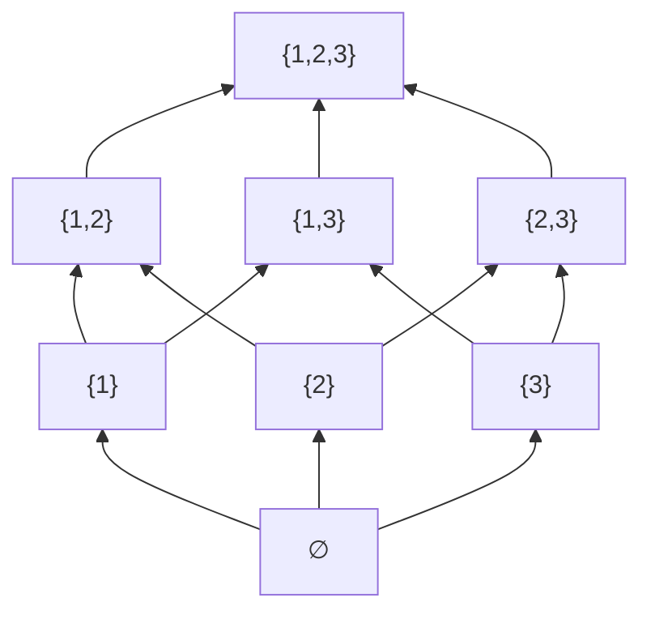

Each upward edge adds one element; the whole picture (the *power set* \(2^{\{1,2,3\}}\)) has \(2^3=8\) nodes because each element is independently in or out.

**Formal Definition.** \(A=B\iff(\forall x)(x\in A\Leftrightarrow x\in B)\) (extensionality); \(A\subset B\iff(\forall x)(x\in A\Rightarrow x\in B)\). A set may be given by a list \(\{a,b,c\}\) or by a defining property \(\{x:P(x)\}\), where \(y\in\{x:P(x)\}\iff P(y)\). The empty set \(\varnothing\) has no members, so \(\varnothing\subset A\) for every \(A\) (vacuously).

**Worked Example.** Show \(\{x\in\mathbb{R}:x^2<9\}=(-3,3)\). If \(x^2<9\) then \(|x|<3\), i.e. \(-3<x<3\); conversely \(-3<x<3\Rightarrow x^2<9\). Both inclusions hold, so the sets are equal. Notice how a set defined by a *property* turned into a familiar *interval* — this back-and-forth between "property" and "region" underlies all of analytic geometry.

**Exercises**

1. Decide whether each is true over \(\mathbb{R}\): (a) \((\exists x)(x^2=2)\); (b) \((\forall x)(x+1>x)\); (c) \((\exists x)(\forall y)(x\le y)\); (d) \((\forall y)(\exists x)(x\le y)\).

   <details><summary>Solution</summary>

   (a) **True** (\(x=\sqrt2\)). (b) **True** (for every real \(x\), \(x+1>x\)). (c) **False** — no real is \(\le\) every real; given any \(x\), take \(y=x-1\). (d) **True** — for each \(y\), pick \(x=y\) (or \(y-1\)). Parts (c) vs (d) show how swapping quantifier order flips truth value.
   </details>

2. Build the truth table of \(\sim(P\ \&\ Q)\) and compare it to \((\sim P)\text{ or }(\sim Q)\).

   <details><summary>Solution</summary>

   | \(P\) | \(Q\) | \(P\&Q\) | \(\sim(P\&Q)\) | \((\sim P)\text{ or }(\sim Q)\) |
   |:--:|:--:|:--:|:--:|:--:|
   | T | T | T | F | F |
   | T | F | F | T | T |
   | F | T | F | T | T |
   | F | F | F | T | T |

   The last two columns agree in every row, so the forms are **equivalent** (De Morgan).
   </details>

3. List all subsets of \(\{1,2,3\}\); how many, and why? Then state \(|2^S|\) for \(|S|=n\).

   <details><summary>Solution</summary>

   \(\varnothing,\{1\},\{2\},\{3\},\{1,2\},\{1,3\},\{2,3\},\{1,2,3\}\) — **8**. Each element is independently in/out, giving \(2^3=8\); in general \(|2^S|=2^{n}\) via characteristic functions \(\chi_B\in\{0,1\}^S\).
   </details>

4. Translate into symbols with quantifiers, then negate: "every positive real number has a positive square root."

   <details><summary>Solution</summary>

   Statement: \((\forall x>0)(\exists y>0)(y^2=x)\). Negation: \((\exists x>0)(\forall y>0)(y^2\neq x)\) — "some positive real has no positive square root." (The original is true over \(\mathbb{R}\); the negation is false.)
   </details>

5. Simplify \(\sim(P\Rightarrow Q)\) to a form using only \(\&\) and \(\sim\), and use it to write the negation of "if it rains, the game is cancelled."

   <details><summary>Solution</summary>

   \(\sim(P\Rightarrow Q)\Leftrightarrow P\ \&\ (\sim Q)\). Negation in words: "**it rains and the game is not cancelled**." (An implication fails exactly when the hypothesis holds but the conclusion does not.)
   </details>

### Intermediate Level

#### Negating quantifiers

**Intuition.** To disprove "everything works," exhibit one thing that fails; to disprove "something works," show everything fails. Symbolically, a negation *flips every quantifier and slides inward*. This is the workhorse of analysis: to say a sequence does **not** converge, or a function is **not** continuous, you mechanically negate a quantifier string and read off what you must construct (usually a "bad" \(\varepsilon\) and a sequence of "bad" points).

**Formal Definition.** \(\sim(\forall x)P\Leftrightarrow(\exists x)\sim P\) and \(\sim(\exists x)P\Leftrightarrow(\forall x)\sim P\), applied left-to-right across a string; inside, use \(\sim(P\Rightarrow Q)\Leftrightarrow P\ \&\ \sim Q\).

#### Relations, functions, and composition

**Intuition.** A relation just says which pairs correspond; a function insists each input has exactly one output. Composition chains functions; the arrow picture makes the bookkeeping obvious:


The codomain of \(f\) must be the domain of \(g\) for \(g\circ f\) to exist; then \((g\circ f)(x)=g(f(x))\).

**Formal Definition.** A relation \(R\subset A\times B\) is a *function* iff \(\langle x,y\rangle,\langle x,z\rangle\in R\Rightarrow y=z\). A function \(f:A\to B\) is **injective** iff \(f(x)=f(x')\Rightarrow x=x'\), **surjective** iff \(\operatorname{range}f=B\), **bijective** iff both; \(g\) is a *right inverse* when \(f\circ g=I_B\) (exists iff \(f\) surjective), a *left inverse* when \(g\circ f=I_A\) (exists iff \(f\) injective, for nonempty domain).

**Worked Example.** Consider \(g:\mathbb{R}\to[0,\infty)\), \(g(x)=x^2\). It is **surjective** (every \(y\ge0\) equals \((\sqrt y)^2\)) but **not injective** (\(g(2)=g(-2)=4\)). A right inverse is \(h(y)=\sqrt y\): \((g\circ h)(y)=(\sqrt y)^2=y\). But \(h\) is **not** a left inverse, since \((h\circ g)(-2)=\sqrt4=2\neq-2\). Thus "\(g\) has a right inverse" matches "\(g\) is surjective," and the failure of a left inverse matches the failure of injectivity.

**Exercises**

1. Write the negation of "\((\forall \varepsilon>0)(\exists \delta>0)(\forall x)\,[\,|x-a|<\delta\Rightarrow|f(x)-f(a)|<\varepsilon\,]\)" (continuity at \(a\)) and read it in words.

   <details><summary>Solution</summary>

   \[ (\exists\varepsilon>0)(\forall\delta>0)(\exists x)\,[\,|x-a|<\delta\ \&\ |f(x)-f(a)|\ge\varepsilon\,]. \]
   "There is a tolerance \(\varepsilon>0\) such that, no matter how small \(\delta>0\), some \(x\) within \(\delta\) of \(a\) is thrown \(\ge\varepsilon\) away from \(f(a)\)" — \(f\) is **discontinuous at \(a\)**.
   </details>

2. Prove \((A\cup B)'=A'\cap B'\) (complements in a domain \(S\)).

   <details><summary>Solution</summary>

   \(x\in(A\cup B)'\iff\sim(x\in A\text{ or }x\in B)\iff(\sim x\in A)\ \&\ (\sim x\in B)\iff x\in A'\cap B'\). Equal by extensionality.
   </details>

3. For \(f:U\to V\) and subsets \(B_1,B_2\subset V\), prove \(f^{-1}[B_1\cap B_2]=f^{-1}[B_1]\cap f^{-1}[B_2]\).

   <details><summary>Solution</summary>

   \(x\in f^{-1}[B_1\cap B_2]\iff f(x)\in B_1\ \&\ f(x)\in B_2\iff x\in f^{-1}[B_1]\ \&\ x\in f^{-1}[B_2]\). Done.
   </details>

4. Show that images do **not** always commute with intersection: give \(f\) with \(f[A\cap B]\subsetneq f[A]\cap f[B]\), and prove \(\subset\) always holds.

   <details><summary>Solution</summary>

   Always: if \(y\in f[A\cap B]\) then \(y=f(x)\) with \(x\in A\cap B\), so \(y\in f[A]\) and \(y\in f[B]\); hence \(f[A\cap B]\subset f[A]\cap f[B]\). Strict example: \(f(x)=x^2\), \(A=\{1\}\), \(B=\{-1\}\): \(A\cap B=\varnothing\) so \(f[A\cap B]=\varnothing\), but \(f[A]\cap f[B]=\{1\}\cap\{1\}=\{1\}\). Equality holds for all \(A,B\) iff \(f\) is injective.
   </details>

5. Prove: for \(f:A\to B\) with \(A\neq\varnothing\), \(f\) is injective iff it has a left inverse.

   <details><summary>Solution</summary>

   (\(\Leftarrow\)) If \(g\circ f=I_A\) and \(f(x)=f(x')\), apply \(g\): \(x=g(f(x))=g(f(x'))=x'\). (\(\Rightarrow\)) If \(f\) is injective, fix \(a_0\in A\) and define \(g(y)=\) the unique \(x\) with \(f(x)=y\) when \(y\in\operatorname{range}f\), else \(g(y)=a_0\). Then \(g(f(x))=x\), so \(g\) is a left inverse. (Choosing the value off the range needs no choice axiom here since a single fixed \(a_0\) works.)
   </details>

### Advanced Level

#### Set-theoretic foundations: pairs and inverses

**Intuition.** Everything — pairs, relations, functions, numbers — is *built from sets*. The payoff is that structural facts (a bijection has a unique inverse; equivalence relations and partitions are the same thing) become short, rigorous set manipulations rather than appeals to intuition. This is the "precision of language" the authors stress in the preface.

**Formal Definition.** The **Kuratowski** ordered pair is \(\langle a,b\rangle:=\{\{a\},\{a,b\}\}\). A relation is any set of such pairs; a function is a single-valued relation; \(f:A\to B\) additionally records domain \(A\) and codomain \(B\). An **equivalence relation** \(\sim\) on \(A\) is reflexive, symmetric, transitive; a **partition** \(\mathfrak{F}\) is a disjoint family of nonempty sets with \(\bigcup\mathfrak{F}=A\).

#### The fibering theorem and canonical decomposition

**Worked Example (the fibering theorem).** *Every equivalence relation \(\sim\) on \(A\) is the equivalence relation of a partition.*

**Step 1.** Define classes \(\bar x=\{y\in A:y\sim x\}\). Reflexivity \(x\sim x\) gives \(x\in\bar x\), so the classes are nonempty and cover \(A\).

**Step 2.** Show two classes are equal or disjoint. Suppose \(x\in\bar a\cap\bar b\), so \(x\sim a\) and \(x\sim b\). For any \(y\in\bar a\): \(y\sim a\); with \(a\sim x\) (symmetry) and transitivity \(y\sim x\), and with \(x\sim b\), \(y\sim b\); so \(y\in\bar b\). Thus \(\bar a\subset\bar b\), and symmetrically \(\bar b\subset\bar a\), giving \(\bar a=\bar b\). Distinct classes are therefore disjoint.

**Step 3.** Hence \(\mathfrak{F}=\{\bar x:x\in A\}\) is a partition, and \(y\sim x\) iff \(y,x\) share a class. \(\blacksquare\)

Two diagrams capture the consequences. First, the **universal property** of the quotient projection \(\pi:A\to A/\!\sim\):

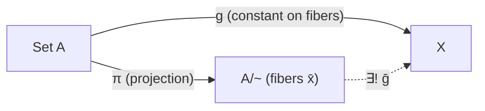

Second, every function factors canonically as *onto*, then *bijection*, then *inclusion* — quotient by the fibers \(f(x)=f(x')\), then match to the range, then include into \(B\):

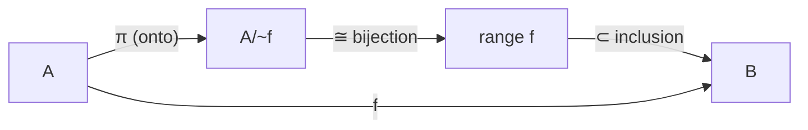

**Exercises**

1. Verify the Kuratowski pair satisfies the characterizing property: \(\{\{a\},\{a,b\}\}=\{\{c\},\{c,d\}\}\iff a=c\ \&\ b=d\).

   <details><summary>Solution</summary>

   (\(\Leftarrow\)) clear. (\(\Rightarrow\)) **If \(a=b\):** LHS \(=\{\{a\}\}\) is a singleton, forcing \(\{c\}=\{c,d\}\), so \(c=d\), and \(\{a\}=\{c\}\Rightarrow a=c\); hence \(b=a=c=d\). **If \(a\neq b\):** \(\{a\}\) is the unique one-element member, equal to \(\{c\}\), so \(a=c\); then \(\{a,b\}=\{c,d\}=\{a,d\}\Rightarrow b=d\). \(\blacksquare\)
   </details>

2. Prove: if \(f:A\to B\) has a right inverse \(h\) and a left inverse \(g\), then \(g=h\), and \(f\) is bijective with unique two-sided inverse.

   <details><summary>Solution</summary>

   \(g=g\circ I_B=g\circ(f\circ h)=(g\circ f)\circ h=I_A\circ h=h\). A left inverse forces injectivity, a right inverse surjectivity, so \(f\) is bijective; the cancellation shows the inverse is unique. \(\blacksquare\)
   </details>

3. Show \(\mathbb{Z}_p\) is the set of fibers of \(mEn\iff p\mid(m-n)\), and that \(\bar m+\bar n:=\overline{m+n}\) is well defined.

   <details><summary>Solution</summary>

   \(E\) is reflexive/symmetric/transitive, so by the fibering theorem its classes partition \(\mathbb{Z}\); indexed by remainders \(\{0,\dots,p-1\}\), they are \(\mathbb{Z}_p\). Well-defined: \(m'\in\bar m,n'\in\bar n\Rightarrow p\mid(m'-m),p\mid(n'-n)\Rightarrow p\mid[(m'+n')-(m+n)]\Rightarrow\overline{m'+n'}=\overline{m+n}\). \(\blacksquare\)
   </details>

4. For a relation \(R\), prove \(\operatorname{dom}(R^{-1})=\operatorname{range}(R)\) and \((R^{-1})^{-1}=R\).

   <details><summary>Solution</summary>

   \(x\in\operatorname{dom}(R^{-1})\iff(\exists y)\langle x,y\rangle\in R^{-1}\iff(\exists y)\langle y,x\rangle\in R\iff x\in\operatorname{range}(R)\). And \(\langle x,y\rangle\in(R^{-1})^{-1}\iff\langle y,x\rangle\in R^{-1}\iff\langle x,y\rangle\in R\), so \((R^{-1})^{-1}=R\). \(\blacksquare\)
   </details>

5. Prove composition of relations is associative: for \(R\subset A\times B\), \(S\subset B\times C\), \(T\subset C\times D\), \((T\circ S)\circ R=T\circ(S\circ R)\).

   <details><summary>Solution</summary>

   Recall \(\langle a,c\rangle\in S\circ R\iff(\exists b)(\langle a,b\rangle\in R\ \&\ \langle b,c\rangle\in S)\). Then \(\langle a,d\rangle\in(T\circ S)\circ R\iff(\exists b)\big[\langle a,b\rangle\in R\ \&\ (\exists c)(\langle b,c\rangle\in S\ \&\ \langle c,d\rangle\in T)\big]\). Since \(\exists\)-quantifiers and `&` reassociate/commute freely, this is equivalent to \((\exists c)\big[(\exists b)(\langle a,b\rangle\in R\ \&\ \langle b,c\rangle\in S)\ \&\ \langle c,d\rangle\in T\big]\iff\langle a,d\rangle\in T\circ(S\circ R)\). \(\blacksquare\)
   </details>

### Research Level

#### Currying as an adjunction

**Intuition.** The elementary "duality" of Chapter 0 is the shadow of a structural fact: in the category **Set**, the operations "pair with \(B\)" and "raise to the power \(B\)" are *adjoint*. The three interconvertible maps \(F,\varphi,\theta\) are components of this adjunction; drawing them:

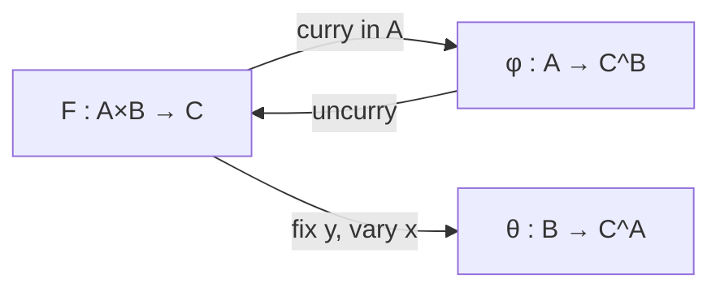

**Formal Definition / Development.** The duality bijection is natural in \(A\) and \(C\):
\[ \operatorname{Hom}(A\times B,\ C)\ \cong\ \operatorname{Hom}(A,\ C^B),\qquad F\longleftrightarrow\varphi,\ \ \varphi(a)(b)=F(a,b). \]
This says \((-)\times B\) is *left adjoint* to \((-)^B\): \((-\times B)\dashv(-)^B\). A category with finite products and all such exponentials is **cartesian closed** — the categorical semantics of the simply-typed \(\lambda\)-calculus, in which currying is exactly this isomorphism.

**Worked Example (adjunction ⇒ elementwise duality).** Take \(A=\{*\}\): then \(\operatorname{Hom}(\{*\}\times B,C)\cong\operatorname{Hom}(\{*\},C^B)\) reads \(\operatorname{Hom}(B,C)\cong C^B\) — "a function of \(B\) *is* a point of the exponential." General \(A\) with the roles of \(A,B\) swapped yields the book's third map \(\theta:B\to C^A\).

#### Quotients, universal properties, and coherence

**Intuition.** A quotient is best understood not by its elements but by the *arrows out of it*: \(\pi:A\to A/\!\sim\) is *initial* among maps collapsing \(\sim\). This viewpoint transfers unchanged to groups, rings, and topological spaces. Likewise the harmless identification \(\mathbb{R}^3=\mathbb{R}^2\times\mathbb{R}\) is licensed by a *coherence theorem*, not by literal equality.

**Formal Definition / Development.** For every \(g:A\to X\) constant on classes there is a unique \(\bar g:A/\!\sim\ \to X\) with \(g=\bar g\circ\pi\). This lifts to \(\mathbb{Z}\twoheadrightarrow\mathbb{Z}_p\) and \(\mathbb{Z}\times(\mathbb{Z}\smallsetminus\{0\})\twoheadrightarrow\mathbb{Q}\), where one additionally checks the operations descend (the equivalence is a *congruence*). The associator \(\alpha_{A,B,C}:(A\times B)\times C\xrightarrow{\sim}A\times(B\times C)\) satisfies **Mac Lane's coherence theorem**: all reassociations agree, so unbracketed \(n\)-fold products are well defined up to canonical isomorphism.

**Exercises**

1. Prove naturality of currying in \(A\): for \(u:A'\to A\), \(\Phi_{A'}(F\circ(u\times\mathrm{id}_B))=\Phi_A(F)\circ u\). Conclude \((-\times B)\dashv(-)^B\).

   <details><summary>Solution</summary>

   Evaluate at \(a'\in A',b\in B\): LHS\((a')(b)=F(u(a'),b)\); RHS\((a')(b)=\Phi_A(F)(u(a'))(b)=F(u(a'),b)\). Equal for all \(a',b\), so the square commutes; naturality in \(A\) and \(C\) plus the bijection is the adjunction, with unit \(a\mapsto(b\mapsto\langle a,b\rangle)\). \(\blacksquare\)
   </details>

2. Prove the exponential law \((C^B)^A\cong C^{A\times B}\) as sets, and identify it with currying.

   <details><summary>Solution</summary>

   Map \(\Psi:C^{A\times B}\to(C^B)^A\) by \(\Psi(F)(a)(b)=F(a,b)\) with inverse \(\Psi^{-1}(\varphi)(a,b)=\varphi(a)(b)\); these are mutually inverse, so \(\Psi\) is a bijection. It is precisely the currying isomorphism \(\operatorname{Hom}(A\times B,C)\cong\operatorname{Hom}(A,C^B)\) with \(C^{A\times B}=\operatorname{Hom}(A\times B,C)\) and \((C^B)^A=\operatorname{Hom}(A,C^B)\). \(\blacksquare\)
   </details>

3. State and prove the universal property of \(\mathbb{Q}\) as the field of fractions of \(\mathbb{Z}\): any injective ring hom \(\mathbb{Z}\to K\) into a field extends uniquely to \(\mathbb{Q}\to K\).

   <details><summary>Solution</summary>

   Define \(\hat\iota(m/n)=\iota(m)\iota(n)^{-1}\). Well-defined: \(m/n=p/q\Rightarrow mq=np\Rightarrow\iota(m)\iota(q)=\iota(n)\iota(p)\Rightarrow\iota(m)\iota(n)^{-1}=\iota(p)\iota(q)^{-1}\). It is a ring hom (check on sums/products) and unique (any extension respecting inverses must send \(m/n\mapsto\iota(m)\iota(n)^{-1}\)). This is localization \(\mathbb{Z}\to\mathbb{Z}[(\mathbb{Z}\smallsetminus\{0\})^{-1}]=\mathbb{Q}\). \(\blacksquare\)
   </details>

4. Give an explicit natural isomorphism \(\alpha:(A\times B)\times C\to A\times(B\times C)\), verify it is a bijection, and explain why coherence lets us write \(A\times B\times C\).

   <details><summary>Solution</summary>

   \(\alpha(\langle\langle a,b\rangle,c\rangle)=\langle a,\langle b,c\rangle\rangle\) with the obvious inverse; both composites are identities, and \(\alpha\) commutes with \(f\times g\times h\) (naturality). Mac Lane coherence: every diagram of associativity isomorphisms commutes, so any two reassociations of an \(n\)-fold product agree, making unbracketed notation unambiguous up to canonical iso — the license behind \(\mathbb{R}^3=\mathbb{R}^2\times\mathbb{R}\). \(\blacksquare\)
   </details>

5. Show that "\(\prod_{i\in I}S_i\neq\varnothing\) whenever every \(S_i\neq\varnothing\)" is equivalent to the Axiom of Choice, and connect this to \(\prod_{i\in I}S_i\) being the set of choice functions.

   <details><summary>Solution</summary>

   By definition \(f\in\prod_{i\in I}S_i\) is exactly a function with \(f(i)\in S_i\) for all \(i\) — a *choice function* selecting an element from each \(S_i\). The assertion "the product of nonempty sets is nonempty" says such a choice function always exists, which is one standard formulation of the **Axiom of Choice**. For finite \(I\) it is provable by induction (finite `&`); the content is entirely in the infinite case, where it is independent of the other ZF axioms (Gödel: consistent to assume; Cohen: consistent to deny). \(\blacksquare\)
   </details>

**Further reading:** Loomis–Sternberg Ch. 0; [Set (mathematics) — Wikipedia](https://en.wikipedia.org/wiki/Set_(mathematics)), [Equivalence relation — Wikipedia](https://en.wikipedia.org/wiki/Equivalence_relation), [Cartesian closed category — Wikipedia](https://en.wikipedia.org/wiki/Cartesian_closed_category), [Axiom of choice — Wikipedia](https://en.wikipedia.org/wiki/Axiom_of_choice).

---

## Chapter 1 — Vector Spaces

Calculus of several variables "unites the calculus of one variable with the theory of vector spaces," so the book spends its first two chapters building that theory. Chapter 1 treats **general** (possibly infinite-dimensional) vector spaces: the axioms, subspaces and span, linear transformations and their matrices, the space \(\operatorname{Hom}(V,W)\), quotient spaces, direct-sum decompositions, and bilinearity. The recurring theme is that the interesting maps of analysis (the derivative, the integral, evaluation) are exactly the ones that *preserve* the vector operations.

**Key Concepts**

1. **Vector space axioms.** A real vector space is a set \(V\) with addition \(\langle\alpha,\beta\rangle\mapsto\alpha+\beta\) and scalar multiplication \(\langle x,\alpha\rangle\mapsto x\alpha\) satisfying: **A1** associativity, **A2** commutativity, **A3** a zero \(0\), **A4** additive inverses; **S1** \((xy)\alpha=x(y\alpha)\), **S2** \((x+y)\alpha=x\alpha+y\alpha\), **S3** \(x(\alpha+\beta)=x\alpha+x\beta\), **S4** \(1\alpha=\alpha\). Consequences: \(0\alpha=0\), \(x0=0\), \((-1)\alpha=-\alpha\), and \(x\alpha=0\Rightarrow x=0\ \text{or}\ \alpha=0\). The standard example is \(V=\mathbb{R}^A\) (all functions \(A\to\mathbb{R}\)); \(\mathbb{R}^{\bar n}=\mathbb{R}^n\).
2. **Subspace.** A nonempty \(W\subset V\) closed under \(+\) and scalar multiplication is itself a vector space (a *subspace*). Any intersection \(\bigcap_{i}W_i\) of subspaces is a subspace.
3. **Linear combination and span.** \(\beta=\sum_i x_i\alpha_i\) (finite). \(L(A)\), the *linear span*, is the smallest subspace containing \(A\); \(A\) *spans* \(V\) if \(L(A)=V\); \(V\) is *finite-dimensional* if it has a finite spanning set.
4. **Linear transformation.** \(T:V\to W\) with \(T(x\alpha+y\beta)=xT(\alpha)+yT(\beta)\), equivalently \(T(\sum x_i\alpha_i)=\sum x_iT(\alpha_i)\). For \(\alpha=(\alpha_1,\dots,\alpha_n)\in W^n\), the *linear-combination map* \(L_\alpha:\mathbb{R}^n\to W\), \(x\mapsto\sum x_i\alpha_i\), is linear with *skeleton* \(\alpha\). **Theorem (skeleton).** \(\alpha\mapsto L_\alpha\) is a **bijection** \(W^n\xrightarrow{\ \sim\ }\operatorname{Hom}(\mathbb{R}^n,W)\), inverse \(T\mapsto(T\delta^1,\dots,T\delta^n)\).
5. **Matrices.** A linear \(T:\mathbb{R}^n\to\mathbb{R}^m\) corresponds to the \(m\times n\) matrix \(\mathbf t=\{t_{ij}\}\) whose columns are the skeleton; \(y_i=\sum_{j=1}^n t_{ij}x_j\). The map \(\mathbf t\mapsto T\) is a bijection between \(m\times n\) matrices and \(\operatorname{Hom}(\mathbb{R}^n,\mathbb{R}^m)\).
6. **Kernel and range.** \(N(T)=T^{-1}(0)\) (null space/kernel), \(R(T)=T[V]\) (range); both are subspaces. **Lemma.** \(T\) is injective iff \(N(T)=\{0\}\). A bijective linear map is an *isomorphism*; isomorphic spaces are "the same" abstractly.
7. **The space \(\operatorname{Hom}(V,W)\).** Under pointwise operations \((S+T)(\alpha)=S\alpha+T\alpha\), \((xT)(\alpha)=x(T\alpha)\), \(\operatorname{Hom}(V,W)\) is a vector space; \(\operatorname{Hom}(V,V)=\operatorname{End}(V)\) is an algebra under composition.
8. **Product and quotient.** The product \(V\times W\) is a vector space with coordinatewise operations. For a subspace \(W\subset V\), the *quotient* \(V/W\) has elements the cosets \(\alpha+W\); the projection \(\pi:V\to V/W\) is linear with \(N(\pi)=W\). **First isomorphism theorem:** \(V/N(T)\cong R(T)\).
9. **Direct sums.** \(V=M\oplus N\) iff every \(\gamma\in V\) is uniquely \(\xi+\eta\) with \(\xi\in M,\eta\in N\); equivalently \(M+N=V\) and \(M\cap N=\{0\}\). The associated *projection* \(E:V\to V\) onto \(M\) along \(N\) satisfies \(E^2=E\), \(R(E)=M\), \(N(E)=N\); idempotents \(E^2=E\) correspond bijectively to decompositions \(V=R(E)\oplus N(E)\).
10. **Bilinearity.** \(\omega:V\times W\to X\) is *bilinear* if linear in each argument separately. Currying gives \(\operatorname{Bil}(V\times W,X)\cong\operatorname{Hom}(V,\operatorname{Hom}(W,X))\); the universal object for bilinear maps is the tensor product \(V\otimes W\).

### Beginner Level

#### What is a vector space?

**Intuition.** Three very different-looking things obey the *same* algebra: geometric arrows from an origin (added by the parallelogram rule), coordinate tuples \(\langle x_1,x_2,x_3\rangle\), and functions \(f:A\to\mathbb{R}\) (added value-by-value). A "vector space" is the common denominator: a place where you can **add** and **scale**, with the usual laws. Recognizing that polynomials, matrices, solutions of a linear ODE, and arrows are *all* vector spaces means every theorem you prove abstractly applies to all of them at once.

**Formal Definition.** \(V\) is a real vector space if addition and scalar multiplication satisfy A1–A4 (an abelian group under \(+\)) and S1–S4. A nonempty subset \(W\subset V\) is a **subspace** if \(\alpha,\beta\in W\Rightarrow\alpha+\beta\in W\) and \(\alpha\in W,\ x\in\mathbb{R}\Rightarrow x\alpha\in W\). The subspaces of \(\mathbb{R}^3\), ordered by inclusion and labelled by dimension, form a tidy picture:

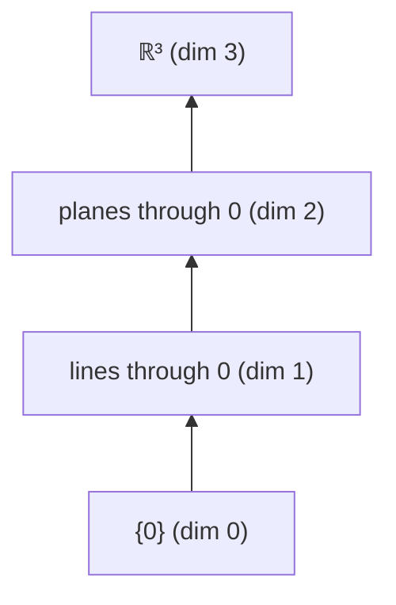

**Formal Definition (span).** The **linear span** \(L(A)=\{\sum_i x_i\alpha_i:\alpha_i\in A,\ x_i\in\mathbb{R}\}\) is the smallest subspace containing \(A\). If \(L(A)=V\), then \(A\) *spans* \(V\).

**Worked Example.** In \(\mathbb{R}^3\), the span of \(\alpha=\langle1,1,1\rangle\) and \(\beta=\langle0,1,-1\rangle\) is the plane \(L=\{s\langle1,1,1\rangle+t\langle0,1,-1\rangle\}=\{\langle s,\ s+t,\ s-t\rangle\}\). Eliminating \(s,t\): from the first coordinate \(s=x_1\); then \(x_2+x_3=2s=2x_1\), i.e. \(2x_1-x_2-x_3=0\). So \(L\) is exactly the plane \(2x_1-x_2-x_3=0\) — a 2-dimensional subspace, matching "span of two independent vectors = a plane."

**Exercises**

1. Show \(W=\{\langle x_1,x_2,x_3\rangle:x_1-2x_2+x_3=0\}\) is a subspace of \(\mathbb{R}^3\), and exhibit two vectors that span it.

   <details><summary>Solution</summary>

   \(0\in W\) (since \(0-0+0=0\)). If \(x,y\in W\) then \((x_1+y_1)-2(x_2+y_2)+(x_3+y_3)=(x_1-2x_2+x_3)+(y_1-2y_2+y_3)=0\), and \((cx_1)-2(cx_2)+(cx_3)=c\cdot0=0\); so \(W\) is closed under \(+\) and scalars, hence a subspace. Parametrize by \(x_2=s,x_3=t\), \(x_1=2s-t\): \(\langle2s-t,s,t\rangle=s\langle2,1,0\rangle+t\langle-1,0,1\rangle\). So \(W=L(\langle2,1,0\rangle,\langle-1,0,1\rangle)\). \(\blacksquare\)
   </details>

2. Show the solution set of \(x_1+x_2=1\) in \(\mathbb{R}^2\) is **not** a subspace.

   <details><summary>Solution</summary>

   \(\langle0,0\rangle\) does not satisfy \(x_1+x_2=1\), so the set omits the zero vector; every subspace contains \(0\). (Alternatively, \(\langle1,0\rangle\) and \(\langle0,1\rangle\) are in the set but their sum \(\langle1,1\rangle\) is not.) It is an *affine* line, a translate of a subspace, not a subspace. \(\blacksquare\)
   </details>

3. Can \(\langle2,0,1\rangle\) be written as a linear combination of \(\langle1,1,1\rangle\) and \(\langle0,1,-1\rangle\)?

   <details><summary>Solution</summary>

   Need \(s\langle1,1,1\rangle+t\langle0,1,-1\rangle=\langle s,s+t,s-t\rangle=\langle2,0,1\rangle\). Then \(s=2\), \(s+t=0\Rightarrow t=-2\), but then \(s-t=2-(-2)=4\neq1\). Inconsistent, so **no** — \(\langle2,0,1\rangle\) is not in that plane (indeed \(2(2)-0-1=3\neq0\)). \(\blacksquare\)
   </details>

4. Using only the axioms, prove \(0\alpha=0\) for every \(\alpha\in V\) (left \(0\) is the scalar, right \(0\) the zero vector).

   <details><summary>Solution</summary>

   \(0\alpha=(0+0)\alpha=0\alpha+0\alpha\) by S2. Adding \(-(0\alpha)\) (exists by A4) to both sides and using A1–A3: \(0=0\alpha\). \(\blacksquare\)
   </details>

5. Prove the intersection of two subspaces is a subspace, and give an example in \(\mathbb{R}^2\) where the **union** is not.

   <details><summary>Solution</summary>

   Let \(M,N\) be subspaces. \(0\in M\cap N\). If \(\alpha,\beta\in M\cap N\) then \(\alpha+\beta\in M\) and \(\in N\) (each closed), so \(\in M\cap N\); similarly \(x\alpha\in M\cap N\). Hence \(M\cap N\) is a subspace. **Union fails:** the \(x\)-axis \(M\) and \(y\)-axis \(N\) in \(\mathbb{R}^2\) are subspaces, but \(\langle1,0\rangle+\langle0,1\rangle=\langle1,1\rangle\notin M\cup N\). \(\blacksquare\)
   </details>

### Intermediate Level

#### Linear transformations and matrices

**Intuition.** A linear map is completely pinned down by what it does to a spanning set — you never need to know it "everywhere," only on basis vectors, and linearity fills in the rest. For \(\mathbb{R}^n\) this is the whole content of matrices: the \(j\)-th column records where the \(j\)-th standard vector \(\delta^j\) goes.

**Formal Definition.** \(T:V\to W\) is **linear** if \(T(x\alpha+y\beta)=xT(\alpha)+yT(\beta)\). Its **kernel** is \(N(T)=T^{-1}(0)\) and its **range** \(R(T)=T[V]\). By the *skeleton theorem*, every linear \(T:\mathbb{R}^n\to\mathbb{R}^m\) is \(x\mapsto\mathbf t\,x\) with \(t_{ij}=\) the \(i\)-th coordinate of \(T\delta^j\), giving \(y_i=\sum_j t_{ij}x_j\).

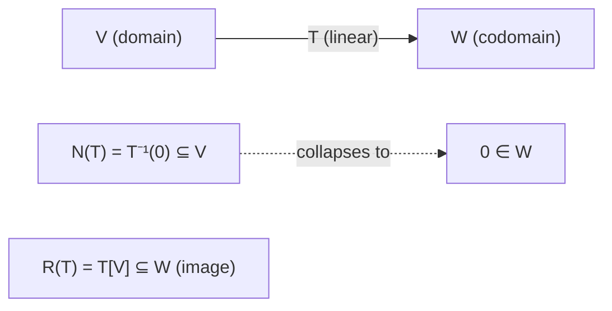

**Worked Example.** \(T:\mathbb{R}^3\to\mathbb{R}^2\), \(T\langle x_1,x_2,x_3\rangle=\langle2x_1-x_2+x_3,\ x_1+3x_2-5x_3\rangle\). Skeleton: \(T\delta^1=\langle2,1\rangle\), \(T\delta^2=\langle-1,3\rangle\), \(T\delta^3=\langle1,-5\rangle\), so \(\mathbf t=\begin{pmatrix}2&-1&1\\1&3&-5\end{pmatrix}\). The kernel solves \(\mathbf t\,x=0\); row-reducing gives a 1-parameter family (a line), consistent with \(\dim N(T)=3-\operatorname{rank}=3-2=1\).

**Exercises**

1. Find the matrix and the kernel of \(T:\mathbb{R}^3\to\mathbb{R}^2\), \(T\langle x_1,x_2,x_3\rangle=\langle x_1-x_2,\ x_2-x_3\rangle\).

   <details><summary>Solution</summary>

   \(\mathbf t=\begin{pmatrix}1&-1&0\\0&1&-1\end{pmatrix}\). Kernel: \(x_1=x_2\) and \(x_2=x_3\), so \(x_1=x_2=x_3\); \(N(T)=\{t\langle1,1,1\rangle\}=L(\langle1,1,1\rangle)\), dimension \(1\). \(\blacksquare\)
   </details>

2. Let \(D\) be differentiation on \(P_3=\{\text{polynomials of degree}\le3\}\). Find \(N(D)\) and \(R(D)\), and check \(\dim N(D)+\dim R(D)=\dim P_3\).

   <details><summary>Solution</summary>

   \(D(a_0+a_1t+a_2t^2+a_3t^3)=a_1+2a_2t+3a_3t^2\). \(N(D)=\) constants \(=P_0\), \(\dim=1\); \(R(D)=P_2\), \(\dim=3\). Sum \(1+3=4=\dim P_3\) (the rank–nullity theorem). \(\blacksquare\)
   </details>

3. Prove that a linear \(T:\mathbb{R}^n\to W\) is completely determined by the values \(T\delta^1,\dots,T\delta^n\).

   <details><summary>Solution</summary>

   Any \(x=\langle x_1,\dots,x_n\rangle=\sum_i x_i\delta^i\). By linearity \(T(x)=\sum_i x_iT(\delta^i)\). So the values on the \(\delta^i\) determine \(T(x)\) for every \(x\); conversely any choice of images \(\beta_i=T\delta^i\) yields a linear map \(L_\beta\). This is the skeleton bijection \(W^n\cong\operatorname{Hom}(\mathbb{R}^n,W)\). \(\blacksquare\)
   </details>

4. Prove: a linear map \(T\) is injective iff \(N(T)=\{0\}\).

   <details><summary>Solution</summary>

   If \(T\) injective and \(\alpha\neq0\), then \(T\alpha\neq T0=0\), so \(N(T)=\{0\}\). Conversely if \(N(T)=\{0\}\) and \(T\alpha=T\beta\), then \(T(\alpha-\beta)=0\), so \(\alpha-\beta\in N(T)=\{0\}\), giving \(\alpha=\beta\). \(\blacksquare\)
   </details>

5. Show the map \(\langle c_0,\dots,c_{n-1}\rangle\mapsto\sum_{i=0}^{n-1}c_it^i\) is an isomorphism \(\mathbb{R}^n\cong P_{n-1}\).

   <details><summary>Solution</summary>

   It is linear (coordinatewise) and its kernel is \(\{c:\sum c_it^i\equiv0\}=\{0\}\) since a polynomial is zero iff all coefficients vanish; hence injective. It is onto \(P_{n-1}\) by construction. Injective + surjective + linear = isomorphism. \(\blacksquare\)
   </details>

### Advanced Level

#### Hom, quotients, and direct sums

**Intuition.** Once maps are objects, \(\operatorname{Hom}(V,W)\) is itself a vector space, and the structural theorems of linear algebra become clean statements about maps: *every* linear map factors as a projection onto a quotient followed by an injection (first isomorphism theorem), and *every* subspace can be split off by an idempotent projection.

**Formal Definition.** For a subspace \(W\subset V\), the **quotient** \(V/W\) has elements \(\alpha+W\) with \((\alpha+W)+(\beta+W)=(\alpha+\beta)+W\), \(x(\alpha+W)=x\alpha+W\); the projection \(\pi:V\to V/W\), \(\alpha\mapsto\alpha+W\), is linear with kernel \(W\). \(V=M\oplus N\) means \(M+N=V\) and \(M\cap N=\{0\}\).

**Worked Example (first isomorphism theorem).** *For linear \(T:V\to W\), \(\ \bar T:V/N(T)\to R(T)\), \(\ \bar T(\alpha+N(T))=T\alpha\), is a well-defined isomorphism.*

**Step 1 (well-defined).** If \(\alpha+N(T)=\alpha'+N(T)\) then \(\alpha-\alpha'\in N(T)\), so \(T\alpha-T\alpha'=T(\alpha-\alpha')=0\), i.e. \(T\alpha=T\alpha'\). **Step 2 (linear).** Immediate from linearity of \(T\) and the quotient operations. **Step 3 (injective).** \(\bar T(\alpha+N(T))=0\Rightarrow T\alpha=0\Rightarrow\alpha\in N(T)\Rightarrow\alpha+N(T)=0\). **Step 4 (surjective onto \(R(T)\)).** Every \(T\alpha\in R(T)\) is \(\bar T(\alpha+N(T))\). Hence \(V/N(T)\cong R(T)\). \(\blacksquare\)

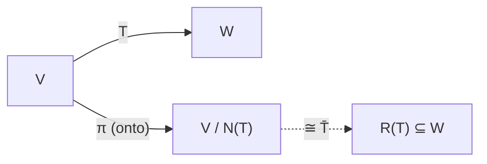

**Exercises**

1. Prove \(\operatorname{Hom}(V,W)\) is a vector space under pointwise operations.

   <details><summary>Solution</summary>

   For \(S,T\) linear, \((S+T)(x\alpha+y\beta)=S(x\alpha+y\beta)+T(x\alpha+y\beta)=x(S\alpha+T\alpha)+y(S\beta+T\beta)=x(S+T)\alpha+y(S+T)\beta\), so \(S+T\) is linear; similarly \(cT\) is linear. The axioms A1–S4 hold pointwise because they hold in \(W\); the zero is the zero map. Thus \(\operatorname{Hom}(V,W)\) is a subspace of \(W^V\). \(\blacksquare\)
   </details>

2. Prove \(V=M\oplus N\) iff every \(\gamma\in V\) has a **unique** representation \(\gamma=\xi+\eta\) with \(\xi\in M,\eta\in N\).

   <details><summary>Solution</summary>

   (\(\Rightarrow\)) \(M+N=V\) gives existence. If \(\xi+\eta=\xi'+\eta'\), then \(\xi-\xi'=\eta'-\eta\in M\cap N=\{0\}\), so \(\xi=\xi',\eta=\eta'\): unique. (\(\Leftarrow\)) Existence gives \(M+N=V\); if \(\zeta\in M\cap N\), then \(\zeta=\zeta+0=0+\zeta\) are two representations, so by uniqueness \(\zeta=0\), i.e. \(M\cap N=\{0\}\). \(\blacksquare\)
   </details>

3. For \(V=M\oplus N\) define \(E(\gamma)=\xi\) (the \(M\)-part). Prove \(E\) is linear, \(E^2=E\), \(R(E)=M\), \(N(E)=N\).

   <details><summary>Solution</summary>

   Uniqueness makes \(E\) well-defined; if \(\gamma=\xi+\eta,\gamma'=\xi'+\eta'\) then \(x\gamma+y\gamma'=(x\xi+y\xi')+(x\eta+y\eta')\) is the decomposition of \(x\gamma+y\gamma'\), so \(E(x\gamma+y\gamma')=x\xi+y\xi'=xE\gamma+yE\gamma'\): linear. For \(\xi\in M\), \(\xi=\xi+0\) so \(E\xi=\xi\); thus \(E^2\gamma=E\xi=\xi=E\gamma\), i.e. \(E^2=E\), and \(R(E)=M\). \(E\gamma=0\iff\xi=0\iff\gamma=\eta\in N\), so \(N(E)=N\). \(\blacksquare\)
   </details>

4. Conversely, given an idempotent \(E\in\operatorname{End}(V)\) (\(E^2=E\)), prove \(V=R(E)\oplus N(E)\).

   <details><summary>Solution</summary>

   Write \(\gamma=E\gamma+(\gamma-E\gamma)\). Here \(E\gamma\in R(E)\), and \(E(\gamma-E\gamma)=E\gamma-E^2\gamma=E\gamma-E\gamma=0\), so \(\gamma-E\gamma\in N(E)\); hence \(V=R(E)+N(E)\). If \(\zeta\in R(E)\cap N(E)\), then \(\zeta=E\mu\) for some \(\mu\) and \(E\zeta=0\); but \(\zeta=E\mu=E^2\mu=E\zeta=0\). So the sum is direct. \(\blacksquare\)
   </details>

5. Prove the rank–nullity theorem for finite-dimensional \(V\): \(\dim N(T)+\dim R(T)=\dim V\), using the first isomorphism theorem.

   <details><summary>Solution</summary>

   By the first isomorphism theorem \(V/N(T)\cong R(T)\), so \(\dim R(T)=\dim\bigl(V/N(T)\bigr)\). For finite-dimensional \(V\) and subspace \(W\), \(\dim(V/W)=\dim V-\dim W\) (extend a basis of \(W\) to one of \(V\); the added vectors project to a basis of \(V/W\)). With \(W=N(T)\): \(\dim R(T)=\dim V-\dim N(T)\), i.e. \(\dim N(T)+\dim R(T)=\dim V\). \(\blacksquare\)
   </details>

### Research Level

#### Bilinearity, tensor products, and exactness

**Intuition.** Bilinear maps (dot products, determinants, matrix multiplication, the evaluation pairing \(V\times V^*\to\mathbb{R}\)) are *not* linear on \(V\times W\), yet they are governed by a single linear object: the **tensor product** \(V\otimes W\), which converts bilinear maps out of \(V\times W\) into linear maps out of \(V\otimes W\). At this level linear algebra becomes the study of *functors* (\(\operatorname{Hom}\), \(\otimes\), duality) and the *exact sequences* they preserve or destroy.

**Formal Definition / Development.**

- **Universal property of \(\otimes\).** There is a bilinear \(\otimes:V\times W\to V\otimes W\) such that every bilinear \(b:V\times W\to X\) factors **uniquely** as \(b=\tilde b\circ\otimes\) with \(\tilde b:V\otimes W\to X\) linear. Equivalently \(\operatorname{Bil}(V\times W,X)\cong\operatorname{Hom}(V\otimes W,X)\), naturally in \(X\).

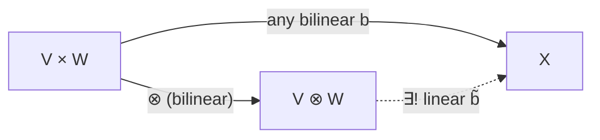

- **Tensor–hom adjunction.** \(\operatorname{Hom}(U\otimes V,\ W)\cong\operatorname{Hom}(U,\ \operatorname{Hom}(V,W))\), naturally — the linear-algebra avatar of currying (\(-\otimes V\dashv\operatorname{Hom}(V,-)\)).
- **Short exact sequences.** \(0\to W\xrightarrow{\iota}V\xrightarrow{\pi}V/W\to0\) is exact (\(\iota\) injective, \(\pi\) surjective, \(\operatorname{im}\iota=\ker\pi\)). Over a field every such sequence **splits**: a choice of complement / projection gives \(V\cong W\oplus V/W\).

**Worked Example (left exactness of \(\operatorname{Hom}\)).** Applying \(\operatorname{Hom}(-,X)\) to \(0\to A\xrightarrow{f}B\xrightarrow{g}C\to0\) yields \(0\to\operatorname{Hom}(C,X)\xrightarrow{g^*}\operatorname{Hom}(B,X)\xrightarrow{f^*}\operatorname{Hom}(A,X)\), exact. Indeed \(g^*\) is injective (if \(\varphi\circ g=0\) and \(g\) is onto, then \(\varphi=0\)), and \(\ker f^*=\operatorname{im}g^*\) (a map \(B\to X\) killing \(A=\ker g\) factors through \(C=B/A\)). Over a field \(f^*\) is also onto, so \(\operatorname{Hom}(-,X)\) is **exact**.

**Exercises**

1. State and prove the universal property characterizing \(V\otimes W\) up to unique isomorphism.

   <details><summary>Solution</summary>

   *Definition.* \((V\otimes W,\otimes)\) is universal if for every bilinear \(b:V\times W\to X\) there is a unique linear \(\tilde b:V\otimes W\to X\) with \(\tilde b\circ\otimes=b\). *Uniqueness up to iso:* if \((T,\tau)\) and \((T',\tau')\) both have the property, universality of \(T\) applied to \(\tau'\) gives linear \(u:T\to T'\) with \(u\tau=\tau'\), and symmetrically \(u':T'\to T\) with \(u'\tau'=\tau\). Then \(u'u\) and \(\mathrm{id}_T\) both factor \(\tau\), so by the *uniqueness* clause \(u'u=\mathrm{id}\); likewise \(uu'=\mathrm{id}\). Hence \(u\) is an isomorphism, canonical. \(\blacksquare\)
   </details>

2. Prove the tensor–hom adjunction \(\operatorname{Hom}(U\otimes V,W)\cong\operatorname{Hom}(U,\operatorname{Hom}(V,W))\).

   <details><summary>Solution</summary>

   Both sides are naturally isomorphic to \(\operatorname{Bil}(U\times V,W)\): a linear \(U\otimes V\to W\) is the same as a bilinear \(U\times V\to W\) (universal property), and a bilinear \(U\times V\to W\) is the same as a linear \(U\to\operatorname{Hom}(V,W)\), \(u\mapsto b(u,-)\) (curry the second slot). Composing the two natural bijections gives the adjunction, natural in \(U,V,W\). \(\blacksquare\)
   </details>

3. Prove that the short exact sequence \(0\to W\xrightarrow{\iota}V\xrightarrow{\pi}V/W\to0\) splits over a field, and relate a splitting to a projection.

   <details><summary>Solution</summary>

   Choose a complement \(N\) with \(V=W\oplus N\) (exists: extend a basis of \(W\) to a basis of \(V\); \(N\) is the span of the added vectors — Zorn/AC in general). Then \(\pi|_N:N\to V/W\) is an isomorphism; its inverse followed by inclusion is a section \(s:V/W\to V\) with \(\pi s=\mathrm{id}\). Equivalently the projection \(E:V\to V\) onto \(W\) along \(N\) is idempotent with \(R(E)=W\), and \(\mathrm{id}-E\) realizes \(V/W\) inside \(V\). Thus \(V\cong W\oplus V/W\). \(\blacksquare\)
   </details>

4. Discuss: for which vector spaces does a (Hamel) basis exist, and why does analysis prefer topological bases for \(C([a,b])\)?

   <details><summary>Solution</summary>

   Every vector space has a Hamel basis **iff** the Axiom of Choice holds (Blass); the proof extends any linearly independent set to a maximal one via Zorn's lemma. But a Hamel basis of an infinite-dimensional space like \(C([a,b])\) is uncountable and non-constructive, and expansions are *finite* sums — useless for analysis. Analysis instead uses **topological** bases (Schauder bases, or orthonormal bases in a Hilbert space) where vectors are *infinite* convergent series \(\sum c_n e_n\); this requires a norm/inner product and completeness, i.e. structure beyond the pure vector space — exactly why Chapters 3–5 add norms and scalar products. \(\blacksquare\)
   </details>

5. Show \(\operatorname{Hom}(-,X)\) is left exact, and give the extra step that makes it exact over a field.

   <details><summary>Solution</summary>

   Apply \(\operatorname{Hom}(-,X)\) to \(0\to A\xrightarrow{f}B\xrightarrow{g}C\to0\). **\(g^*\) injective:** \(\varphi g=0\) with \(g\) surjective \(\Rightarrow\varphi=0\). **\(\ker f^*\subseteq\operatorname{im}g^*\):** if \(\psi f=0\), then \(\psi\) vanishes on \(\operatorname{im}f=\ker g\), so \(\psi\) factors as \(\psi=\bar\psi\circ g=g^*(\bar\psi)\); the reverse inclusion is \(f^*g^*=(gf)^*=0\). This is left-exactness. **Over a field:** the sequence splits, \(B\cong A\oplus C\), so any \(\chi:A\to X\) extends to \(A\oplus C\to X\) by \(0\) on \(C\); hence \(f^*\) is onto and \(\operatorname{Hom}(-,X)\) is exact (\(X\) is injective — every vector space is). \(\blacksquare\)
   </details>

**Further reading:** Loomis–Sternberg Ch. 1; [Vector space — Wikipedia](https://en.wikipedia.org/wiki/Vector_space), [Linear map — Wikipedia](https://en.wikipedia.org/wiki/Linear_map), [Tensor product — Wikipedia](https://en.wikipedia.org/wiki/Tensor_product), [Exact sequence — Wikipedia](https://en.wikipedia.org/wiki/Exact_sequence).

---

## Chapter 2 — Finite-Dimensional Vector Spaces

Adding the single hypothesis "\(V\) has a finite spanning set" unlocks the whole classical toolkit: **bases** and **dimension**, **coordinates**, the **dual space**, **matrices** relative to bases and their **change-of-basis** law, and the two great basis-independent invariants of an operator — its **trace** and **determinant**. The chapter closes with the diagonalization of a quadratic form, the algebraic seed of the later spectral theory.

**Key Concepts**

1. **Independence, basis, dimension.** \(\{\alpha_i\}\) is *linearly independent* if \(\sum x_i\alpha_i=0\Rightarrow\) all \(x_i=0\). A **basis** is an independent spanning set. Every finite-dimensional \(V\neq\{0\}\) has a basis, and **any two bases have the same size** \(=\dim V\). Subspace \(W\subset V\Rightarrow\dim W\le\dim V\), with equality iff \(W=V\); and \(\dim(M+N)=\dim M+\dim N-\dim(M\cap N)\).
2. **Coordinates.** A basis \(\beta=(\beta_1,\dots,\beta_n)\) yields an isomorphism \(L_\beta:\mathbb{R}^n\xrightarrow{\ \sim\ }V\), \(x\mapsto\sum x_i\beta_i\); the *coordinate functionals* \(\beta^i\) read off \(x_i\).
3. **Dual space.** \(V^*=\operatorname{Hom}(V,\mathbb{R})\). For finite-dimensional \(V\), \(\dim V^*=\dim V\), with **dual basis** \(\{\beta^i\}\) determined by \(\beta^i(\beta_j)=\delta^i_j\). The evaluation map \(V\to V^{**}\), \(\alpha\mapsto(\,f\mapsto f(\alpha)\,)\), is a **natural** isomorphism in finite dimension; the transpose \(T^*:W^*\to V^*\), \((T^*g)=g\circ T\), reverses arrows.
4. **Matrix of a map; similarity.** Relative to bases of \(V,W\), a linear \(T\) gets a matrix \(A\); changing basis by \(P\) replaces \(A\) with the **similar** matrix \(P^{-1}AP\) (when \(V=W\)).
5. **Trace.** \(\operatorname{tr}A=\sum_i a_{ii}\). It satisfies \(\operatorname{tr}(AB)=\operatorname{tr}(BA)\), hence \(\operatorname{tr}(P^{-1}AP)=\operatorname{tr}A\): trace is a **similarity invariant**, an invariant of the *operator*, not the matrix.
6. **Determinant.** \(\det:\operatorname{Mat}_n\to\mathbb{R}\) is the unique alternating multilinear function of the columns with \(\det I=1\). It is **multiplicative** \(\det(AB)=\det A\det B\), so \(\det(P^{-1}AP)=\det A\); \(A\) is invertible iff \(\det A\neq0\); \(|\det A|\) is the volume-scaling factor.
7. **Eigen-theory.** \(T\alpha=\lambda\alpha\) (\(\alpha\neq0\)) makes \(\lambda\) an *eigenvalue*; they are the roots of the **characteristic polynomial** \(\chi_T(\lambda)=\det(\lambda I-A)\). Eigenvectors for distinct eigenvalues are independent; \(T\) is *diagonalizable* iff \(V\) has a basis of eigenvectors.
8. **Quadratic forms.** \(Q(x)=x^{\mathsf T}Ax\) with \(A=A^{\mathsf T}\). Congruence \(A\mapsto P^{\mathsf T}AP\) diagonalizes \(Q\); **Sylvester's law of inertia** says the resulting *signature* \((p,q)\) (numbers of \(+\) and \(-\) entries) is invariant.

### Beginner Level

#### Basis, dimension, and coordinates

**Intuition.** A basis is a minimal set of "directions" from which every vector is built in exactly one way. "Minimal spanning" and "maximal independent" turn out to be the same thing, and the count of basis vectors — the **dimension** — does not depend on which basis you pick. Once you fix a basis, every abstract vector becomes an honest tuple of numbers (its coordinates), so any \(n\)-dimensional space is a disguised copy of \(\mathbb{R}^n\).

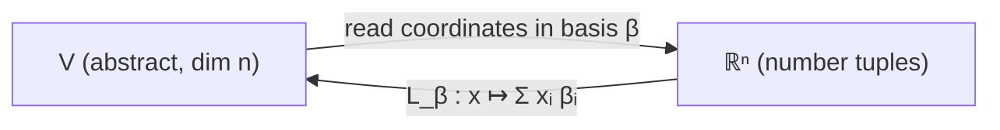

**Formal Definition.** \(\{\beta_1,\dots,\beta_n\}\) is a **basis** if it is linearly independent (\(\sum x_i\beta_i=0\Rightarrow x_i=0\)) and spans \(V\). Then each \(\alpha\in V\) is \(\alpha=\sum_i x_i\beta_i\) for a **unique** coordinate tuple \(x=\langle x_1,\dots,x_n\rangle\), and \(\dim V:=n\).

**Worked Example.** Is \(\beta=\{\langle1,1\rangle,\langle1,-1\rangle\}\) a basis of \(\mathbb{R}^2\)? Independence: \(x\langle1,1\rangle+y\langle1,-1\rangle=\langle x+y,\ x-y\rangle=0\) forces \(x+y=0,x-y=0\Rightarrow x=y=0\). Two independent vectors in a \(2\)-dimensional space also span, so yes. Coordinates of \(\langle3,1\rangle\): solve \(x+y=3,\ x-y=1\Rightarrow x=2,y=1\); so \(\langle3,1\rangle=2\langle1,1\rangle+1\langle1,-1\rangle\).

**Exercises**

1. Find a basis and the dimension of \(W=\{x\in\mathbb{R}^3:x_1+x_2+x_3=0\}\).

   <details><summary>Solution</summary>

   Set \(x_2=s,x_3=t\), \(x_1=-s-t\): \(\langle-s-t,s,t\rangle=s\langle-1,1,0\rangle+t\langle-1,0,1\rangle\). The two vectors \(\langle-1,1,0\rangle,\langle-1,0,1\rangle\) are independent (their nonzero pattern differs) and span \(W\), so \(\dim W=2\). \(\blacksquare\)
   </details>

2. Show \(\{1,\ t,\ t^2,\ (t+1)^2\}\) is linearly **dependent** in \(P_2\), and find an explicit relation.

   <details><summary>Solution</summary>

   \(\dim P_2=3<4\), so any four vectors are dependent. Explicitly \((t+1)^2=t^2+2t+1\), so \((t+1)^2-t^2-2t-1=0\), i.e. \(1\cdot(t+1)^2+(-1)t^2+(-2)t+(-1)\cdot1=0\). \(\blacksquare\)
   </details>

3. Prove any \(n+1\) vectors in an \(n\)-dimensional space are linearly dependent.

   <details><summary>Solution</summary>

   Fix a basis \(\{\beta_1,\dots,\beta_n\}\) and write each \(\alpha_k=\sum_i a_{ik}\beta_i\), \(k=1,\dots,n+1\). A dependence \(\sum_k c_k\alpha_k=0\) is equivalent to \(\sum_k c_k a_{ik}=0\) for all \(i\): a homogeneous linear system of \(n\) equations in \(n+1\) unknowns \(c_k\), which has a nontrivial solution. Hence the \(\alpha_k\) are dependent. \(\blacksquare\)
   </details>

4. Show \(\beta=\{\langle2,1\rangle,\langle1,1\rangle\}\) is a basis of \(\mathbb{R}^2\) and find the coordinates of \(\langle0,1\rangle\).

   <details><summary>Solution</summary>

   \(x\langle2,1\rangle+y\langle1,1\rangle=\langle2x+y,\ x+y\rangle=0\Rightarrow x=y=0\): independent, hence a basis. For \(\langle0,1\rangle\): \(2x+y=0,\ x+y=1\Rightarrow x=-1,\ y=2\); so \(\langle0,1\rangle=-\langle2,1\rangle+2\langle1,1\rangle\). \(\blacksquare\)
   </details>

5. Prove that if \(\{\beta_i\}\) is a basis, the coordinate representation of each vector is unique.

   <details><summary>Solution</summary>

   If \(\sum x_i\beta_i=\sum y_i\beta_i\), then \(\sum(x_i-y_i)\beta_i=0\); independence forces \(x_i-y_i=0\), i.e. \(x_i=y_i\) for all \(i\). So coordinates are unique. \(\blacksquare\)
   </details>

### Intermediate Level

#### Dual space and change of basis

**Intuition.** For every space of vectors there is a shadow space of *measurements* — linear functionals that eat a vector and return a number (a coordinate, an average, an evaluation). This is the **dual space** \(V^*\). Meanwhile, an operator has *many* matrices, one per basis, all related by conjugation \(A\mapsto P^{-1}AP\); the properties that survive conjugation (rank, trace, determinant, eigenvalues) are the ones that truly belong to the operator.

**Formal Definition.** \(V^*=\operatorname{Hom}(V,\mathbb{R})\). Given a basis \(\{\beta_i\}\), the **dual basis** \(\{\beta^i\}\subset V^*\) is defined by \(\beta^i(\beta_j)=\delta^i_j\); then \(f=\sum_i f(\beta_i)\,\beta^i\) for every \(f\in V^*\). If \(P\) is the change-of-basis matrix from \(\beta\) to \(\beta'\), an operator's matrices satisfy \(B=P^{-1}AP\) (they are **similar**).

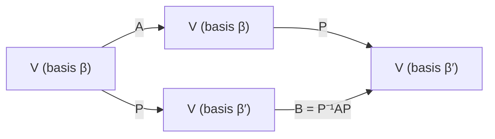

**Worked Example.** Dual basis of \(\beta=\{\langle1,1\rangle,\langle1,-1\rangle\}\subset\mathbb{R}^2\). Seek \(\beta^1=\langle a,b\rangle\) (as a functional \(x\mapsto ax_1+bx_2\)) with \(\beta^1(\beta_1)=a+b=1\), \(\beta^1(\beta_2)=a-b=0\Rightarrow a=b=\tfrac12\). So \(\beta^1=\tfrac12\langle1,1\rangle\); similarly \(\beta^2=\tfrac12\langle1,-1\rangle\). Check: \(\beta^2(\beta_1)=\tfrac12(1-1)=0\), \(\beta^2(\beta_2)=\tfrac12(1+1)=1\). ✓

**Exercises**

1. Find the matrix of \(D\) (differentiation) on \(P_2\) in the basis \(\{1,t,t^2\}\).

   <details><summary>Solution</summary>

   \(D1=0,\ Dt=1,\ Dt^2=2t\). Columns are coordinates of the images: \(A=\begin{pmatrix}0&1&0\\0&0&2\\0&0&0\end{pmatrix}\). (Nilpotent: \(A^3=0\), consistent with \(D^3=0\) on \(P_2\).) \(\blacksquare\)
   </details>

2. Prove \(\dim V^*=\dim V\) for finite-dimensional \(V\).

   <details><summary>Solution</summary>

   Given a basis \(\{\beta_i\}_{i=1}^n\), the dual functionals \(\{\beta^i\}\) are independent (\(\sum c_i\beta^i=0\Rightarrow\) evaluate at \(\beta_j\): \(c_j=0\)) and spanning (\(f=\sum f(\beta_i)\beta^i\), checked on each \(\beta_j\)). So \(\{\beta^i\}\) is a basis of \(V^*\) with \(n\) elements, giving \(\dim V^*=n=\dim V\). \(\blacksquare\)
   </details>

3. Prove that two matrices of the same operator in different bases are similar.

   <details><summary>Solution</summary>

   Let \(P\) be the matrix whose columns are the \(\beta'\)-vectors in \(\beta\)-coordinates (change of basis). Coordinates transform by \([\cdot]_\beta=P[\cdot]_{\beta'}\). If \(A,B\) represent \(T\) in \(\beta,\beta'\), then \(P B[\alpha]_{\beta'}=P[T\alpha]_{\beta'}=[T\alpha]_\beta=A[\alpha]_\beta=AP[\alpha]_{\beta'}\) for all \(\alpha\); hence \(PB=AP\), i.e. \(B=P^{-1}AP\). \(\blacksquare\)
   </details>

4. Compute the matrix of \(D\) on \(P_2\) in the basis \(\gamma=\{1,\ 1+t,\ 1+t+t^2\}\) using change of basis from \(\{1,t,t^2\}\).

   <details><summary>Solution</summary>

   \(P\) (columns = \(\gamma\)-vectors in the standard basis) \(=\begin{pmatrix}1&1&1\\0&1&1\\0&0&1\end{pmatrix}\), \(P^{-1}=\begin{pmatrix}1&-1&0\\0&1&-1\\0&0&1\end{pmatrix}\). With \(A\) from Exercise 1, \(B=P^{-1}AP=P^{-1}\begin{pmatrix}0&1&1\\0&0&2\\0&0&0\end{pmatrix}=\begin{pmatrix}0&1&-1\\0&0&2\\0&0&0\end{pmatrix}\). (Check: \(D(1+t)=1\), which in \(\gamma\)-coordinates is \(\langle1,0,0\rangle\) — the second column. ✓) \(\blacksquare\)
   </details>

5. Show the dual basis condition \(\beta^i(\beta_j)=\delta^i_j\) determines the \(\beta^i\) uniquely.

   <details><summary>Solution</summary>

   A functional \(f\in V^*\) is determined by its values on a basis. The conditions \(\beta^i(\beta_j)=\delta^i_j\) prescribe \(\beta^i\) on every basis vector \(\beta_j\), hence fix \(\beta^i\) completely; existence follows since we may *define* a functional by any assignment of values on a basis. \(\blacksquare\)
   </details>

### Advanced Level

#### Invariants: trace, determinant, and the double dual

**Intuition.** Trace and determinant are the two most important numbers attached to an operator precisely because they *ignore the choice of basis*. The double-dual map is the first example of a **natural** isomorphism — one built with no arbitrary choices — in contrast to \(V\cong V^*\), which requires a basis and is therefore "unnatural."

**Formal Definition.** \(\operatorname{tr}A=\sum a_{ii}\); \(\det A=\sum_{\sigma}(\operatorname{sgn}\sigma)\prod_i a_{i\sigma(i)}\), the unique alternating multilinear function of the columns with \(\det I=1\). The evaluation map \(\operatorname{ev}:V\to V^{**}\), \(\operatorname{ev}(\alpha)(f)=f(\alpha)\), is linear and injective, hence an isomorphism when \(\dim V<\infty\).

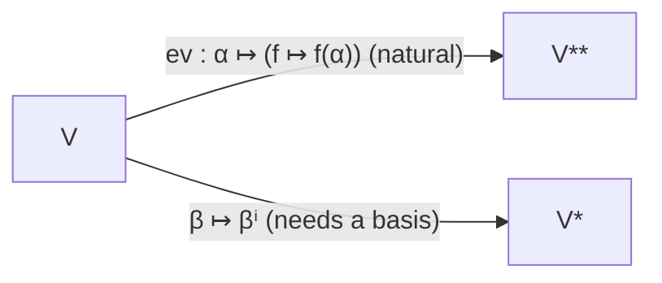

**Worked Example (trace is a similarity invariant).** First, \(\operatorname{tr}(AB)=\sum_i(AB)_{ii}=\sum_i\sum_k a_{ik}b_{ki}=\sum_k\sum_i b_{ki}a_{ik}=\sum_k(BA)_{kk}=\operatorname{tr}(BA)\). Then \(\operatorname{tr}(P^{-1}AP)=\operatorname{tr}\bigl((P^{-1}A)P\bigr)=\operatorname{tr}\bigl(P(P^{-1}A)\bigr)=\operatorname{tr}(A)\). So trace depends only on the operator, not the basis — it is a legitimate invariant.

**Exercises**

1. Prove \(\det(AB)=\det A\det B\) implies \(\det\) is a similarity invariant and detects invertibility.

   <details><summary>Solution</summary>

   \(\det(P^{-1}AP)=\det(P^{-1})\det A\det P=\det(P)^{-1}\det A\det P=\det A\) (using \(\det(P^{-1})\det P=\det I=1\)). And \(A\) invertible \(\Rightarrow AA^{-1}=I\Rightarrow\det A\det A^{-1}=1\Rightarrow\det A\neq0\); conversely \(\det A\neq0\) gives a nonzero product of pivots so \(A\) is invertible. \(\blacksquare\)
   </details>

2. Prove eigenvectors corresponding to distinct eigenvalues are linearly independent.

   <details><summary>Solution</summary>

   Suppose \(\alpha_1,\dots,\alpha_k\) are eigenvectors with distinct eigenvalues \(\lambda_1,\dots,\lambda_k\) and take a minimal dependence \(\sum_{i=1}^m c_i\alpha_i=0\) with all \(c_i\neq0\), \(m\) minimal. Apply \(T-\lambda_m I\): \(\sum_{i=1}^{m-1}c_i(\lambda_i-\lambda_m)\alpha_i=0\), a shorter dependence with nonzero coefficients (since \(\lambda_i\neq\lambda_m\)), contradicting minimality. Hence no nontrivial dependence exists. \(\blacksquare\)
   </details>

3. Prove the evaluation map \(\operatorname{ev}:V\to V^{**}\) is injective always, and an isomorphism when \(\dim V<\infty\).

   <details><summary>Solution</summary>

   Injectivity: if \(\operatorname{ev}(\alpha)=0\) then \(f(\alpha)=0\) for all \(f\in V^*\); but if \(\alpha\neq0\), extend \(\alpha\) to a basis and let \(f\) be the coordinate functional picking out \(\alpha\)'s component, giving \(f(\alpha)=1\neq0\) — contradiction. So \(\alpha=0\). In finite dimension \(\dim V^{**}=\dim V^*=\dim V\), and an injective linear map between equal finite dimensions is onto, hence an isomorphism. \(\blacksquare\)
   </details>

4. Prove \(\operatorname{tr}A\) equals the sum of eigenvalues and \(\det A\) their product (over \(\mathbb{C}\), with multiplicity).

   <details><summary>Solution</summary>

   The characteristic polynomial \(\chi_A(\lambda)=\det(\lambda I-A)=\prod_j(\lambda-\lambda_j)=\lambda^n-(\sum\lambda_j)\lambda^{n-1}+\dots+(-1)^n\prod\lambda_j\). Expanding \(\det(\lambda I-A)\) directly, the \(\lambda^{n-1}\) coefficient is \(-\sum a_{ii}=-\operatorname{tr}A\) and the constant term is \(\det(-A)=(-1)^n\det A\). Matching coefficients: \(\sum\lambda_j=\operatorname{tr}A\) and \(\prod\lambda_j=\det A\). \(\blacksquare\)
   </details>

5. Prove the Cayley–Hamilton theorem for a diagonalizable operator: \(\chi_T(T)=0\).

   <details><summary>Solution</summary>

   Diagonalizable: there is a basis of eigenvectors \(\alpha_j\), \(T\alpha_j=\lambda_j\alpha_j\). Then \(\chi_T(T)\alpha_j=\prod_k(T-\lambda_k I)\,\alpha_j\); the factor \((T-\lambda_j I)\) sends \(\alpha_j\mapsto0\), and the factors commute, so \(\chi_T(T)\alpha_j=0\) for every basis vector. A linear map vanishing on a basis is the zero map, so \(\chi_T(T)=0\). (The general case follows by density/limits or the adjugate identity.) \(\blacksquare\)
   </details>

### Research Level

#### Coordinate-free invariants, inertia, and naturality

**Intuition.** Trace and determinant are shadows of functorial constructions on multilinear/exterior algebra: trace is the canonical *contraction* \(V\otimes V^*\to\mathbb{R}\), and determinant is the action of \(T\) on the one-dimensional top exterior power \(\bigwedge^{n}V\). Recasting them this way makes their basis-independence a *theorem about functors* rather than a computation, and connects Chapter 2 directly to Chapter 7's exterior algebra.

**Formal Definition / Development.**

- **Trace as contraction.** The natural isomorphism \(\operatorname{End}(V)\cong V\otimes V^*\) followed by the evaluation pairing \(V\otimes V^*\to\mathbb{R}\), \(\alpha\otimes f\mapsto f(\alpha)\), is the trace; in coordinates it is \(\sum_i a_{ii}\), manifestly basis-free because the pairing is.
- **Determinant on the top power.** \(T:V\to V\) induces \(\bigwedge^{n}T:\bigwedge^{n}V\to\bigwedge^{n}V\); since \(\dim\bigwedge^{n}V=1\), this map is multiplication by a scalar, \(\det T\). Functoriality \(\bigwedge^n(ST)=\bigwedge^nS\,\bigwedge^nT\) gives \(\det(ST)=\det S\det T\) for free.

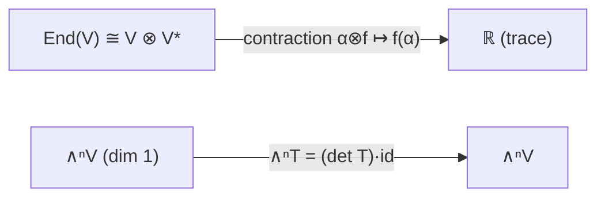

- **Naturality.** \(\operatorname{ev}:\mathrm{Id}\Rightarrow(-)^{**}\) is a natural isomorphism of functors on finite-dimensional spaces; there is **no** natural isomorphism \(\mathrm{Id}\Rightarrow(-)^*\) (the dual is *contravariant*), which is the precise sense in which "\(V\cong V^*\) requires a choice."
- **Sylvester's law of inertia.** A real symmetric form has a well-defined **signature** \((p,q)\) invariant under congruence \(A\mapsto P^{\mathsf T}AP\).

**Worked Example (inertia is well-defined).** Suppose \(Q\) is positive on a \(p\)-dimensional subspace \(U_+\) and negative-or-zero on an \((n-p')\)-dimensional subspace \(U_-\) with \(p'>p\). Then \(\dim U_+ +\dim U_-=p+(n-p')<n\)... rather, counting a second diagonalization giving \(p'\) positive squares, the subspaces \(U_+\) (positive) and \(W_-\) (nonpositive, dimension \(n-p'\)) would satisfy \(\dim U_++\dim W_->n\), forcing a nonzero common vector on which \(Q\) is both \(>0\) and \(\le0\) — a contradiction. Hence \(p=p'\); symmetrically \(q\) is fixed.

**Exercises**

1. Define the trace coordinate-free via \(\operatorname{End}(V)\cong V\otimes V^*\) and verify it equals \(\sum a_{ii}\).

   <details><summary>Solution</summary>

   Under \(\operatorname{End}(V)\cong V\otimes V^*\), the operator \(T\) corresponds to \(\sum_{i,j}a_{ij}\,\beta_i\otimes\beta^j\) (since \(T\beta_j=\sum_i a_{ij}\beta_i\)). The contraction \(c(\alpha\otimes f)=f(\alpha)\) gives \(c(T)=\sum_{i,j}a_{ij}\beta^j(\beta_i)=\sum_{i,j}a_{ij}\delta^j_i=\sum_i a_{ii}=\operatorname{tr}A\). The pairing \(f\mapsto f(\alpha)\) uses no basis, so the value is basis-independent. \(\blacksquare\)
   </details>

2. Show \(\det(ST)=\det S\det T\) follows from functoriality of \(\bigwedge^n\).

   <details><summary>Solution</summary>

   \(\bigwedge^n\) is a functor, so \(\bigwedge^n(ST)=\bigwedge^n S\circ\bigwedge^n T\). On the \(1\)-dimensional space \(\bigwedge^nV\) each side is a scalar: \(\bigwedge^n(ST)=\det(ST)\cdot\mathrm{id}\), \(\bigwedge^nS=\det S\cdot\mathrm{id}\), \(\bigwedge^nT=\det T\cdot\mathrm{id}\). Composing scalars multiplies them, so \(\det(ST)=\det S\det T\). \(\blacksquare\)
   </details>

3. Prove Sylvester's law of inertia: the signature \((p,q)\) of a real symmetric form is a congruence invariant.

   <details><summary>Solution</summary>

   Diagonalize by congruence to \(\operatorname{diag}(+1,\dots,+1,-1,\dots,-1,0,\dots)\) with \(p\) plus signs. Let \(U_+\) be the span of the positive coordinate axes (\(Q>0\) on \(U_+\setminus0\)) and \(U_{\le}\) the span of the negative and zero axes (\(Q\le0\) there), \(\dim U_{\le}=n-p\). For any *other* diagonalization with \(p'\) positive signs and subspace \(U'_+\) (\(Q>0\)), if \(p'>p\) then \(\dim U'_++\dim U_{\le}=p'+(n-p)>n\), so \(U'_+\cap U_{\le}\neq0\); a nonzero vector there has \(Q>0\) and \(Q\le0\) — impossible. Thus \(p'\le p\), and by symmetry \(p'=p\); likewise the count of negative signs \(q\) is fixed. The rank \(p+q\) is congruence-invariant too, so the zero count is determined. \(\blacksquare\)
   </details>

4. Explain, using functor language, why \(V\cong V^{**}\) is natural but \(V\cong V^*\) is not.

   <details><summary>Solution</summary>

   \((-)^{**}\) is a **covariant** functor and \(\operatorname{ev}_V:V\to V^{**}\) commutes with every linear map (\(\operatorname{ev}_W\circ T=T^{**}\circ\operatorname{ev}_V\)), so \(\operatorname{ev}\) is a natural transformation \(\mathrm{Id}\Rightarrow(-)^{**}\), iso in finite dimension. But \((-)^*\) is **contravariant**, so there is not even a candidate natural transformation \(\mathrm{Id}\Rightarrow(-)^*\) of functors of the same variance; any iso \(V\cong V^*\) must be chosen per space (e.g. via a basis or inner product) and fails to commute with all maps. Hence "\(V\cong V^*\) unnaturally, \(V\cong V^{**}\) naturally." \(\blacksquare\)
   </details>

5. Relate the coefficients of \(\chi_T\) to traces of exterior powers: show the \(\lambda^{n-k}\) coefficient is \((-1)^k\operatorname{tr}(\bigwedge^kT)\).

   <details><summary>Solution</summary>

   Over \(\mathbb{C}\), \(\chi_T(\lambda)=\prod_j(\lambda-\lambda_j)=\sum_{k=0}^n(-1)^k e_k(\lambda)\,\lambda^{n-k}\), where \(e_k\) is the \(k\)-th elementary symmetric polynomial in the eigenvalues \(\lambda_j\). The eigenvalues of \(\bigwedge^kT\) are the products \(\lambda_{i_1}\cdots\lambda_{i_k}\) over \(i_1<\dots<i_k\), so \(\operatorname{tr}(\bigwedge^kT)=\sum_{i_1<\dots<i_k}\lambda_{i_1}\cdots\lambda_{i_k}=e_k(\lambda)\). Therefore the \(\lambda^{n-k}\) coefficient of \(\chi_T\) is \((-1)^k\operatorname{tr}(\bigwedge^kT)\); in particular \(k=1\) gives \(-\operatorname{tr}T\) and \(k=n\) gives \((-1)^n\det T\). \(\blacksquare\)
   </details>

**Further reading:** Loomis–Sternberg Ch. 2; [Basis (linear algebra) — Wikipedia](https://en.wikipedia.org/wiki/Basis_(linear_algebra)), [Dual space — Wikipedia](https://en.wikipedia.org/wiki/Dual_space), [Determinant — Wikipedia](https://en.wikipedia.org/wiki/Determinant), [Sylvester's law of inertia — Wikipedia](https://en.wikipedia.org/wiki/Sylvester%27s_law_of_inertia).

---

## Chapter 3 — The Differential Calculus

This is the analytic core of the book. Its decisive idea: **the derivative of a map \(F:V\to W\) between normed spaces is a linear map** \(dF_\alpha\) — the best linear approximation to the increment \(\Delta F_\alpha(\xi)=F(\alpha+\xi)-F(\alpha)\). Everything classical (partials, gradient, Jacobian, chain rule, mean-value theorem, implicit/inverse function theorems, Lagrange multipliers, Taylor's formula) becomes a statement about this one linear object, valid even in infinite dimensions where it is the "first variation" of the calculus of variations.

**Key Concepts**

1. **Norms and normed spaces.** A *norm* on \(V\) satisfies **n1** \(\|\alpha\|>0\) for \(\alpha\neq0\), **n2** \(\|x\alpha\|=|x|\,\|\alpha\|\), **n3** \(\|\alpha+\beta\|\le\|\alpha\|+\|\beta\|\). Standard norms on \(\mathbb{R}^n\): \(\|x\|_1=\sum|x_i|\), \(\|x\|_2=(\sum x_i^2)^{1/2}\), \(\|x\|_\infty=\max|x_i|\). On \(C([a,b])\): \(\|f\|_1=\int|f|\), \(\|f\|_2=(\int|f|^2)^{1/2}\), \(\|f\|_\infty=\max|f|\). Distance \(\|\alpha-\beta\|\); open ball \(B_r(\alpha)\); *open* = every point interior; *closed* = complement open.
2. **Continuity and bounded linear maps.** \(f\) is *continuous at \(\alpha\)* if \(\forall\varepsilon\,\exists\delta:\ \|\xi-\alpha\|<\delta\Rightarrow\|f(\xi)-f(\alpha)\|<\varepsilon\). **Theorem 3.1.** For **linear** \(T\), continuous \(\iff\) continuous at one point \(\iff\) *bounded* (\(\|T\xi\|\le C\|\xi\|\)). The least such \(C\) is the **operator norm** \(\|T\|=\mathrm{lub}\{\|T\alpha\|/\|\alpha\|:\alpha\neq0\}\).
3. **The \(o\) and \(O\) classes.** \(g\in o(V,W)\) ("little-o") if \(\|g(\xi)\|/\|\xi\|\to0\) as \(\xi\to0\); \(g\in O(V,W)\) ("big-O") if \(\|g(\xi)\|/\|\xi\|\) is bounded near \(0\). The **\(O\!\cdot\! o\)-theorem** records the closure/absorption rules (e.g. \(O\circ o\subset o\), \(o+o\subset o\), a bounded linear map composed with \(o\) stays \(o\)) that drive every differentiation rule.
4. **The differential.** \(F:A\to W\) (\(A\) a neighborhood of \(\alpha\) in \(V\)) is **differentiable at \(\alpha\)** if there is \(T\in\operatorname{Hom}(V,W)\) with
\[ \Delta F_\alpha(\xi)=F(\alpha+\xi)-F(\alpha)=T(\xi)+o(\xi). \]
\(T\) is unique, written \(dF_\alpha\) (the *differential*, or *first variation* when \(V\) is a function space). Notation: \(\mathfrak{D}_\alpha(V,W)\) = maps differentiable at \(\alpha\).
5. **Differentiation rules (Thm 6.1).** \(d(F+G)_\alpha=dF_\alpha+dG_\alpha\); constants have \(dF_\alpha=0\); a linear \(T\) has \(dT_\alpha=T\) everywhere; a product (via a bilinear map) obeys \(d(FG)_\alpha=F(\alpha)\,dG_\alpha+dF_\alpha\,G(\alpha)\).
6. **Chain rule (Thm 6.2).** If \(F\in\mathfrak{D}_\alpha(V,W)\) and \(G\in\mathfrak{D}_{F(\alpha)}(W,X)\), then \(G\circ F\in\mathfrak{D}_\alpha(V,X)\) and
\[ d(G\circ F)_\alpha=dG_{F(\alpha)}\circ dF_\alpha. \]
7. **Coordinates: partials, gradient, Jacobian.** The *directional derivative* \(D_\xi F(\alpha)=\lim_{t\to0}\tfrac1t\bigl(F(\alpha+t\xi)-F(\alpha)\bigr)=dF_\alpha(\xi)\). For \(F:\mathbb{R}^n\to\mathbb{R}^m\), \(dF_\alpha\) has matrix the **Jacobian** \(\bigl[\partial F_i/\partial x_j\bigr]\); for scalar \(f\), \(df_\alpha(\xi)=\nabla f(\alpha)\cdot\xi\). **Mean-value inequality:** \(\|F(\beta)-F(\alpha)\|\le\bigl(\sup_{[\alpha,\beta]}\|dF\|\bigr)\|\beta-\alpha\|\).
8. **Inverse & implicit function theorems.** If \(dF_\alpha\) is a bounded invertible linear map (and \(F\) is \(C^1\)), then \(F\) is a local diffeomorphism near \(\alpha\); equivalently \(G(\xi,\eta)=0\) with \(d_\eta G\) invertible defines \(\eta=\varphi(\xi)\) locally. (Proved via the contraction-mapping theorem — Chapter 4.)
9. **Lagrange multipliers.** At a smooth extremum of \(f\) constrained to \(\{g_1=\dots=g_k=0\}\) with independent \(dg_i\), \(\ df_\alpha=\sum_i\lambda_i\,d(g_i)_\alpha\).
10. **Second differential; Taylor; critical points.** \(d^2F_\alpha\) is a symmetric bilinear map; **Taylor:** \(F(\alpha+\xi)=F(\alpha)+dF_\alpha(\xi)+\tfrac12 d^2F_\alpha(\xi,\xi)+o(\|\xi\|^2)\). A critical point (\(df_\alpha=0\)) is a min/max/saddle according to the **signature** of the Hessian \(d^2f_\alpha\).

### Beginner Level

#### The derivative as best linear approximation

**Intuition.** The single idea unifying all of differential calculus: near a point, a smooth function *looks linear*. In one variable the tangent line \(y=f(a)+f'(a)(x-a)\) hugs the graph; the derivative \(f'(a)\) is the slope of the unique line matching \(f\) to first order. In several variables the tangent *plane* plays the same role, and its "slopes" are the partial derivatives. The differential just packages those slopes into one linear map.

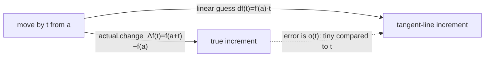

**Formal Definition.** \(f\) is differentiable at \(a\) with derivative \(f'(a)\) if \(\Delta f_a(t)=f(a+t)-f(a)=f'(a)\,t+o(t)\), i.e. \(\dfrac{f(a+t)-f(a)}{t}\to f'(a)\). For \(f(x,y)\) the **partial derivatives** \(f_x=\partial f/\partial x\), \(f_y=\partial f/\partial y\) are ordinary derivatives holding the other variable fixed, and the tangent plane is \(z=f(a,b)+f_x(a,b)(x-a)+f_y(a,b)(y-b)\).

**Worked Example.** Approximate \((2.01)^3\). With \(f(x)=x^3\), \(f'(x)=3x^2\), at \(a=2\): \(f(2)=8\), \(f'(2)=12\). Linear approximation \(f(2+t)\approx8+12t\) with \(t=0.01\) gives \(8+0.12=8.12\). (Exact \(8.120601\); the error \(0.0006\approx3\cdot2\cdot t^2\) is the promised \(o(t)\).)

**Exercises**

1. Use the differential of \(f(x)=\sqrt x\) at \(a=4\) to approximate \(\sqrt{4.1}\).

   <details><summary>Solution</summary>

   \(f'(x)=\tfrac1{2\sqrt x}\), \(f'(4)=\tfrac14\). \(\sqrt{4.1}\approx f(4)+f'(4)(0.1)=2+0.025=2.025\). (Exact \(2.02485\ldots\)) \(\blacksquare\)
   </details>

2. For \(f(x,y)=x^2+xy\), find \(f_x,f_y\) and the tangent plane at \((1,2)\).

   <details><summary>Solution</summary>

   \(f_x=2x+y\), \(f_y=x\); at \((1,2)\): \(f=3\), \(f_x=4\), \(f_y=1\). Tangent plane \(z=3+4(x-1)+1(y-2)=4x+y-3\). \(\blacksquare\)
   </details>

3. Compute \(\nabla f\) for \(f(x,y,z)=x^2+y^2+z^2\) and the directional derivative at \((1,0,0)\) in the unit direction \(\tfrac1{\sqrt2}\langle1,1,0\rangle\).

   <details><summary>Solution</summary>

   \(\nabla f=\langle2x,2y,2z\rangle\); at \((1,0,0)\), \(\nabla f=\langle2,0,0\rangle\). Directional derivative \(=\nabla f\cdot u=\langle2,0,0\rangle\cdot\tfrac1{\sqrt2}\langle1,1,0\rangle=\tfrac{2}{\sqrt2}=\sqrt2\). \(\blacksquare\)
   </details>

4. Show the linear approximation of \(f(x,y)=e^{x+y}\) at the origin is \(1+x+y\).

   <details><summary>Solution</summary>

   \(f(0,0)=1\), \(f_x=f_y=e^{x+y}\), both \(=1\) at the origin. So \(f\approx1+1\cdot x+1\cdot y=1+x+y\). \(\blacksquare\)
   </details>

5. The radius of a sphere is measured as \(10\) with error up to \(0.05\). Use the differential of \(V=\tfrac43\pi r^3\) to estimate the resulting error in volume.

   <details><summary>Solution</summary>

   \(dV=4\pi r^2\,dr\). At \(r=10\), \(dr=0.05\): \(dV=4\pi(100)(0.05)=20\pi\approx62.8\). So the volume error is about \(63\) cubic units (relative error \(3\,dr/r=1.5\%\)). \(\blacksquare\)
   </details>

### Intermediate Level

#### Differential, Jacobian, and the chain rule

**Intuition.** For a map \(F:\mathbb{R}^n\to\mathbb{R}^m\), the differential \(dF_\alpha\) *is* the Jacobian matrix acting on increment vectors. The chain rule then says: to linearize a composite, **multiply the Jacobians** — the derivative is a functor from "smooth maps and composition" to "linear maps and matrix product."

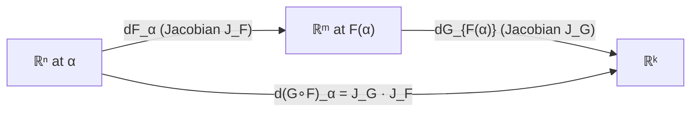

**Formal Definition.** \(dF_\alpha:\mathbb{R}^n\to\mathbb{R}^m\) has matrix \(J_F(\alpha)=\bigl[\partial F_i/\partial x_j\bigr]\); for scalar \(f\), \(df_\alpha(\xi)=\nabla f(\alpha)\cdot\xi\). Chain rule: \(d(G\circ F)_\alpha=dG_{F(\alpha)}\circ dF_\alpha\), i.e. \(J_{G\circ F}=J_G\,J_F\).

**Worked Example.** Polar coordinates \(F(r,\theta)=(r\cos\theta,\ r\sin\theta)\). Jacobian \(J_F=\begin{pmatrix}\cos\theta&-r\sin\theta\\\sin\theta&r\cos\theta\end{pmatrix}\), \(\det J_F=r\cos^2\theta+r\sin^2\theta=r\). The factor \(r\) is exactly the area element \(dA=r\,dr\,d\theta\) — the differential's determinant measures local area scaling.

**Exercises**

1. Compute the Jacobian and its determinant for \(F(x,y)=(x^2-y^2,\ 2xy)\) at \((1,1)\); interpret.

   <details><summary>Solution</summary>

   \(J_F=\begin{pmatrix}2x&-2y\\2y&2x\end{pmatrix}\), at \((1,1)\): \(\begin{pmatrix}2&-2\\2&2\end{pmatrix}\), \(\det=8\). This \(F\) is \(z\mapsto z^2\) in complex notation; \(dF\) is multiplication by \(2z=2+2i\) (a rotation-scaling), and \(|2z|^2=8\) is the area factor. \(\blacksquare\)
   </details>

2. Verify the chain rule for \(F(t)=(t,t^2)\), \(g(x,y)=x^2+y^2\): compute \((g\circ F)'\) directly and via Jacobians.

   <details><summary>Solution</summary>

   Direct: \(g(F(t))=t^2+t^4\), derivative \(2t+4t^3\). Via chain rule: \(\nabla g=\langle2x,2y\rangle=\langle2t,2t^2\rangle\), \(F'(t)=\langle1,2t\rangle\); \(\nabla g\cdot F'=2t\cdot1+2t^2\cdot2t=2t+4t^3\). ✓ \(\blacksquare\)
   </details>

3. For \(F:\mathbb{R}^2\to\mathbb{R}^2\), \(F(x,y)=(e^x\cos y,\ e^x\sin y)\), show \(dF_\alpha\) is invertible everywhere and find \(\det J_F\).

   <details><summary>Solution</summary>

   \(J_F=\begin{pmatrix}e^x\cos y&-e^x\sin y\\e^x\sin y&e^x\cos y\end{pmatrix}\), \(\det=e^{2x}(\cos^2y+\sin^2y)=e^{2x}>0\) for all \((x,y)\). So \(dF_\alpha\) is invertible everywhere ( \(F\) is the complex exponential, a local diffeomorphism, though not globally injective). \(\blacksquare\)
   </details>

4. Find and classify the critical points of \(f(x,y)=x^2+y^2-2x-4y\).

   <details><summary>Solution</summary>

   \(\nabla f=\langle2x-2,\ 2y-4\rangle=0\Rightarrow(x,y)=(1,2)\). Hessian \(\begin{pmatrix}2&0\\0&2\end{pmatrix}\) is positive definite, so \((1,2)\) is a strict local (indeed global) **minimum**, \(f(1,2)=-5\). \(\blacksquare\)
   </details>

5. Prove the mean-value inequality \(\|F(\beta)-F(\alpha)\|\le M\|\beta-\alpha\|\) where \(M=\sup_{[\alpha,\beta]}\|dF\|\), assuming \(F\) is \(C^1\) on the segment.

   <details><summary>Solution</summary>

   Let \(\varphi(t)=F(\alpha+t(\beta-\alpha))\), \(t\in[0,1]\). By the chain rule \(\varphi'(t)=dF_{\alpha+t(\beta-\alpha)}(\beta-\alpha)\), so \(\|\varphi'(t)\|\le\|dF\|\,\|\beta-\alpha\|\le M\|\beta-\alpha\|\). Then \(\|F(\beta)-F(\alpha)\|=\bigl\|\int_0^1\varphi'(t)\,dt\bigr\|\le\int_0^1\|\varphi'(t)\|\,dt\le M\|\beta-\alpha\|\). \(\blacksquare\)
   </details>

### Advanced Level

#### The differential in normed spaces: definition, uniqueness, and the rules

**Intuition.** Loomis–Sternberg define the derivative with **no coordinates at all**: it is the unique bounded linear map whose error against the true increment is negligible (little-o) compared to the displacement. Uniqueness and every differentiation rule then fall out of the algebra of the \(o\)/\(O\) classes rather than \(\varepsilon\)–\(\delta\) gymnastics.

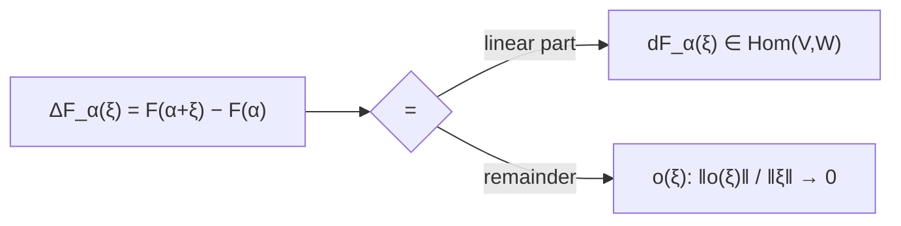

**Formal Definition.** \(F\in\mathfrak{D}_\alpha(V,W)\) iff \(\exists\,T\in\operatorname{Hom}(V,W)\) (bounded) with \(\Delta F_\alpha=T+o\); then \(dF_\alpha:=T\).

**Worked Example (uniqueness of the differential).** *If \(\Delta F_\alpha=T+o=S+o\), then \(T=S\).*

**Step 1.** Subtracting, \(T-S=o_1-o_2\in o(V,W)\) (since \(o+o\subset o\)), and \(T-S\) is linear. **Step 2.** A linear map that is little-o must be \(0\): for any \(\xi\neq0\) and small \(t>0\), \(\dfrac{\|(T-S)(t\xi)\|}{\|t\xi\|}=\dfrac{|t|\,\|(T-S)\xi\|}{|t|\,\|\xi\|}=\dfrac{\|(T-S)\xi\|}{\|\xi\|}\), a *constant* in \(t\); for it to \(\to0\) as \(t\to0\) it must already be \(0\), so \((T-S)\xi=0\). **Step 3.** Hence \(T-S=0\), i.e. \(T=S\). \(\blacksquare\)

**Exercises**

1. Prove \(d(F+G)_\alpha=dF_\alpha+dG_\alpha\) directly from the definition.

   <details><summary>Solution</summary>

   \(\Delta(F+G)_\alpha=\Delta F_\alpha+\Delta G_\alpha=(dF_\alpha+o_1)+(dG_\alpha+o_2)=(dF_\alpha+dG_\alpha)+(o_1+o_2)\). Since \(o_1+o_2\in o\) and \(dF_\alpha+dG_\alpha\) is bounded linear, uniqueness gives \(d(F+G)_\alpha=dF_\alpha+dG_\alpha\). \(\blacksquare\)
   </details>

2. Prove the chain rule \(d(G\circ F)_\alpha=dG_{F(\alpha)}\circ dF_\alpha\).

   <details><summary>Solution</summary>

   Write \(\beta=F(\alpha)\), \(\Delta F_\alpha(\xi)=dF_\alpha\xi+o_1(\xi)=:\eta\) and \(\Delta G_\beta(\eta)=dG_\beta\eta+o_2(\eta)\). Then
   \(\Delta(G\circ F)_\alpha(\xi)=\Delta G_\beta(\Delta F_\alpha(\xi))=dG_\beta\bigl(dF_\alpha\xi+o_1(\xi)\bigr)+o_2(\eta)=dG_\beta\,dF_\alpha\,\xi+\underbrace{dG_\beta\,o_1(\xi)+o_2(\eta)}_{\text{remainder}}.\)
   Now \(dG_\beta\circ o_1\in o\) (bounded linear \(\circ\) little-o), and \(o_2\circ\eta\in o\) because \(\eta=\Delta F_\alpha\in O\) (differentiable \(\Rightarrow\) big-O) so \(o_2\circ O\subset o\). Hence the remainder is \(o(\xi)\), and by uniqueness \(d(G\circ F)_\alpha=dG_\beta\circ dF_\alpha\). \(\blacksquare\)
   </details>

3. Prove the product rule: if \(F:V\to\mathbb{R}\), \(G:V\to W\) are differentiable, then \(d(FG)_\alpha=F(\alpha)\,dG_\alpha+dF_\alpha\,G(\alpha)\) (the last term a dyad).

   <details><summary>Solution</summary>

   \(\Delta(FG)_\alpha(\xi)=F(\alpha+\xi)G(\alpha+\xi)-F(\alpha)G(\alpha)\). Add and subtract \(F(\alpha)G(\alpha+\xi)\):
   \(=\Delta F_\alpha(\xi)\,G(\alpha+\xi)+F(\alpha)\,\Delta G_\alpha(\xi)\). Substitute \(\Delta F=dF_\alpha+o_1\), \(\Delta G=dG_\alpha+o_2\), \(G(\alpha+\xi)=G(\alpha)+O\): the leading terms give \(dF_\alpha(\xi)\,G(\alpha)+F(\alpha)\,dG_\alpha(\xi)\), and all cross terms (\(o\cdot O\), \(F\cdot o\), \(dF\cdot O\)-with-\(O\to\)higher order) lie in \(o(V,W)\) by the \(O\!\cdot\!o\)-theorem. Uniqueness finishes it. \(\blacksquare\)
   </details>

4. State the inverse function theorem precisely and explain how invertibility of \(dF_\alpha\) enters.

   <details><summary>Solution</summary>

   *Theorem.* Let \(F:A\to W\) be \(C^1\) on an open \(A\subset V\) (Banach), \(\alpha\in A\), and suppose \(dF_\alpha\in\operatorname{Hom}(V,W)\) is a bounded linear map with bounded inverse. Then there are neighborhoods \(U\ni\alpha\), \(U'\ni F(\alpha)\) such that \(F:U\to U'\) is a bijection with \(C^1\) inverse, and \(d(F^{-1})_{F(\alpha)}=(dF_\alpha)^{-1}\). *Role of \(dF_\alpha\):* one reduces to a fixed-point problem \(x=x+(dF_\alpha)^{-1}(y-F(x))=:\Phi_y(x)\); invertibility of \(dF_\alpha\) makes \(\Phi_y\) a contraction near \(\alpha\) (its differential is \(I-(dF_\alpha)^{-1}dF_x\approx0\)), so the contraction-mapping theorem yields a unique local solution \(x=F^{-1}(y)\). \(\blacksquare\)
   </details>

5. Prove the Lagrange multiplier condition: if \(\alpha\) extremizes \(f\) on \(M=\{g=0\}\) (scalar \(g\), \(dg_\alpha\neq0\)), then \(df_\alpha=\lambda\,dg_\alpha\) for some \(\lambda\).

   <details><summary>Solution</summary>

   The tangent space to \(M\) at \(\alpha\) is \(\ker dg_\alpha\). For any curve \(\gamma(t)\) in \(M\) with \(\gamma(0)=\alpha\), \(f\circ\gamma\) has a critical point at \(0\), so \(0=(f\circ\gamma)'(0)=df_\alpha(\gamma'(0))\); as \(\gamma'(0)\) ranges over \(\ker dg_\alpha\), \(df_\alpha\) vanishes on \(\ker dg_\alpha\). Hence \(df_\alpha\) is a scalar multiple of \(dg_\alpha\) (two functionals with the same kernel of codimension 1 are proportional): \(df_\alpha=\lambda\,dg_\alpha\). For several constraints, \(df_\alpha\in\operatorname{span}\{dg_i\}_\alpha\). \(\blacksquare\)
   </details>

### Research Level

#### Fréchet vs Gâteaux, the calculus of variations, and Morse theory

**Intuition.** The abstract differential really shines in **infinite dimensions**: the "derivative" of a functional \(J[y]=\int L\) on a space of functions is its *first variation*, and setting it to zero is the Euler–Lagrange equation — the entire calculus of variations is differential calculus on a Banach space. Subtleties appear: directional (Gâteaux) differentiability is weaker than full (Fréchet) differentiability, and the *second* differential's signature controls the nature of critical points (Morse theory).

**Formal Definition / Development.**

- **Gâteaux vs Fréchet.** The *Gâteaux* derivative is \(D_\xi F(\alpha)=\lim_{t\to0}\tfrac1t[F(\alpha+t\xi)-F(\alpha)]\) (directional, may be nonlinear/discontinuous in \(\xi\)); the *Fréchet* derivative is the book's \(dF_\alpha\), requiring the single **uniform** linear approximation \(\Delta F_\alpha=dF_\alpha+o\). Fréchet \(\Rightarrow\) Gâteaux with \(D_\xi F=dF_\alpha(\xi)\); the converse fails.
- **First variation / Euler–Lagrange.** For \(J[y]=\int_a^b L(x,y,y')\,dx\) on \(\{y:y(a)=y_0,y(b)=y_1\}\), the first variation in direction \(h\) (with \(h(a)=h(b)=0\)) is \(dJ_y(h)=\int_a^b\bigl(L_y-\tfrac{d}{dx}L_{y'}\bigr)h\,dx\); \(dJ_y=0\) for all \(h\) forces the **Euler–Lagrange equation** \(L_y-\tfrac{d}{dx}L_{y'}=0\).

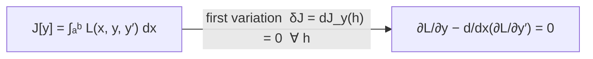

- **Second differential and Morse.** At a critical point, Taylor gives \(F(\alpha+\xi)=F(\alpha)+\tfrac12 d^2F_\alpha(\xi,\xi)+o(\|\xi\|^2)\); if \(d^2F_\alpha\) (the Hessian) is *nondegenerate* with signature \((p,q)\), the **Morse lemma** puts \(F\) in the normal form \(F(\alpha)-\sum_{i\le q}u_i^2+\sum_{j\le p}v_j^2\) in suitable coordinates — the index \(q\) classifies the critical point.

**Worked Example (Euler–Lagrange for arclength ⇒ straight lines).** \(L=\sqrt{1+y'^2}\), independent of \(y\), so \(L_y=0\) and E–L reads \(\tfrac{d}{dx}\dfrac{y'}{\sqrt{1+y'^2}}=0\), i.e. \(\dfrac{y'}{\sqrt{1+y'^2}}=\text{const}\Rightarrow y'=\text{const}\). The extremals of arclength are straight lines — geodesics of the plane, recovered purely from the vanishing first variation.

**Exercises**

1. Give a function \(f:\mathbb{R}^2\to\mathbb{R}\) that is Gâteaux differentiable at \(0\) but not Fréchet differentiable there.

   <details><summary>Solution</summary>

   \(f(x,y)=\dfrac{x^3}{x^2+y^2}\) (\(f(0,0)=0\)). Along any line \((x,y)=t\,u\), \(f(tu)=t\dfrac{u_1^3}{u_1^2+u_2^2}\), so \(\tfrac1t f(tu)\to\dfrac{u_1^3}{|u|^2}\): every directional (Gâteaux) derivative exists, but it is **not linear** in \(u\), so no single linear \(df_0\) can reproduce all directions — \(f\) is not Fréchet differentiable at \(0\). (Equivalently, the candidate \(df_0=0\) fails since \(f(x,x)/\|(x,x)\|\not\to0\).) \(\blacksquare\)
   </details>

2. Derive the Euler–Lagrange equation from \(dJ_y(h)=0\) for all admissible \(h\).

   <details><summary>Solution</summary>

   \(\dfrac{d}{ds}\Big|_{0}J[y+sh]=\int_a^b\bigl(L_y\,h+L_{y'}\,h'\bigr)dx\). Integrate the second term by parts: \(\int L_{y'}h'=[L_{y'}h]_a^b-\int\tfrac{d}{dx}(L_{y'})\,h\), and the boundary term vanishes since \(h(a)=h(b)=0\). Thus \(dJ_y(h)=\int_a^b\bigl(L_y-\tfrac{d}{dx}L_{y'}\bigr)h\,dx=0\) for all such \(h\). By the fundamental lemma of the calculus of variations (if \(\int\phi h=0\) for all smooth \(h\) vanishing at endpoints then \(\phi\equiv0\)), \(L_y-\tfrac{d}{dx}L_{y'}=0\). \(\blacksquare\)
   </details>

3. State Taylor's formula with the second differential and prove the second-derivative test: \(d^2f_\alpha\) positive definite \(\Rightarrow\) strict local minimum.

   <details><summary>Solution</summary>

   Taylor: \(f(\alpha+\xi)=f(\alpha)+df_\alpha(\xi)+\tfrac12 d^2f_\alpha(\xi,\xi)+o(\|\xi\|^2)\). At a critical point \(df_\alpha=0\). If \(d^2f_\alpha\) is positive definite there is \(m>0\) with \(d^2f_\alpha(\xi,\xi)\ge m\|\xi\|^2\); choosing \(\|\xi\|\) small enough that the \(o(\|\xi\|^2)\) term is \(<\tfrac{m}{4}\|\xi\|^2\) in size, \(f(\alpha+\xi)-f(\alpha)\ge\tfrac{m}{2}\|\xi\|^2-\tfrac{m}{4}\|\xi\|^2=\tfrac{m}{4}\|\xi\|^2>0\). Hence \(\alpha\) is a strict local minimum. \(\blacksquare\)
   </details>

4. Show the contraction-mapping approach to the inverse function theorem requires only that \(dF_\alpha\) be boundedly invertible and \(dF\) continuous at \(\alpha\).

   <details><summary>Solution</summary>

   Normalize \(A:=dF_\alpha\). Define \(\Phi_y(x)=x-A^{-1}(F(x)-y)\); a fixed point solves \(F(x)=y\). Its differential is \(I-A^{-1}dF_x=A^{-1}(A-dF_x)\); by continuity of \(dF\) at \(\alpha\) there is a ball where \(\|A-dF_x\|\le\tfrac1{2\|A^{-1}\|}\), so \(\|d\Phi_y\|\le\tfrac12\) and \(\Phi_y\) is a contraction (mean-value inequality). The contraction-mapping theorem gives a unique local solution depending continuously (indeed \(C^1\)) on \(y\), with \(d(F^{-1})=(dF)^{-1}\). Only bounded invertibility of \(A\) and local continuity of \(dF\) were used. \(\blacksquare\)
   </details>

5. Explain in what precise sense the calculus of variations "is" the differential calculus on an infinite-dimensional space (the book's remark that \(dJ_y\) is the *first variation*).

   <details><summary>Solution</summary>

   Take \(V=C^1_0([a,b])\) (functions vanishing at the endpoints) as a normed space with \(\|h\|=\|h\|_\infty+\|h'\|_\infty\), and regard \(J:y_0+V\to\mathbb{R}\). Then \(J\) is Fréchet differentiable with \(\Delta J_y(h)=dJ_y(h)+o(\|h\|)\), where \(dJ_y(h)=\int(L_y-\tfrac{d}{dx}L_{y'})h\,dx\) is a **bounded linear functional on \(V\)** — exactly the differential \(dJ_y\in V^*\) of Chapter 3, now on an infinite-dimensional domain. "First variation \(=0\)" is literally "\(dJ_y=0\)", i.e. \(y\) is a critical point of \(J\); Euler–Lagrange is the Riesz-type representation of that functional. The early variationalists saw the analogy but, as Loomis–Sternberg note, "did not realize it was the same subject." \(\blacksquare\)
   </details>

**Further reading:** Loomis–Sternberg Ch. 3; [Fréchet derivative — Wikipedia](https://en.wikipedia.org/wiki/Fr%C3%A9chet_derivative), [Total derivative — Wikipedia](https://en.wikipedia.org/wiki/Total_derivative), [Inverse function theorem — Wikipedia](https://en.wikipedia.org/wiki/Inverse_function_theorem), [Lagrange multiplier — Wikipedia](https://en.wikipedia.org/wiki/Lagrange_multiplier), [Euler–Lagrange equation — Wikipedia](https://en.wikipedia.org/wiki/Euler%E2%80%93Lagrange_equation).

---

## Chapter 4 — Compactness and Completeness

The differential calculus of Chapter 3 wrote checks that only **completeness** can cash: the inverse and implicit function theorems, and later the existence theorem for ODEs, all rest on the ability to *pass to a limit*. This chapter supplies the two topological pillars — **compactness** (every sequence has a convergent subsequence; continuous functions attain extrema and are uniformly continuous) and **completeness** (Cauchy sequences converge) — culminating in the elegant **contraction-mapping fixed-point theorem**.

**Key Concepts**

1. **Metric space.** \((X,\rho)\) with \(\rho\ge0\), \(\rho(x,y)=0\iff x=y\), \(\rho(x,y)=\rho(y,x)\), and \(\rho(x,z)\le\rho(x,y)+\rho(y,z)\). A norm induces the metric \(\rho(\alpha,\beta)=\|\alpha-\beta\|\). *Open/closed* sets, interior, closure as in Chapter 3.
2. **Sequential convergence.** \(x_n\to x\) iff \(\rho(x_n,x)\to0\). A set is **closed** iff it contains the limit of every convergent sequence of its points.
3. **Compactness.** \(X\) is *(sequentially) compact* if every sequence has a subsequence converging in \(X\). **Heine–Borel:** in \(\mathbb{R}^n\), compact \(\iff\) closed and bounded (via **Bolzano–Weierstrass**). *Continuous image of compact is compact*, so a continuous real function on a compact set **attains its max and min** (extreme-value theorem).
4. **Uniform continuity.** A continuous function on a **compact** metric space is *uniformly* continuous (one \(\delta\) works everywhere).
5. **Equicontinuity — Arzelà–Ascoli.** A family \(\mathcal F\subset C(K)\) (\(K\) compact) is relatively compact in the sup norm **iff** it is uniformly bounded and *equicontinuous*.
6. **Completeness.** \(\{x_n\}\) is *Cauchy* if \(\rho(x_m,x_n)\to0\); \(X\) is **complete** if every Cauchy sequence converges. A complete normed space is a **Banach space**; \(\mathbb{R}^n\) and \(C(K)\) (sup norm) are Banach. A *Banach algebra* adds a submultiplicative product.
7. **Contraction-mapping theorem (Thm 9.1).** If \(X\) is a nonempty **complete** metric space and \(K:X\to X\) is a *contraction* (\(\rho(Kx,Ky)\le C\,\rho(x,y)\), \(0<C<1\)), then \(K\) has a **unique** fixed point \(x^*\), and \(x_n=K^n(x_0)\to x^*\) with \(\rho(x_n,x^*)\le\frac{C^n}{1-C}\rho(x_1,x_0)\). This drives the implicit/inverse function theorems (Thms 9.3–9.4) and ODE existence.
8. **The complex numbers.** \(\mathbb{C}=\mathbb{R}^2\) with \((a,b)(c,d)=(ac-bd,\ ad+bc)\) is a complete field; \(|z|\) is the Euclidean norm.

### Beginner Level

#### Distance, convergence, open and closed sets

**Intuition.** A *metric* is just a rule for the distance between two points that behaves like ordinary distance (never negative, symmetric, and no shortcut through a third point). Once you can measure distance you can say what "getting arbitrarily close" (convergence) means, and which sets contain their own edges (**closed**) versus consist purely of interior (**open**). The crucial finiteness property is **compactness**: a set so "small at infinity" that no sequence can escape — every sequence has a subsequence that settles down.

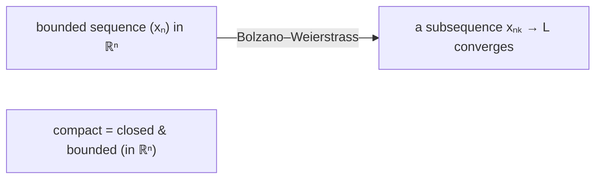

**Formal Definition.** \(x_n\to x\) iff \(\forall\varepsilon\,\exists N:\ n\ge N\Rightarrow\rho(x_n,x)<\varepsilon\). A set \(A\) is *open* if every point has a ball inside \(A\); *closed* if its complement is open (equivalently, closed under sequential limits). \(A\subset\mathbb{R}^n\) is *compact* iff closed and bounded.

**Worked Example.** Classify \((0,1),[0,1],[0,1),\{1/n:n\ge1\}\subset\mathbb{R}\). \((0,1)\) is **open** (every point has room on both sides). \([0,1]\) is **closed** and bounded, hence **compact**. \([0,1)\) is **neither** ( \(0\) is interior-side included but \(1\) is a missing limit — the sequence \(1-1/n\) has no limit inside). \(\{1/n\}\) is **not closed** (its limit \(0\) is absent); adding \(0\) makes \(\{0\}\cup\{1/n\}\) compact.

**Exercises**

1. Verify \(\rho(x,y)=|x-y|\) is a metric on \(\mathbb{R}\); which axiom is the triangle inequality?

   <details><summary>Solution</summary>

   \(|x-y|\ge0\) with equality iff \(x=y\); \(|x-y|=|y-x|\); and \(|x-z|=|(x-y)+(y-z)|\le|x-y|+|y-z|\) — the last is the triangle inequality, inherited from the absolute-value inequality \(|a+b|\le|a|+|b|\). \(\blacksquare\)
   </details>

2. State the limit of \(x_n=1/n\) and of \(x_n=(1+1/n)^n\); which sequence is monotone?

   <details><summary>Solution</summary>

   \(1/n\to0\) (monotone decreasing). \((1+1/n)^n\to e\) (monotone increasing and bounded above, hence convergent by the monotone convergence theorem). \(\blacksquare\)
   </details>

3. Give a bounded sequence in \(\mathbb{R}\) with **two** subsequential limits, and name them.

   <details><summary>Solution</summary>

   \(x_n=(-1)^n\) is bounded; the even-indexed subsequence \(\to1\) and the odd-indexed \(\to-1\). Both \(1\) and \(-1\) are subsequential limits (Bolzano–Weierstrass guarantees at least one). \(\blacksquare\)
   </details>

4. Show \([0,\infty)\) is closed but not compact.

   <details><summary>Solution</summary>

   Closed: its complement \((-\infty,0)\) is open. Not compact: it is unbounded, and the sequence \(x_n=n\) has no convergent subsequence (every subsequence \(\to\infty\)). \(\blacksquare\)
   </details>

5. Explain why a continuous \(f:[0,1]\to\mathbb{R}\) must attain a maximum, but \(f:(0,1)\to\mathbb{R}\), \(f(x)=1/x\) need not.

   <details><summary>Solution</summary>

   \([0,1]\) is compact, so \(f[[0,1]]\) is compact (closed & bounded), hence contains its supremum — the max is attained (extreme-value theorem). \((0,1)\) is not compact; \(1/x\to\infty\) as \(x\to0^+\), so \(f\) is unbounded and attains no maximum. Compactness is exactly what fails. \(\blacksquare\)
   </details>

### Intermediate Level

#### Uniform continuity and completeness

**Intuition.** On a compact set, continuity upgrades for free to **uniform** continuity — a single \(\delta\) handles the whole domain. Separately, **completeness** is the "no holes" property: a sequence whose terms bunch together (Cauchy) actually converges to a point that is *present*. The rationals fail this (\(\sqrt2\) is a hole); the reals and \(C(K)\) succeed, which is why analysis lives there.

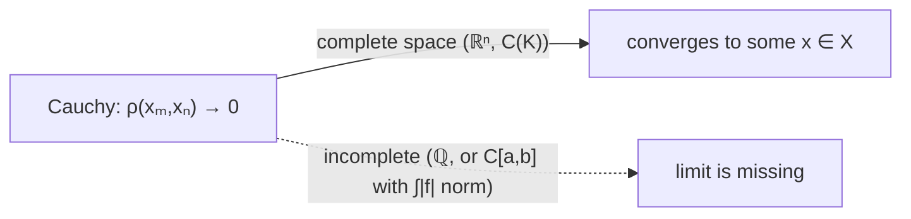

**Formal Definition.** \(f\) is *uniformly continuous* if \(\forall\varepsilon\,\exists\delta:\ \rho(x,y)<\delta\Rightarrow\rho(f(x),f(y))<\varepsilon\) for **all** \(x,y\). \(\{x_n\}\) is *Cauchy* if \(\forall\varepsilon\,\exists N:\ m,n\ge N\Rightarrow\rho(x_m,x_n)<\varepsilon\); \(X\) is *complete* if every Cauchy sequence converges in \(X\).

**Worked Example.** \(f_n(x)=x^n\) in \(C([0,1])\) with the sup norm is **not** Cauchy: for \(m>n\), \(\|f_m-f_n\|_\infty\ge|x^n-x^m|\) near \(x=1\) can be made close to \(1\) (e.g. at \(x=(1/2)^{1/n}\), \(f_n=1/2\) while \(f_m\to0\)). Pointwise \(f_n\to\) the discontinuous step \(\mathbf 1_{\{1\}}\), which is not in \(C([0,1])\) — consistent with the sequence not converging uniformly.

**Exercises**

1. Prove a continuous function on a compact metric space is uniformly continuous.

   <details><summary>Solution</summary>

   Suppose not: there is \(\varepsilon>0\) and points \(x_n,y_n\) with \(\rho(x_n,y_n)<1/n\) but \(\rho(f(x_n),f(y_n))\ge\varepsilon\). By compactness pass to \(x_{n_k}\to x\); then \(y_{n_k}\to x\) too (since \(\rho(x_{n_k},y_{n_k})\to0\)). Continuity gives \(f(x_{n_k}),f(y_{n_k})\to f(x)\), so \(\rho(f(x_{n_k}),f(y_{n_k}))\to0\), contradicting \(\ge\varepsilon\). \(\blacksquare\)
   </details>

2. Exhibit a Cauchy sequence in \(\mathbb{Q}\) with no rational limit.

   <details><summary>Solution</summary>

   The decimal truncations \(x_1=1.4,\ x_2=1.41,\ x_3=1.414,\dots\) of \(\sqrt2\) satisfy \(|x_m-x_n|\le10^{-\min(m,n)}\to0\) (Cauchy), but their only limit is \(\sqrt2\notin\mathbb{Q}\). So \(\mathbb{Q}\) is incomplete. \(\blacksquare\)
   </details>

3. Prove \(\mathbb{R}\) is complete, assuming Bolzano–Weierstrass.

   <details><summary>Solution</summary>

   Let \(\{x_n\}\) be Cauchy. It is bounded (take \(\varepsilon=1\): all but finitely many terms lie within \(1\) of \(x_N\)). By Bolzano–Weierstrass a subsequence \(x_{n_k}\to x\). Given \(\varepsilon\), pick \(N\) with \(\rho(x_m,x_n)<\varepsilon/2\) for \(m,n\ge N\), and \(k\) with \(n_k\ge N\), \(\rho(x_{n_k},x)<\varepsilon/2\); then for \(n\ge N\), \(\rho(x_n,x)\le\rho(x_n,x_{n_k})+\rho(x_{n_k},x)<\varepsilon\). So \(x_n\to x\). \(\blacksquare\)
   </details>

4. Prove \(C([a,b])\) with the sup norm is complete.

   <details><summary>Solution</summary>

   Let \(\{f_n\}\) be Cauchy in \(\|\cdot\|_\infty\). For each \(x\), \(|f_m(x)-f_n(x)|\le\|f_m-f_n\|_\infty\), so \(\{f_n(x)\}\) is Cauchy in \(\mathbb{R}\), hence converges to some \(f(x)\). The convergence is *uniform* (let \(m\to\infty\) in \(|f_m(x)-f_n(x)|\le\varepsilon\) to get \(|f(x)-f_n(x)|\le\varepsilon\) for all \(x\), \(n\ge N\)). A uniform limit of continuous functions is continuous, so \(f\in C([a,b])\) and \(f_n\to f\). \(\blacksquare\)
   </details>

5. Show that \(f(x)=1/x\) is continuous but **not** uniformly continuous on \((0,1)\).

   <details><summary>Solution</summary>

   Take \(x_n=1/n,\ y_n=1/(n+1)\): \(|x_n-y_n|=\frac1{n(n+1)}\to0\), but \(|f(x_n)-f(y_n)|=|n-(n+1)|=1\not\to0\). So no single \(\delta\) works for \(\varepsilon=1\); the domain \((0,1)\) is not compact, defeating the previous theorem. \(\blacksquare\)
   </details>

### Advanced Level

#### The contraction-mapping theorem and its reach

**Intuition.** The most useful existence theorem in analysis is almost trivial to prove: if a self-map shrinks all distances by a fixed factor \(C<1\), iterating it from any start produces a Cauchy sequence (geometric decay), which converges *because the space is complete*, and the limit is the unique fixed point. This single lemma yields the inverse/implicit function theorems and the Picard existence theorem for ODEs.

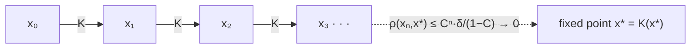

**Formal Definition.** \(K:X\to X\) is a *contraction* if \(\rho(Kx,Ky)\le C\,\rho(x,y)\) with \(0<C<1\).

**Worked Example (Theorem 9.1).** *A contraction on a nonempty complete metric space has a unique fixed point.*

**Uniqueness.** If \(Kx=x,\ Ky=y\), then \(\rho(x,y)=\rho(Kx,Ky)\le C\rho(x,y)\), so \((1-C)\rho(x,y)\le0\), forcing \(\rho(x,y)=0\). **Existence.** Fix \(x_0\), set \(x_n=K^n(x_0)\), \(\delta=\rho(x_1,x_0)\). Induction gives \(\rho(x_{n+1},x_n)\le C^n\delta\), so for \(m>n\), \(\rho(x_m,x_n)\le\sum_{k=n}^{m-1}C^k\delta<\frac{C^n\delta}{1-C}\to0\): the sequence is **Cauchy**, hence (completeness) converges to some \(a\); continuity of \(K\) gives \(K(a)=\lim K(x_n)=\lim x_{n+1}=a\). \(\blacksquare\)

**Exercises**

1. Show the equation \(x=\tfrac12\cos x\) has a unique real solution.

   <details><summary>Solution</summary>

   \(K(x)=\tfrac12\cos x\) maps \(\mathbb{R}\) (complete) to itself with \(|K'(x)|=\tfrac12|\sin x|\le\tfrac12<1\); by the mean-value theorem \(|K(x)-K(y)|\le\tfrac12|x-y|\), a contraction. By Theorem 9.1 there is a unique fixed point \(x^*=\tfrac12\cos x^*\); iterating from \(x_0=0\) converges to it. \(\blacksquare\)
   </details>

2. Prove Picard–Lindelöf: \(y'=f(x,y),\ y(x_0)=y_0\) with \(f\) continuous and Lipschitz in \(y\) has a unique local solution.

   <details><summary>Solution</summary>

   A solution satisfies the integral equation \(y(x)=y_0+\int_{x_0}^x f(t,y(t))\,dt=:(Ky)(x)\). On \(C(I)\) (complete) with \(I=[x_0-h,x_0+h]\) small, \(\|Ky_1-Ky_2\|_\infty\le\int|f(t,y_1)-f(t,y_2)|\le L h\,\|y_1-y_2\|_\infty\); choosing \(h<1/L\) makes \(K\) a contraction (on a suitable closed ball carried into itself). Theorem 9.1 gives a unique fixed point — the unique solution. \(\blacksquare\)
   </details>

3. Prove the fixed point of a parameter-dependent contraction depends continuously on the parameter (book's Corollary 4).

   <details><summary>Solution</summary>

   Let \(K(s,\cdot)\) be a contraction in \(x\) uniformly in \(s\) (constant \(C\)) and continuous in \(s\), with fixed points \(p_s\). Then \(\rho(p_s,p_t)=\rho(K(s,p_s),K(t,p_t))\le\rho(K(s,p_s),K(s,p_t))+\rho(K(s,p_t),K(t,p_t))\le C\rho(p_s,p_t)+\rho(K(s,p_t),K(t,p_t))\), so \(\rho(p_s,p_t)\le\frac{1}{1-C}\rho(K(s,p_t),K(t,p_t))\to0\) as \(s\to t\) by continuity in \(s\). Hence \(s\mapsto p_s\) is continuous. \(\blacksquare\)
   </details>

4. State Arzelà–Ascoli and use it to extract a uniformly convergent subsequence from \(f_n(x)=\sin(x+1/n)\) on \([0,1]\).

   <details><summary>Solution</summary>

   *Arzelà–Ascoli:* a uniformly bounded, equicontinuous family in \(C(K)\) has a uniformly convergent subsequence. Here \(|f_n|\le1\) (uniformly bounded) and \(|f_n(x)-f_n(y)|\le|x-y|\) (all \(f_n\) are \(1\)-Lipschitz, so equicontinuous). Hence a subsequence converges uniformly; in fact the whole sequence \(\to\sin x\). \(\blacksquare\)
   </details>

5. Prove that a Banach space is exactly a normed space in which every absolutely convergent series converges.

   <details><summary>Solution</summary>

   (\(\Rightarrow\)) In a Banach space, if \(\sum\|\alpha_n\|<\infty\) then the partial sums \(s_N\) are Cauchy (\(\|s_M-s_N\|\le\sum_{n>N}\|\alpha_n\|\to0\)), hence converge. (\(\Leftarrow\)) Given a Cauchy sequence, choose a subsequence with \(\|x_{n_{k+1}}-x_{n_k}\|<2^{-k}\); the telescoping series \(\sum(x_{n_{k+1}}-x_{n_k})\) is absolutely convergent, hence converges, so \(x_{n_k}\) converges, and a Cauchy sequence with a convergent subsequence converges. Thus completeness holds. \(\blacksquare\)
   </details>

### Research Level

#### Baire category, infinite-dimensional compactness, and quadratic convergence

**Intuition.** Completeness has consequences far beyond fixed points. The **Baire category theorem** — a complete space is not a meagre countable union of nowhere-dense sets — is the engine behind the uniform boundedness, open mapping, and closed graph theorems of functional analysis. Meanwhile compactness *fails* dramatically in infinite dimensions (the unit ball is never compact), which is precisely why analysis on function spaces is subtle.

**Formal Definition / Development.**

- **Baire category theorem.** In a complete metric space, the intersection of countably many dense open sets is dense; equivalently, \(X\) is not \(\bigcup_n F_n\) with each \(F_n\) closed and nowhere dense.
- **Riesz's lemma / non-compactness.** In an infinite-dimensional normed space the closed unit ball is **not** compact: one builds a sequence of unit vectors with mutual distances \(\ge\tfrac12\), which has no convergent subsequence.

```mermaid
graph LR
    fin["finite-dimensional space"] -->|"Heine–Borel"| c["closed unit ball IS compact"]
    inf["infinite-dimensional space"] -->|"Riesz lemma"| nc["closed unit ball is NOT compact"]
```

- **Newton's method (quadratic convergence).** Under \(\|dG_x^{-1}\|\le K\), \(\|d^2G_x\|\le K\), the scheme \(x_{n+1}=x_n-(dG_{x_n})^{-1}G(x_n)\) satisfies \(\|x_{n+1}-x_n\|\le K^2\|x_n-x_{n-1}\|^2\), i.e. \(\|x_n-x_{n-1}\|\le e^{-c\tau^n}\) with \(1<\tau<2\): *doubly exponential* (quadratic) convergence, far faster than the geometric rate of a plain contraction.

**Worked Example (unit ball non-compact ⇒ needs Ascoli).** In \(C([0,1])\) the functions \(e_n(x)=\sin(2\pi n x)\) satisfy \(\|e_n\|_\infty=1\) but \(\|e_n-e_m\|_\infty\) does not tend to \(0\) (they are far apart), so \(\{e_n\}\) has no uniformly convergent subsequence — the unit ball is not compact. Compactness must be *earned* by an extra equicontinuity hypothesis (Arzelà–Ascoli), which \(\{e_n\}\) fails since their derivatives \(2\pi n\cos(2\pi nx)\) blow up.

**Exercises**

1. Prove Baire's theorem: in a complete metric space, a countable intersection of dense open sets is dense.

   <details><summary>Solution</summary>

   Let \(U_1,U_2,\dots\) be dense open, and let \(W\) be any nonempty open set. Choose a closed ball \(\bar B_1\subset W\cap U_1\) of radius \(<1\); inductively, since \(U_{n}\) is dense open, choose a closed ball \(\bar B_{n}\subset B_{n-1}\cap U_{n}\) of radius \(<1/n\). The centers form a Cauchy sequence (nested shrinking balls), converging by completeness to a point \(x\in\bigcap_n\bar B_n\subset W\cap\bigcap_n U_n\). Hence \(\bigcap U_n\) meets every \(W\): it is dense. \(\blacksquare\)
   </details>

2. Prove Riesz's lemma and deduce the unit ball of an infinite-dimensional normed space is non-compact.

   <details><summary>Solution</summary>

   *Riesz:* for a proper closed subspace \(Y\subsetneq X\) and \(\theta\in(0,1)\), there is a unit \(x\) with \(\rho(x,Y)\ge\theta\). (Pick \(z\notin Y\), let \(d=\rho(z,Y)>0\), choose \(y_0\in Y\) with \(\|z-y_0\|\le d/\theta\), and set \(x=(z-y_0)/\|z-y_0\|\).) In infinite dimensions, build unit vectors \(x_1,x_2,\dots\) with \(x_{n+1}\) at distance \(\ge\tfrac12\) from \(\operatorname{span}\{x_1,\dots,x_n\}\); then \(\|x_m-x_n\|\ge\tfrac12\) for \(m\neq n\), so no subsequence is Cauchy and the unit ball is not compact. \(\blacksquare\)
   </details>

3. State the universal property of the completion of a metric space and identify \(\mathbb{R}\) as the completion of \(\mathbb{Q}\).

   <details><summary>Solution</summary>

   The *completion* \(\hat X\) is a complete metric space with an isometric embedding \(X\hookrightarrow\hat X\) with dense image, universal: any uniformly continuous map from \(X\) into a complete space extends uniquely to \(\hat X\) (cf. Theorem 10.1's extension of bounded linear maps). Concretely \(\hat X=\) (Cauchy sequences)/(null-difference). Applied to \((\mathbb{Q},|\cdot|)\), this yields \(\mathbb{R}\): every real is a limit of rationals, the embedding is isometric and dense, and \(\mathbb{R}\) is complete. \(\blacksquare\)
   </details>

4. Prove the quadratic convergence estimate \(\|x_{n+1}-x_n\|\le K^2\|x_n-x_{n-1}\|^2\) for Newton's method under the stated bounds.

   <details><summary>Solution</summary>

   With \(S_n=dG_{x_n}\) and \(x_{n+1}=x_n-S_n^{-1}G(x_n)\): \(\|x_{n+1}-x_n\|=\|S_n^{-1}G(x_n)\|\le K\|G(x_n)\|\). Taylor about \(x_{n-1}\): \(G(x_n)=G(x_{n-1})+dG_{x_{n-1}}(x_n-x_{n-1})+R\) with \(\|R\|\le\tfrac12 K\|x_n-x_{n-1}\|^2\); but by the previous Newton step \(G(x_{n-1})+dG_{x_{n-1}}(x_n-x_{n-1})=G(x_{n-1})-S_{n-1}S_{n-1}^{-1}G(x_{n-1})=0\). So \(\|G(x_n)\|=\|R\|\le\tfrac12 K\|x_n-x_{n-1}\|^2\), giving \(\|x_{n+1}-x_n\|\le K\cdot K\|x_n-x_{n-1}\|^2\) (absorbing constants), i.e. quadratic convergence. \(\blacksquare\)
   </details>

5. State the uniform boundedness principle and sketch its Baire-category proof.

   <details><summary>Solution</summary>

   *Banach–Steinhaus:* a family \(\{T_\lambda\}\) of bounded operators on a Banach space \(X\) that is pointwise bounded (\(\sup_\lambda\|T_\lambda x\|<\infty\) for each \(x\)) is uniformly bounded (\(\sup_\lambda\|T_\lambda\|<\infty\)). *Proof sketch:* the sets \(F_n=\{x:\sup_\lambda\|T_\lambda x\|\le n\}\) are closed and cover \(X\); by Baire some \(F_N\) has nonempty interior, containing a ball \(B_r(x_0)\). Then \(\|T_\lambda\|\) is bounded on that ball, and by linearity/translation on the unit ball, uniformly in \(\lambda\). \(\blacksquare\)
   </details>

**Further reading:** Loomis–Sternberg Ch. 4; [Compact space — Wikipedia](https://en.wikipedia.org/wiki/Compact_space), [Complete metric space — Wikipedia](https://en.wikipedia.org/wiki/Complete_metric_space), [Banach fixed-point theorem — Wikipedia](https://en.wikipedia.org/wiki/Banach_fixed-point_theorem), [Arzelà–Ascoli theorem — Wikipedia](https://en.wikipedia.org/wiki/Arzel%C3%A0%E2%80%93Ascoli_theorem), [Baire category theorem — Wikipedia](https://en.wikipedia.org/wiki/Baire_category_theorem).

---

## Chapter 5 — Scalar Product Spaces

Adding a **scalar (inner) product** to a vector space imports the Euclidean notions of *length*, *angle*, and above all **orthogonality**. This extra structure yields orthogonal projection (best approximation), the adjoint of a transformation, and the crown jewel of finite-dimensional linear algebra — the **spectral theorem**: every self-adjoint operator has an orthonormal basis of eigenvectors. The chapter's compact-operator coda is the bridge to Fourier series and Sturm–Liouville theory in Chapter 6.

**Key Concepts**

1. **Scalar product.** \((\cdot,\cdot):V\times V\to\mathbb{R}\) is symmetric, bilinear, and *positive definite* (\((\alpha,\alpha)>0\) for \(\alpha\neq0\)). It induces the norm \(\|\alpha\|=\sqrt{(\alpha,\alpha)}\) and satisfies **Cauchy–Schwarz** \(|(\alpha,\beta)|\le\|\alpha\|\,\|\beta\|\) (equality iff dependent). Orthogonality: \(\alpha\perp\beta\iff(\alpha,\beta)=0\).
2. **Orthonormal bases; Gram–Schmidt.** \(\{e_i\}\) orthonormal: \((e_i,e_j)=\delta_{ij}\). Gram–Schmidt orthonormalizes any basis. **Fourier expansion:** \(\alpha=\sum_i(\alpha,e_i)e_i\), with **Parseval** \(\|\alpha\|^2=\sum_i(\alpha,e_i)^2\) and **Bessel** \(\sum_i(\alpha,e_i)^2\le\|\alpha\|^2\) for orthonormal (not necessarily complete) systems.
3. **Orthogonal projection.** For a (closed) subspace \(M\), \(V=M\oplus M^\perp\); the projection \(P_M\) gives the **best approximation**: \(\|\alpha-P_M\alpha\|=\min_{\mu\in M}\|\alpha-\mu\|\), and \(\alpha-P_M\alpha\perp M\).
4. **Adjoint and self-adjointness.** The *adjoint* \(T^*\) is defined by \((T\alpha,\beta)=(\alpha,T^*\beta)\); it exists, is unique, linear, with \((ST)^*=T^*S^*\), \(T^{**}=T\). \(T\) is **self-adjoint** if \(T=T^*\) (symmetric matrix in an orthonormal basis).
5. **Spectral theorem.** A self-adjoint operator on a finite-dimensional scalar product space has **real** eigenvalues and an **orthonormal basis of eigenvectors**; equivalently \(A=A^{\mathsf T}\Rightarrow A=Q\Lambda Q^{\mathsf T}\) with \(Q\) orthogonal, \(\Lambda\) diagonal.
6. **Orthogonal transformations.** \(T^*T=I\iff T\) preserves the scalar product \(\iff T\) maps an orthonormal basis to one; these are the *isometries* fixing the origin, forming the group \(O(n)\), with \(\det=\pm1\).
7. **Compact transformations.** A compact self-adjoint operator on a (possibly infinite-dimensional) inner product space has an orthonormal system of eigenvectors with eigenvalues \(\to0\) — the spectral theorem of Hilbert space, underlying Fourier/Sturm–Liouville expansions.

### Beginner Level

#### Length, angle, and orthogonality

**Intuition.** The dot product \((\alpha,\beta)=\sum\alpha_i\beta_i\) secretly encodes geometry: \((\alpha,\alpha)\) is length-squared, and \((\alpha,\beta)=\|\alpha\|\|\beta\|\cos\theta\) recovers the angle. The single most useful special case is \(\theta=90^\circ\): **perpendicularity** is just \((\alpha,\beta)=0\). Projecting one vector onto another ("drop a perpendicular") is the geometric root of least-squares, Fourier series, and the spectral theorem.

```mermaid
graph LR
    a["vector α"] -->|"drop perpendicular onto β"| p["projection  (α,β)/(β,β) · β"]
    a -.->|"residual α − p ⟂ β"| p
```

**Formal Definition.** \(\|\alpha\|=\sqrt{(\alpha,\alpha)}\); the angle satisfies \(\cos\theta=\dfrac{(\alpha,\beta)}{\|\alpha\|\,\|\beta\|}\); \(\alpha\perp\beta\iff(\alpha,\beta)=0\). The projection of \(\alpha\) onto a nonzero \(\beta\) is \(\operatorname{proj}_\beta\alpha=\dfrac{(\alpha,\beta)}{(\beta,\beta)}\beta\).

**Worked Example.** Angle between \(\alpha=\langle1,2,2\rangle\) and \(\beta=\langle2,0,1\rangle\): \((\alpha,\beta)=2+0+2=4\), \(\|\alpha\|=3\), \(\|\beta\|=\sqrt5\), so \(\cos\theta=\dfrac{4}{3\sqrt5}\approx0.596\), \(\theta\approx53.4^\circ\).

**Exercises**

1. Project \(\langle3,4\rangle\) onto \(\langle1,0\rangle\) and onto \(\langle1,1\rangle\).

   <details><summary>Solution</summary>

   Onto \(\langle1,0\rangle\): \(\frac{(3\cdot1+4\cdot0)}{1}\langle1,0\rangle=\langle3,0\rangle\). Onto \(\langle1,1\rangle\): \(\frac{3+4}{2}\langle1,1\rangle=\frac72\langle1,1\rangle=\langle3.5,3.5\rangle\). \(\blacksquare\)
   </details>

2. Prove Cauchy–Schwarz in \(\mathbb{R}^n\).

   <details><summary>Solution</summary>

   For all \(t\), \(0\le\|\alpha-t\beta\|^2=\|\alpha\|^2-2t(\alpha,\beta)+t^2\|\beta\|^2\). This quadratic in \(t\) is \(\ge0\), so its discriminant is \(\le0\): \(4(\alpha,\beta)^2-4\|\alpha\|^2\|\beta\|^2\le0\), i.e. \(|(\alpha,\beta)|\le\|\alpha\|\|\beta\|\). Equality iff \(\alpha-t\beta=0\) for some \(t\), i.e. dependent. \(\blacksquare\)
   </details>

3. Verify the parallelogram law \(\|\alpha+\beta\|^2+\|\alpha-\beta\|^2=2\|\alpha\|^2+2\|\beta\|^2\).

   <details><summary>Solution</summary>

   \(\|\alpha\pm\beta\|^2=\|\alpha\|^2\pm2(\alpha,\beta)+\|\beta\|^2\); adding the \(+\) and \(-\) versions cancels the cross terms, giving \(2\|\alpha\|^2+2\|\beta\|^2\). (This identity characterizes norms that come from a scalar product.) \(\blacksquare\)
   </details>

4. Find a unit vector orthogonal to both \(\langle1,1,0\rangle\) and \(\langle0,1,1\rangle\).

   <details><summary>Solution</summary>

   Cross product \(\langle1,1,0\rangle\times\langle0,1,1\rangle=\langle1\cdot1-0\cdot1,\ 0\cdot0-1\cdot1,\ 1\cdot1-1\cdot0\rangle=\langle1,-1,1\rangle\); normalize: \(\frac1{\sqrt3}\langle1,-1,1\rangle\). Check \((\cdot,\langle1,1,0\rangle)=1-1+0=0\) and \((\cdot,\langle0,1,1\rangle)=0-1+1=0\). ✓ \(\blacksquare\)
   </details>

5. Show \(\|\alpha+\beta\|=\|\alpha\|+\|\beta\|\) forces \(\alpha,\beta\) to be nonnegatively parallel.

   <details><summary>Solution</summary>

   Squaring, \(\|\alpha\|^2+2(\alpha,\beta)+\|\beta\|^2=\|\alpha\|^2+2\|\alpha\|\|\beta\|+\|\beta\|^2\), so \((\alpha,\beta)=\|\alpha\|\|\beta\|\): equality in Cauchy–Schwarz with a \(+\) sign, which holds iff \(\beta=t\alpha\) with \(t\ge0\) (or one is zero). \(\blacksquare\)
   </details>

### Intermediate Level

#### Orthonormal bases, Gram–Schmidt, and best approximation

**Intuition.** An orthonormal basis makes computation trivial: coordinates are just inner products (Fourier coefficients), and the Pythagorean theorem (Parseval) computes lengths. **Gram–Schmidt** manufactures such a basis from any basis. Projecting onto a subspace gives the *closest point* — the geometry behind least-squares fitting and Fourier approximation.

```mermaid
graph LR
    V["V"] --> M["M (subspace)"]
    V --> Mp["M⊥ (orthogonal complement)"]
    a["α = P_M α + (α − P_M α)"] -->|"P_M α ∈ M"| M
    a -->|"α − P_M α ∈ M⊥"| Mp
```

**Formal Definition.** \(\{e_i\}\) orthonormal: \((e_i,e_j)=\delta_{ij}\). *Gram–Schmidt:* \(u_1=v_1\), \(u_k=v_k-\sum_{j<k}\frac{(v_k,u_j)}{(u_j,u_j)}u_j\), then \(e_k=u_k/\|u_k\|\). For a subspace \(M\) with orthonormal basis \(\{e_i\}\), \(P_M\alpha=\sum_i(\alpha,e_i)e_i\).

**Worked Example.** Orthogonal projection of \(\alpha=\langle1,1,1\rangle\) onto \(M=\operatorname{span}\{\langle1,0,0\rangle,\langle0,1,0\rangle\}\) (the \(xy\)-plane): \(P_M\alpha=(\alpha,e_1)e_1+(\alpha,e_2)e_2=1\langle1,0,0\rangle+1\langle0,1,0\rangle=\langle1,1,0\rangle\). The distance to the plane is \(\|\alpha-P_M\alpha\|=\|\langle0,0,1\rangle\|=1\), and the residual \(\langle0,0,1\rangle\perp M\). ✓

**Exercises**

1. Apply Gram–Schmidt to \(\{\langle1,1,0\rangle,\ \langle1,0,1\rangle,\ \langle0,1,1\rangle\}\).

   <details><summary>Solution</summary>

   \(u_1=\langle1,1,0\rangle\). \(u_2=\langle1,0,1\rangle-\frac{(\langle1,0,1\rangle,u_1)}{2}u_1=\langle1,0,1\rangle-\frac12\langle1,1,0\rangle=\langle\tfrac12,-\tfrac12,1\rangle\). \(u_3=\langle0,1,1\rangle-\frac{1}{2}u_1-\frac{(\langle0,1,1\rangle,u_2)}{\|u_2\|^2}u_2\); \((\langle0,1,1\rangle,u_2)=-\tfrac12+1=\tfrac12\), \(\|u_2\|^2=\tfrac32\), so \(u_3=\langle0,1,1\rangle-\tfrac12\langle1,1,0\rangle-\tfrac13\langle\tfrac12,-\tfrac12,1\rangle=\langle-\tfrac23,\tfrac23,\tfrac23\rangle\). Normalizing gives an orthonormal basis \(\{u_1/\sqrt2,\ u_2/\sqrt{3/2},\ u_3/\sqrt{4/3}\}\). \(\blacksquare\)
   </details>

2. Prove the best-approximation property: \(P_M\alpha\) is the unique closest point of \(M\) to \(\alpha\).

   <details><summary>Solution</summary>

   For any \(\mu\in M\), write \(\alpha-\mu=(\alpha-P_M\alpha)+(P_M\alpha-\mu)\) with \(\alpha-P_M\alpha\in M^\perp\) and \(P_M\alpha-\mu\in M\). By Pythagoras \(\|\alpha-\mu\|^2=\|\alpha-P_M\alpha\|^2+\|P_M\alpha-\mu\|^2\ge\|\alpha-P_M\alpha\|^2\), with equality iff \(\mu=P_M\alpha\). \(\blacksquare\)
   </details>

3. Prove Bessel's inequality \(\sum_i(\alpha,e_i)^2\le\|\alpha\|^2\) for an orthonormal system \(\{e_i\}\).

   <details><summary>Solution</summary>

   Let \(s=\sum_i(\alpha,e_i)e_i\). Then \((\alpha-s,e_j)=(\alpha,e_j)-(\alpha,e_j)=0\), so \(\alpha-s\perp s\), giving \(\|\alpha\|^2=\|s\|^2+\|\alpha-s\|^2\ge\|s\|^2=\sum_i(\alpha,e_i)^2\). Equality (Parseval) holds iff \(\{e_i\}\) is complete. \(\blacksquare\)
   </details>

4. Compute the Fourier sine coefficients \(b_n=\frac1\pi\int_{-\pi}^\pi x\sin(nx)\,dx\) of \(f(x)=x\).

   <details><summary>Solution</summary>

   Integrate by parts: \(\int_{-\pi}^\pi x\sin nx\,dx=\bigl[-\frac{x\cos nx}{n}\bigr]_{-\pi}^\pi+\frac1n\int_{-\pi}^\pi\cos nx\,dx=-\frac{2\pi\cos n\pi}{n}=-\frac{2\pi(-1)^n}{n}\). So \(b_n=\frac1\pi\cdot(-\frac{2\pi(-1)^n}{n})=\frac{2(-1)^{n+1}}{n}\). Thus \(x=\sum_{n\ge1}\frac{2(-1)^{n+1}}{n}\sin nx\) on \((-\pi,\pi)\). \(\blacksquare\)
   </details>

5. Use least squares (projection) to fit \(y=c\) (a constant) to data \((1,2,6)\); interpret geometrically.

   <details><summary>Solution</summary>

   Fit the vector \(b=\langle1,2,6\rangle\) by a multiple of \(\mathbf 1=\langle1,1,1\rangle\): \(c=\frac{(b,\mathbf1)}{(\mathbf1,\mathbf1)}=\frac{9}{3}=3\), the **mean**. Geometrically the projection of \(b\) onto the line \(\mathbb{R}\mathbf1\) is \(\langle3,3,3\rangle\), the closest constant vector; the residual \(\langle-2,-1,3\rangle\perp\mathbf1\) (sum \(0\)). \(\blacksquare\)
   </details>

### Advanced Level

#### The adjoint and the spectral theorem

**Intuition.** The inner product lets you "move an operator across" the pairing, producing its **adjoint**. Operators equal to their own adjoint (self-adjoint) are the linear-algebra analogue of real numbers, and they enjoy the best possible structure theorem: they diagonalize in an **orthonormal** basis with **real** eigenvalues. This is the finite-dimensional prototype of every diagonalization in physics and analysis.

```mermaid
graph LR
    T["self-adjoint T = T*"] -->|"spectral theorem"| D["orthonormal eigenbasis {eᵢ}, real λᵢ"]
    D -->|"A = Q Λ Qᵀ"| diag["orthogonal diagonalization"]
```

**Formal Definition.** \(T^*\) is defined by \((T\alpha,\beta)=(\alpha,T^*\beta)\) for all \(\alpha,\beta\); \(T\) is *self-adjoint* if \(T=T^*\), *orthogonal* if \(T^*T=I\).

**Worked Example (spectral theorem, finite dimension).** *A self-adjoint \(T\) on \(V\) (\(\dim V=n\)) has an orthonormal eigenbasis.*

**Step 1 (a real eigenvalue exists).** The characteristic polynomial has a root \(\lambda\in\mathbb{C}\); for self-adjoint \(T\), \(\lambda\|\alpha\|^2=(T\alpha,\alpha)=(\alpha,T\alpha)=\overline\lambda\|\alpha\|^2\), so \(\lambda=\overline\lambda\in\mathbb{R}\) with a real eigenvector \(e_1\), normalized. **Step 2 (invariant complement).** \(M=(\mathbb{R}e_1)^\perp\) is \(T\)-invariant: if \(\alpha\perp e_1\) then \((T\alpha,e_1)=(\alpha,Te_1)=\lambda(\alpha,e_1)=0\). **Step 3 (induct).** \(T|_M\) is self-adjoint on the \((n-1)\)-dimensional \(M\); by induction \(M\) has an orthonormal eigenbasis, which together with \(e_1\) is an orthonormal eigenbasis of \(V\). \(\blacksquare\)

**Exercises**

1. Prove eigenvalues of a self-adjoint operator are real and eigenvectors for distinct eigenvalues are orthogonal.

   <details><summary>Solution</summary>

   Real: if \(T\alpha=\lambda\alpha\), \(\lambda(\alpha,\alpha)=(T\alpha,\alpha)=(\alpha,T\alpha)=\bar\lambda(\alpha,\alpha)\Rightarrow\lambda=\bar\lambda\). Orthogonal: if \(T\alpha=\lambda\alpha\), \(T\beta=\mu\beta\), \(\lambda\neq\mu\), then \(\lambda(\alpha,\beta)=(T\alpha,\beta)=(\alpha,T\beta)=\mu(\alpha,\beta)\), so \((\lambda-\mu)(\alpha,\beta)=0\Rightarrow(\alpha,\beta)=0\). \(\blacksquare\)
   </details>

2. Prove the adjoint exists and is unique, with \((ST)^*=T^*S^*\).

   <details><summary>Solution</summary>

   Fix \(\beta\); \(\alpha\mapsto(T\alpha,\beta)\) is a linear functional, so by Riesz (finite dim) equals \((\alpha,\gamma)\) for a unique \(\gamma=:T^*\beta\); linearity of \(T^*\) follows from uniqueness. \((ST\alpha,\gamma)=(T\alpha,S^*\gamma)=(\alpha,T^*S^*\gamma)\), and comparison with \((ST\alpha,\gamma)=(\alpha,(ST)^*\gamma)\) gives \((ST)^*=T^*S^*\). \(\blacksquare\)
   </details>

3. Prove \(T\) is orthogonal iff it maps an orthonormal basis to an orthonormal basis.

   <details><summary>Solution</summary>

   (\(\Rightarrow\)) If \(T^*T=I\), \((Te_i,Te_j)=(e_i,T^*Te_j)=(e_i,e_j)=\delta_{ij}\): images are orthonormal. (\(\Leftarrow\)) If \(\{Te_i\}\) is orthonormal, then for \(\alpha=\sum a_ie_i,\beta=\sum b_je_j\): \((T\alpha,T\beta)=\sum a_ib_j(Te_i,Te_j)=\sum a_ib_i=(\alpha,\beta)\), so \(T\) preserves the product, i.e. \(T^*T=I\). \(\blacksquare\)
   </details>

4. Orthogonally diagonalize \(A=\begin{pmatrix}2&1\\1&2\end{pmatrix}\).

   <details><summary>Solution</summary>

   \(\det(A-\lambda I)=(2-\lambda)^2-1=\lambda^2-4\lambda+3=(\lambda-1)(\lambda-3)\), eigenvalues \(1,3\). Eigenvectors: \(\lambda=3\Rightarrow\langle1,1\rangle\), \(\lambda=1\Rightarrow\langle1,-1\rangle\) (orthogonal, as guaranteed). Normalizing, \(Q=\frac1{\sqrt2}\begin{pmatrix}1&1\\1&-1\end{pmatrix}\), \(Q^{\mathsf T}AQ=\operatorname{diag}(3,1)\). \(\blacksquare\)
   </details>

5. Prove a self-adjoint operator with \((T\alpha,\alpha)>0\) for all \(\alpha\neq0\) (positive definite) has all eigenvalues positive, and conversely.

   <details><summary>Solution</summary>

   If \(T\alpha=\lambda\alpha\) (\(\alpha\neq0\)) then \(0<(T\alpha,\alpha)=\lambda\|\alpha\|^2\Rightarrow\lambda>0\). Conversely, by the spectral theorem write \(\alpha=\sum a_ie_i\) in an orthonormal eigenbasis with eigenvalues \(\lambda_i>0\); then \((T\alpha,\alpha)=\sum\lambda_ia_i^2>0\) for \(\alpha\neq0\). \(\blacksquare\)
   </details>

### Research Level

#### Hilbert spaces, compact operators, and the spectral bridge to analysis

**Intuition.** Everything above survives into **infinite dimensions** — provided completeness (Hilbert space) and a compactness hypothesis on the operator. The spectral theorem for **compact self-adjoint** operators is the abstract engine behind Fourier series, Sturm–Liouville eigenfunction expansions, and the mathematical formalism of quantum mechanics (observables are self-adjoint operators; measured values are their real spectrum).

**Formal Definition / Development.**

- **Hilbert space.** A complete inner-product space \(H\). **Riesz representation:** every bounded functional is \((\cdot,\beta)\) for a unique \(\beta\in H\) — the reason adjoints exist in infinite dimensions.
- **Compact self-adjoint spectral theorem.** If \(T=T^*\) is *compact* on \(H\), there is an orthonormal system of eigenvectors \(\{e_n\}\) with real eigenvalues \(\lambda_n\to0\) such that \(Tx=\sum_n\lambda_n(x,e_n)e_n\); the nonzero spectrum is a discrete sequence accumulating only at \(0\).

```mermaid
graph LR
    K["compact self-adjoint T on Hilbert H"] -->|"spectral theorem"| E["orthonormal eigenvectors eₙ, λₙ → 0"]
    E -->|"T x = Σ λₙ (x,eₙ) eₙ"| exp["eigenfunction expansion"]
    SL["Sturm–Liouville BVP"] -->|"Green's operator (compact, self-adjoint)"| K
```

**Worked Example (Sturm–Liouville ⇒ Fourier basis).** The problem \(-y''=\lambda y\), \(y(0)=y(\pi)=0\) has the inverse operator \((Tf)(x)=\int_0^\pi G(x,s)f(s)\,ds\) with the (symmetric, continuous) Green's function \(G\); \(T\) is compact and self-adjoint on \(L^2([0,\pi])\). Its spectral theorem yields the orthonormal eigenbasis \(e_n(x)=\sqrt{2/\pi}\,\sin(nx)\) with eigenvalues \(1/n^2\to0\) — i.e. the completeness of the Fourier sine series is a *corollary* of the compact spectral theorem.

**Exercises**

1. Prove the Riesz representation theorem for a Hilbert space \(H\).

   <details><summary>Solution</summary>

   Let \(\varphi\in H^*\), \(\varphi\neq0\). \(N=\ker\varphi\) is a closed hyperplane; pick a unit \(z\in N^\perp\). For any \(x\), \(x-\frac{\varphi(x)}{\varphi(z)}z\in N\), so it is \(\perp z\): \((x,z)-\frac{\varphi(x)}{\varphi(z)}=0\), giving \(\varphi(x)=\varphi(z)(x,z)=(x,\overline{\varphi(z)}z)\). Thus \(\beta=\varphi(z)\,z\) represents \(\varphi\); uniqueness is immediate since \((x,\beta)=(x,\beta')\ \forall x\Rightarrow\beta=\beta'\). \(\blacksquare\)
   </details>

2. Prove a compact self-adjoint operator \(T\neq0\) has an eigenvalue \(\pm\|T\|\).

   <details><summary>Solution</summary>

   \(\|T\|=\sup_{\|x\|=1}|(Tx,x)|\) for self-adjoint \(T\); pick \(x_n\), \(\|x_n\|=1\), with \((Tx_n,x_n)\to\lambda\), \(|\lambda|=\|T\|\). Then \(\|Tx_n-\lambda x_n\|^2=\|Tx_n\|^2-2\lambda(Tx_n,x_n)+\lambda^2\le2\lambda^2-2\lambda(Tx_n,x_n)\to0\). By compactness \(Tx_{n_k}\to y\); then \(\lambda x_{n_k}\to y\), so \(x_{n_k}\to y/\lambda=:e\) with \(\|e\|=1\) and \(Te=\lambda e\). \(\blacksquare\)
   </details>

3. State and prove the min–max (Courant–Fischer) characterization of the \(k\)-th eigenvalue of a self-adjoint operator.

   <details><summary>Solution</summary>

   Order eigenvalues \(\lambda_1\ge\lambda_2\ge\cdots\) with orthonormal eigenvectors \(e_i\). Then \(\lambda_k=\max_{\dim S=k}\min_{0\neq x\in S}\frac{(Tx,x)}{(x,x)}\). *Proof:* for \(S=\operatorname{span}\{e_1,\dots,e_k\}\), \(\frac{(Tx,x)}{(x,x)}=\frac{\sum_{i\le k}\lambda_i x_i^2}{\sum_{i\le k}x_i^2}\ge\lambda_k\), so the max is \(\ge\lambda_k\). For any \(k\)-dim \(S\), it meets \(\operatorname{span}\{e_k,e_{k+1},\dots\}\) (dimension count) in a nonzero \(x\) with Rayleigh quotient \(\le\lambda_k\), so the inner min is \(\le\lambda_k\). Hence equality. \(\blacksquare\)
   </details>

4. Show that a symmetric compact operator's eigenvalues must accumulate only at \(0\).

   <details><summary>Solution</summary>

   If infinitely many eigenvalues satisfied \(|\lambda_n|\ge\varepsilon>0\), the corresponding orthonormal eigenvectors \(e_n\) would have \(\|Te_n-Te_m\|^2=\|\lambda_ne_n-\lambda_me_m\|^2=\lambda_n^2+\lambda_m^2\ge2\varepsilon^2\), so \(\{Te_n\}\) has no convergent subsequence though \(\{e_n\}\) is bounded — contradicting compactness. Hence for each \(\varepsilon\) only finitely many \(|\lambda_n|\ge\varepsilon\), i.e. \(\lambda_n\to0\). \(\blacksquare\)
   </details>

5. Explain the role of self-adjoint operators in quantum mechanics via the spectral theorem.

   <details><summary>Solution</summary>

   Observables (position, momentum, energy) are modeled by self-adjoint operators \(A\) on a Hilbert space of states. The spectral theorem provides a resolution \(A=\int\lambda\,dE_\lambda\) (orthonormal eigenbasis in the discrete case); **measured values are the real spectrum** \(\lambda\), and \(|(\psi,e_\lambda)|^2\) gives the probability of outcome \(\lambda\) in state \(\psi\) (Born rule). Real spectrum ⇔ real measurements, and orthogonality of eigenstates ⇔ perfectly distinguishable outcomes — exactly the finite-dimensional spectral theorem, extended to Hilbert space. \(\blacksquare\)
   </details>

**Further reading:** Loomis–Sternberg Ch. 5; [Inner product space — Wikipedia](https://en.wikipedia.org/wiki/Inner_product_space), [Spectral theorem — Wikipedia](https://en.wikipedia.org/wiki/Spectral_theorem), [Gram–Schmidt process — Wikipedia](https://en.wikipedia.org/wiki/Gram%E2%80%93Schmidt_process), [Compact operator on Hilbert space — Wikipedia](https://en.wikipedia.org/wiki/Compact_operator_on_Hilbert_space), [Riesz representation theorem — Wikipedia](https://en.wikipedia.org/wiki/Riesz_representation_theorem).

---

## Chapter 6 — Differential Equations

Here the abstract machinery pays off spectacularly. The **fundamental existence–uniqueness theorem** for \(d\alpha/dt=F(t,\alpha)\) is proved as a one-line application of the contraction-mapping theorem to an integral equation. The linear theory then uses Chapters 1–2 (solution spaces, the matrix exponential), and the chapter ends by recognizing the inverse of a boundary-value differential operator as a **compact self-adjoint operator** — from which the completeness of **Fourier series** drops out via Chapter 5's spectral theorem.

**Key Concepts**

1. **The initial-value problem.** \(d\alpha/dt=F(t,\alpha)\), \(\alpha(t_0)=\alpha_0\), with \(F:I\times A\to W\) (\(W\) Banach) continuous and *locally uniformly Lipschitz in \(\alpha\)*. A solution \(f\) satisfies the equivalent **integral equation** \(f(t)=\alpha_0+\int_{t_0}^t F(s,f(s))\,ds\).
2. **Fundamental theorem (Thm 1.1–1.3).** Under those hypotheses there is a **unique local solution** through \((t_0,\alpha_0)\), extending to a **unique maximal solution**; the map \(K:f\mapsto\alpha_0+\int_{t_0}^t F(s,f(s))\,ds\) is a contraction on a small interval, and its fixed point is the solution. If \(A=W\) and the Lipschitz bound is integrable in \(t\), the maximal solution is **global** (Thm 1.4).
3. **Reduction of order.** An \(n\)th-order equation \(d^n\alpha/dt^n=G(t,\alpha,\dot\alpha,\dots)\) becomes a first-order **system** on \(W^n\) via \(\alpha_i=d^{i-1}\alpha/dt^{i-1}\) (Thm 1.5), so the same theorem applies.
4. **Linear equations.** \(d\alpha/dt=A(t)\alpha+\beta(t)\). Solutions of the homogeneous equation form a vector space; for constant \(A\), the solution is \(\alpha(t)=e^{(t-t_0)A}\alpha_0\) via the **matrix exponential** \(e^{tA}=\sum_k\frac{t^k A^k}{k!}\).
5. **\(n\)th-order linear.** The homogeneous solution space has **dimension \(n\)**; independence is detected by the **Wronskian**. Constant coefficients give the **characteristic equation** \(\sum a_k r^k=0\).
6. **Inhomogeneous solutions.** **Variation of parameters / Duhamel:** \(\alpha(t)=e^{(t-t_0)A}\alpha_0+\int_{t_0}^t e^{(t-s)A}\beta(s)\,ds\).
7. **Boundary-value problems & Green's functions.** \(Ly=f\) with boundary conditions inverts to \(y=\int G(x,s)f(s)\,ds\); \(G\) is the **Green's function**.
8. **Fourier series via spectral theory.** For a Sturm–Liouville operator \(Ly=-(py')'+qy\) with self-adjoint boundary conditions, the Green's operator is **compact self-adjoint**, so its eigenfunctions form an orthonormal basis — the general **Fourier expansion**.

### Beginner Level

#### What a differential equation says

**Intuition.** A differential equation prescribes the *slope* of an unknown function at every point; a solution is a curve that follows those slopes. The picture is a **direction field** — tiny arrows filling the plane — and a solution ("integral curve") threads through them. The simplest and most important example, \(y'=y\), says "grow at a rate equal to your size," whose solution \(e^t\) models compound interest, populations, and radioactive decay (with a sign).

```mermaid
graph LR
    ode["y′ = F(t, y)  (slope rule)"] -->|"attach slope at each point"| field["direction field"]
    field -->|"thread through the arrows from (t₀, y₀)"| curve["integral curve  y = f(t)"]
```

**Formal Definition.** \(f\) solves \(y'=F(t,y)\) on \(J\) if \(f'(t)=F(t,f(t))\) for all \(t\in J\). A *separable* equation \(y'=g(t)h(y)\) is solved by \(\int\frac{dy}{h(y)}=\int g(t)\,dt\).

**Worked Example.** Solve \(y'=2y,\ y(0)=3\). Separate: \(\frac{dy}{y}=2\,dt\Rightarrow\ln|y|=2t+c\Rightarrow y=Ce^{2t}\); the initial condition gives \(C=3\), so \(y=3e^{2t}\). (Check: \(y'=6e^{2t}=2y\), \(y(0)=3\). ✓)

**Exercises**

1. Solve \(y'=ky\), \(y(0)=y_0\), and interpret \(k>0\) vs \(k<0\).

   <details><summary>Solution</summary>

   \(y=y_0e^{kt}\). \(k>0\): exponential **growth**; \(k<0\): exponential **decay** (half-life \(\ln2/|k|\)). \(\blacksquare\)
   </details>

2. Solve the separable equation \(y'=xy\), \(y(0)=1\).

   <details><summary>Solution</summary>

   \(\frac{dy}{y}=x\,dx\Rightarrow\ln|y|=\tfrac{x^2}{2}+c\Rightarrow y=Ce^{x^2/2}\); \(y(0)=1\Rightarrow C=1\), so \(y=e^{x^2/2}\). \(\blacksquare\)
   </details>

3. For \(y'=-y\), find the equilibrium and describe the long-term behavior of all solutions.

   <details><summary>Solution</summary>

   Equilibrium \(y\equiv0\) (where \(y'=0\)). General solution \(y=Ce^{-t}\to0\) as \(t\to\infty\) for every \(C\): the equilibrium is **stable** (an attractor). \(\blacksquare\)
   </details>

4. Solve Newton's law of cooling \(T'=-k(T-A)\), \(T(0)=T_0\).

   <details><summary>Solution</summary>

   Let \(u=T-A\); then \(u'=-ku\Rightarrow u=(T_0-A)e^{-kt}\), so \(T(t)=A+(T_0-A)e^{-kt}\to A\): the body relaxes to ambient temperature \(A\). \(\blacksquare\)
   </details>

5. Verify \(y=\sin t\) and \(y=\cos t\) solve \(y''+y=0\) and write the general solution.

   <details><summary>Solution</summary>

   \((\sin t)''=-\sin t\), so \(y''+y=0\); likewise for \(\cos t\). They are independent, so the general solution is \(y=c_1\cos t+c_2\sin t\) (a 2-dimensional space, matching the 2nd order). \(\blacksquare\)
   </details>

### Intermediate Level

#### Linear equations, the matrix exponential, and superposition

**Intuition.** Linear ODEs obey **superposition**: the homogeneous solutions form a vector space (dimension = order), and any particular solution plus that space gives all solutions. For constant coefficients everything is governed by the **characteristic roots**, and for systems by the **matrix exponential** \(e^{tA}\), which "flows" the initial vector forward.

```mermaid
graph LR
    hom["y″ + p y′ + q y = 0"] -->|"characteristic roots r₁, r₂"| basis["basis  e^{r₁t},  e^{r₂t}"]
    basis -->|"span (dimension 2)"| gen["general solution  c₁e^{r₁t} + c₂e^{r₂t}"]
```

**Formal Definition.** For \(\dot\alpha=A\alpha\) (constant \(A\)), \(\alpha(t)=e^{tA}\alpha_0\), \(e^{tA}=\sum_{k\ge0}\frac{t^kA^k}{k!}\). The **Wronskian** of solutions \(y_1,\dots,y_n\) is \(W=\det[y_j^{(i-1)}]\); \(W\neq0\) certifies independence.

**Worked Example.** \(e^{tA}\) for \(A=\begin{pmatrix}0&1\\-1&0\end{pmatrix}\): since \(A^2=-I\), \(e^{tA}=\sum\frac{t^kA^k}{k!}=\cos t\,I+\sin t\,A=\begin{pmatrix}\cos t&\sin t\\-\sin t&\cos t\end{pmatrix}\), the rotation flow of the harmonic oscillator \(\dot x=y,\ \dot y=-x\).

**Exercises**

1. Solve \(y'+2y=e^{x}\) by the integrating factor.

   <details><summary>Solution</summary>

   Multiply by \(\mu=e^{2x}\): \((e^{2x}y)'=e^{3x}\), so \(e^{2x}y=\tfrac13 e^{3x}+C\), giving \(y=\tfrac13 e^{x}+Ce^{-2x}\). \(\blacksquare\)
   </details>

2. Solve \(y''-3y'+2y=0\).

   <details><summary>Solution</summary>

   Characteristic equation \(r^2-3r+2=(r-1)(r-2)=0\), roots \(1,2\); general solution \(y=c_1e^{x}+c_2e^{2x}\). \(\blacksquare\)
   </details>

3. Solve the system \(\dot x=y,\ \dot y=-x\) with \(x(0)=1,\ y(0)=0\).

   <details><summary>Solution</summary>

   From the worked example \(\begin{pmatrix}x\\y\end{pmatrix}=e^{tA}\begin{pmatrix}1\\0\end{pmatrix}=\begin{pmatrix}\cos t\\-\sin t\end{pmatrix}\), i.e. \(x=\cos t,\ y=-\sin t\) — circular motion. \(\blacksquare\)
   </details>

4. Compute the Wronskian of \(\{e^{x},e^{2x}\}\) and conclude independence.

   <details><summary>Solution</summary>

   \(W=\det\begin{pmatrix}e^{x}&e^{2x}\\e^{x}&2e^{2x}\end{pmatrix}=2e^{3x}-e^{3x}=e^{3x}\neq0\), so the functions are linearly independent. \(\blacksquare\)
   </details>

5. Solve \(y''-2y'+y=0\) (repeated root) and explain the extra factor of \(x\).

   <details><summary>Solution</summary>

   \(r^2-2r+1=(r-1)^2\), double root \(r=1\); solutions \(e^{x}\) and \(xe^{x}\). The second arises because a double root leaves a 1-dimensional deficit; reduction of order (or \(\lim_{r_2\to r_1}\frac{e^{r_2x}-e^{r_1x}}{r_2-r_1}=xe^{x}\)) supplies it. General: \(y=(c_1+c_2x)e^{x}\). \(\blacksquare\)
   </details>

### Advanced Level

#### The fundamental theorem via contraction, and variation of parameters

**Intuition.** Existence and uniqueness for ODEs is *not* obvious — it needs completeness. Loomis–Sternberg reformulate the ODE as a fixed-point equation \(f=Kf\) with \(K\) an integral operator, show \(K\) contracts on a small time interval, and invoke Chapter 4. Uniqueness and maximal extension follow by patching local solutions. **Picard iteration** \(f_{n+1}=Kf_n\) even computes the solution's Taylor series.

```mermaid
graph LR
    f0["f₀ = α₀ (constant)"] -->|"K: f ↦ α₀ + ∫ₜ₀ᵗ F(s,f) ds"| f1["f₁"]
    f1 -->|"K"| f2["f₂"]
    f2 -->|"K"| dots["f₃ · · ·"]
    dots -.->|"contraction ⇒ Cauchy"| star["unique solution f*"]
```

**Formal Definition.** \(F\) is *locally uniformly Lipschitz in \(\alpha\)* if near each \((t_0,\alpha_0)\) there is \(c\) with \(\|F(t,\xi)-F(t,\eta)\|\le c\|\xi-\eta\|\).

**Worked Example (fundamental theorem).** With \(F\) bounded by \(m\) and Lipschitz-\(c\) on \(L\times U\), on \(J\) of length \(\delta\): \(K\) maps the ball \(\mathfrak U=B_r(\bar\alpha_0)\) into itself provided \(\delta m<(1-\delta c)r\), and \(\|Kf_1-Kf_2\|_\infty\le\delta c\|f_1-f_2\|_\infty\) is a contraction once \(\delta c<1\). Both hold when \(\delta<\dfrac{r}{m+cr}\); the fixed-point theorem then yields the unique local solution. \(\blacksquare\)

**Exercises**

1. Prove existence-uniqueness (Picard) by exhibiting the contraction explicitly.

   <details><summary>Solution</summary>

   On \(C(J,W)\) (complete), \(Kf(t)=\alpha_0+\int_{t_0}^t F(s,f(s))\,ds\). Then \(\|Kf_1-Kf_2\|_\infty\le\int_{t_0}^t\|F(s,f_1)-F(s,f_2)\|\le c\,\delta\,\|f_1-f_2\|_\infty\); choosing \(\delta c<1\) makes \(K\) a contraction on a closed ball it maps into itself, so it has a unique fixed point — the unique solution of the integral equation, hence of the IVP. \(\blacksquare\)
   </details>

2. Compute the Picard iterates \(f_0,f_1,f_2,f_3\) for \(y'=t+y,\ y(0)=0\) and identify the series.

   <details><summary>Solution</summary>

   \(f_0=0\); \(f_1=\int_0^t s\,ds=\tfrac{t^2}{2}\); \(f_2=\int_0^t(s+\tfrac{s^2}{2})ds=\tfrac{t^2}{2}+\tfrac{t^3}{6}\); \(f_3=\tfrac{t^2}{2}+\tfrac{t^3}{6}+\tfrac{t^4}{24}\). The limit is \(\sum_{k\ge2}\frac{t^k}{k!}=e^{t}-1-t\), which indeed solves \(y'=t+y\), \(y(0)=0\). \(\blacksquare\)
   </details>

3. Solve \(y''+y=\sec t\) by variation of parameters on \((-\pi/2,\pi/2)\).

   <details><summary>Solution</summary>

   Homogeneous basis \(\cos t,\sin t\), Wronskian \(=1\). Variation of parameters: \(y_p=-\cos t\int\frac{\sin t\sec t}{1}dt+\sin t\int\frac{\cos t\sec t}{1}dt=-\cos t\,(-\ln|\cos t|)+\sin t\cdot t=\cos t\,\ln|\cos t|+t\sin t\). General: \(y=c_1\cos t+c_2\sin t+\cos t\ln|\cos t|+t\sin t\). \(\blacksquare\)
   </details>

4. Prove the solution space of an \(n\)th-order linear homogeneous ODE is \(n\)-dimensional.

   <details><summary>Solution</summary>

   Reduce to a first-order system \(\dot{\mathbf y}=A(t)\mathbf y\) on \(\mathbb{R}^n\). By the fundamental theorem, the map "solution \(\mapsto\) initial value \(\mathbf y(t_0)\in\mathbb{R}^n\)" is well-defined (uniqueness) and onto (existence) and linear; it is therefore a linear isomorphism from the solution space to \(\mathbb{R}^n\). Hence the solution space has dimension \(n\). \(\blacksquare\)
   </details>

5. Prove Grönwall's inequality and use it for uniqueness.

   <details><summary>Solution</summary>

   *Grönwall:* if \(u(t)\le a+\int_{t_0}^t c\,u(s)\,ds\) (\(u\ge0,\ c\ge0\)), then \(u(t)\le a\,e^{c(t-t_0)}\). Proof: let \(U(t)=a+\int c\,u\); then \(U'=cu\le cU\), so \((e^{-c(t-t_0)}U)'\le0\), giving \(U(t)\le U(t_0)e^{c(t-t_0)}=a\,e^{c(t-t_0)}\), and \(u\le U\). *Uniqueness:* if \(f,g\) both solve the IVP, \(u=\|f-g\|\) satisfies \(u(t)\le\int c\,u\) (\(a=0\)), so \(u\equiv0\), i.e. \(f=g\). \(\blacksquare\)
   </details>

### Research Level

#### Boundary-value problems, Green's functions, and Fourier series from spectral theory

**Intuition.** Initial-value problems march forward in time; **boundary-value** problems constrain both ends and behave completely differently — they are eigenvalue problems in disguise. Inverting a boundary-value differential operator produces an *integral* operator with a **Green's function** kernel, and that operator is **compact and self-adjoint**. Chapter 5's spectral theorem then hands you a complete orthonormal set of eigenfunctions — which is exactly what a **Fourier series** is. This is the book's climactic unification: Fourier analysis is the spectral theory of a differential operator.

**Formal Definition / Development.**

- **Green's function.** For \(Ly=-y''=f\) with \(y(0)=y(1)=0\), \(y(x)=\int_0^1 G(x,s)f(s)\,ds\) with \(G(x,s)=\begin{cases}s(1-x)&s\le x\\ x(1-s)&s\ge x\end{cases}\) — symmetric, continuous, \(G(x,s)=G(s,x)\).
- **Compact self-adjoint inverse.** The Green's operator \(T:f\mapsto\int G(\cdot,s)f(s)ds\) on \(L^2([0,1])\) is compact (Hilbert–Schmidt kernel) and self-adjoint (symmetric kernel), so by Chapter 5 it has an orthonormal eigenbasis \(\{e_n\}\) with eigenvalues \(\to0\).

```mermaid
graph LR
    L["Ly = −(p y′)′ + q y = λ w y,  self-adjoint BCs"] -->|"invert"| G["Green's operator T (kernel G(x,s))"]
    G -->|"compact + self-adjoint on L²_w"| K["spectral theorem (Ch 5)"]
    K -->|"orthonormal eigenfunctions eₙ"| F["generalized Fourier series  f = Σ (f,eₙ) eₙ"]
```

**Worked Example (Fourier sine series).** For \(-y''=\lambda y\), \(y(0)=y(1)=0\), the eigenpairs are \(\lambda_n=n^2\pi^2\), \(e_n(x)=\sqrt2\sin(n\pi x)\); the Green's operator has eigenvalues \(1/\lambda_n\to0\). Completeness of \(\{e_n\}\) (spectral theorem) is precisely the statement that every \(L^2\) function equals its **Fourier sine series** \(\sum_n\bigl(\int_0^1 f\cdot\sqrt2\sin(n\pi s)\,ds\bigr)\sqrt2\sin(n\pi x)\).

**Exercises**

1. Derive the Green's function for \(-y''=f\), \(y(0)=y(1)=0\), and verify symmetry.

   <details><summary>Solution</summary>

   Solve \(-G''=\delta(x-s)\) with \(G(0,s)=G(1,s)=0\): \(G\) is piecewise linear in \(x\), continuous at \(x=s\), with a unit jump in slope. For \(x<s\): \(G=Ax\); for \(x>s\): \(G=B(1-x)\). Continuity at \(x=s\): \(As=B(1-s)\); jump \(G_x(s^-)-G_x(s^+)=A+B=1\). Solving, \(A=1-s,\ B=s\), giving \(G(x,s)=s(1-x)\) for \(x\ge s\) and \(x(1-s)\) for \(x\le s\), symmetric in \((x,s)\). \(\blacksquare\)
   </details>

2. Show the Green's operator \(Tf(x)=\int_0^1 G(x,s)f(s)ds\) is self-adjoint on \(L^2\).

   <details><summary>Solution</summary>

   \((Tf,g)=\int_0^1\!\!\int_0^1 G(x,s)f(s)g(x)\,ds\,dx\). Since \(G(x,s)=G(s,x)\), swapping names of the variables gives \((Tf,g)=\int\!\!\int G(s,x)f(s)g(x)\,dx\,ds=(f,Tg)\). Hence \(T=T^*\). \(\blacksquare\)
   </details>

3. Explain why completeness of the Fourier sine basis follows from the compact self-adjoint spectral theorem.

   <details><summary>Solution</summary>

   \(T\) is compact self-adjoint, so by Chapter 5 its eigenvectors \(\{e_n\}\) form an orthonormal basis of the closure of \(\operatorname{range}T\); since \(T\) is injective here (\(Tf=0\Rightarrow f=0\) as \(-（Tf)''=f\)), that closure is all of \(L^2\). Hence \(\{e_n\}=\{\sqrt2\sin n\pi x\}\) is a complete orthonormal system, i.e. every \(L^2\) function has a convergent Fourier sine expansion. \(\blacksquare\)
   </details>

4. Contrast Peano and Picard: give an IVP with a continuous but non-Lipschitz \(F\) that has **non-unique** solutions.

   <details><summary>Solution</summary>

   \(y'=\sqrt{|y|}\), \(y(0)=0\). \(F(y)=\sqrt{|y|}\) is continuous (Peano guarantees existence) but not Lipschitz at \(0\). Two solutions: \(y\equiv0\) and \(y(t)=\tfrac14 t^2\) for \(t\ge0\) (indeed a whole family delaying the "launch"). Lipschitz continuity is exactly what Picard needs for **uniqueness**. \(\blacksquare\)
   </details>

5. State Floquet's theorem for periodic linear systems and its consequence for stability.

   <details><summary>Solution</summary>

   For \(\dot{\mathbf y}=A(t)\mathbf y\) with \(A(t+T)=A(t)\), the fundamental matrix satisfies \(\Phi(t+T)=\Phi(t)\Phi(T)\), and \(\Phi(t)=P(t)e^{tR}\) with \(P\) \(T\)-periodic and \(R\) constant (Floquet). The eigenvalues of the *monodromy matrix* \(\Phi(T)=e^{TR}\) (Floquet multipliers) govern stability: solutions are bounded/stable iff all multipliers have modulus \(\le1\) (with semisimplicity on the unit circle). This underlies parametric resonance (Mathieu equation) and band structure in periodic media. \(\blacksquare\)
   </details>

**Further reading:** Loomis–Sternberg Ch. 6; [Ordinary differential equation — Wikipedia](https://en.wikipedia.org/wiki/Ordinary_differential_equation), [Picard–Lindelöf theorem — Wikipedia](https://en.wikipedia.org/wiki/Picard%E2%80%93Lindel%C3%B6f_theorem), [Matrix exponential — Wikipedia](https://en.wikipedia.org/wiki/Matrix_exponential), [Sturm–Liouville theory — Wikipedia](https://en.wikipedia.org/wiki/Sturm%E2%80%93Liouville_theory), [Green's function — Wikipedia](https://en.wikipedia.org/wiki/Green%27s_function).

---

## Chapter 7 — Multilinear Functionals

This algebraic interlude builds the machinery that the integral calculus on manifolds (Chapters 8–11) runs on: **multilinear** and especially **alternating** functionals. The star of the chapter is the **exterior (Grassmann) algebra** \(\bigwedge V^*\), whose degree-\(n\) part is one-dimensional and *is* the determinant, and whose elements — after Chapter 9 — become the differential forms one integrates. The **star operator** encodes the extra symmetry available when \(V\) carries a scalar product and orientation.

**Key Concepts**

1. **Multilinear functionals.** \(\omega:V^k\to\mathbb{R}\) linear in each argument. The tensor product \(\omega\otimes\eta\) multiplies a \(k\)-form and an \(\ell\)-form to a \((k+\ell)\)-form; \(\{\,e^{i_1}\otimes\cdots\otimes e^{i_k}\}\) is a basis of the \(k\)-tensors, \(\dim=n^k\).
2. **Permutations and sign.** \(S_k\) is the group of permutations; each \(\sigma\) has a **sign** \(\operatorname{sgn}\sigma=(-1)^{\#\text{transpositions}}\in\{\pm1\}\), a homomorphism \(S_k\to\{\pm1\}\).
3. **Alternating tensors.** \(\omega\) is *alternating* if it changes sign under any transposition of arguments (equivalently vanishes when two arguments coincide). The alternating \(k\)-forms form \(\bigwedge^k V^*\), with \(\dim=\binom{n}{k}\).
4. **Wedge product.** \(\alpha\wedge\beta=\operatorname{Alt}(\alpha\otimes\beta)\) (suitably normalized) is associative and **graded-commutative:** \(\alpha\wedge\beta=(-1)^{k\ell}\beta\wedge\alpha\). A basis of \(\bigwedge^k V^*\) is \(\{e^{i_1}\wedge\cdots\wedge e^{i_k}:i_1<\cdots<i_k\}\).
5. **Determinant.** \(\bigwedge^n V^*\) is **one-dimensional**; the determinant is the unique alternating \(n\)-linear functional with \(\det(e_1,\dots,e_n)=1\), and \(\det T\) is the scalar by which \(T\) acts on \(\bigwedge^n\). Hence \(\det(e^{1}\wedge\cdots\wedge e^{n})(v_1,\dots,v_n)=\det[v_j^i]\).
6. **Exterior algebra.** \(\bigwedge V^*=\bigoplus_{k=0}^n\bigwedge^k V^*\) is the graded-commutative algebra under \(\wedge\), of total dimension \(\sum_k\binom nk=2^n\).
7. **Star operator.** On an oriented scalar-product space, the induced inner product on \(\bigwedge^k V^*\) and the volume form define the **Hodge star** \(*:\bigwedge^k V^*\to\bigwedge^{n-k}V^*\), an isometry with \(**=(-1)^{k(n-k)}\).

### Beginner Level

#### Multilinearity and signed area/volume

**Intuition.** Area and volume are the original *alternating multilinear* functions: the area of the parallelogram on \(u,v\) is linear in each edge separately, and it *flips sign* when you swap the two edges (orientation) and *vanishes* when they coincide (degenerate parallelogram). Those two properties — multilinear and alternating — force the formula to be the determinant, up to scale.

```mermaid
graph LR
    uv["edge vectors u, v"] -->|"signed area = det[u v]"| A["±(area of parallelogram)"]
    swap["swap u ↔ v"] -->|"sign flips"| A2["area → −area"]
    equal["u = v (degenerate)"] -->|"vanishes"| zero["area = 0"]
```

**Formal Definition.** \(D:( \mathbb{R}^n)^n\to\mathbb{R}\) is the determinant if it is linear in each column, alternating (swapping two columns negates \(D\)), and \(D(I)=1\). A permutation \(\sigma\in S_n\) has \(\operatorname{sgn}\sigma=(-1)^{N}\), \(N\) the number of transpositions needed.

**Worked Example.** \(2\times2\) determinant as signed area: \(\det\begin{pmatrix}a&c\\b&d\end{pmatrix}=ad-bc\). For \(u=\langle a,b\rangle\), \(v=\langle c,d\rangle\), this is \(\|u\|\|v\|\sin\theta\) — positive if \(v\) is counterclockwise from \(u\), negative if clockwise, zero if parallel. Swapping columns sends \(ad-bc\mapsto cb-da=-(ad-bc)\). ✓

**Exercises**

1. Compute the sign of the permutation \(\sigma=(1\,3\,2)\) (cycle sending \(1\to3\to2\to1\)).

   <details><summary>Solution</summary>

   A 3-cycle is a product of two transpositions, e.g. \((1\,3\,2)=(1\,3)(3\,2)\), so \(\operatorname{sgn}=(-1)^2=+1\) (even). \(\blacksquare\)
   </details>

2. Evaluate \(\det\begin{pmatrix}1&2&0\\0&3&1\\2&0&1\end{pmatrix}\) by cofactor expansion.

   <details><summary>Solution</summary>

   \(=1(3\cdot1-1\cdot0)-2(0\cdot1-1\cdot2)+0=1(3)-2(-2)=3+4=7\). \(\blacksquare\)
   </details>

3. Show that a multilinear \(D\) which is alternating vanishes whenever two arguments are equal, and conversely.

   <details><summary>Solution</summary>

   Alternating \(\Rightarrow\) swapping the two equal arguments negates \(D\) but leaves it unchanged, so \(D=-D\Rightarrow D=0\). Conversely if \(D\) vanishes on repeated arguments, expand \(D(\dots,u+v,\dots,u+v,\dots)=0\) by multilinearity to get \(D(\dots,u,\dots,v,\dots)+D(\dots,v,\dots,u,\dots)=0\), i.e. swapping negates \(D\). \(\blacksquare\)
   </details>

4. Verify \(\det\) is multiplied by \(-1\) when two columns of a \(3\times3\) matrix are swapped, using a concrete example.

   <details><summary>Solution</summary>

   \(\det\begin{pmatrix}1&0&0\\0&1&0\\0&0&1\end{pmatrix}=1\); swap columns 1,2 to get \(\det\begin{pmatrix}0&1&0\\1&0&0\\0&0&1\end{pmatrix}=-1\) (the permutation matrix of a transposition has determinant \(-1\)). \(\blacksquare\)
   </details>

5. How many basis elements does \(\bigwedge^2 V^*\) have for \(\dim V=4\)? List them.

   <details><summary>Solution</summary>

   \(\binom42=6\): \(e^{1}\wedge e^{2},\ e^{1}\wedge e^{3},\ e^{1}\wedge e^{4},\ e^{2}\wedge e^{3},\ e^{2}\wedge e^{4},\ e^{3}\wedge e^{4}\). \(\blacksquare\)
   </details>

### Intermediate Level

#### The wedge product and the dimension of \(\bigwedge^k V^*\)

**Intuition.** The **wedge product** multiplies forms while *building in* the alternating sign. Wedging \(k\) covectors \(e^{i_1}\wedge\cdots\wedge e^{i_k}\) produces a \(k\)-form that measures the (signed) \(k\)-volume of the projection onto the corresponding coordinate \(k\)-plane. Because repeats vanish (\(e^i\wedge e^i=0\)) and order only matters up to sign, the independent basis forms are indexed by *increasing* multi-indices — giving dimension \(\binom nk\), the entries of Pascal's triangle.

```mermaid
graph LR
    L0["∧⁰ = ℝ (dim 1)"] --> L1["∧¹ = V* (dim n)"]
    L1 --> L2["∧² (dim n(n−1)/2)"]
    L2 --> Lk["… ∧ᵏ (dim C(n,k)) …"]
    Lk --> Ln["∧ⁿ (dim 1, the determinant)"]
```

**Formal Definition.** \(\alpha\wedge\beta=(-1)^{|\alpha||\beta|}\beta\wedge\alpha\); on basis covectors \(e^{i_1}\wedge\cdots\wedge e^{i_k}\) is totally antisymmetric, \(=0\) if any index repeats. \(\dim\bigwedge^k V^*=\binom nk\), \(\ \sum_k\binom nk=2^n=\dim\bigwedge V^*\).

**Worked Example.** In \(\bigwedge V^*\) with \(\dim V=3\): \((e^1+e^2)\wedge(e^2+e^3)=e^1\wedge e^2+e^1\wedge e^3+e^2\wedge e^2+e^2\wedge e^3=e^1\wedge e^2+e^1\wedge e^3+e^2\wedge e^3\) (the \(e^2\wedge e^2\) term vanishes). This 2-form's coefficients \(\langle1,1,1\rangle\) are the components of the cross product \((e_1+e_2)\times(e_2+e_3)\) — the wedge *is* the cross product in disguise in \(\mathbb{R}^3\).

**Exercises**

1. Show \(\alpha\wedge\alpha=0\) for any \(1\)-form \(\alpha\), but not necessarily for a \(2\)-form.

   <details><summary>Solution</summary>

   For a \(1\)-form, graded-commutativity gives \(\alpha\wedge\alpha=(-1)^{1\cdot1}\alpha\wedge\alpha=-\alpha\wedge\alpha\), so \(2\alpha\wedge\alpha=0\). For a \(2\)-form \(\beta\), \(\beta\wedge\beta=(-1)^{4}\beta\wedge\beta\) — no sign obstruction; e.g. \(\beta=e^1\wedge e^2+e^3\wedge e^4\) has \(\beta\wedge\beta=2\,e^1\wedge e^2\wedge e^3\wedge e^4\neq0\). \(\blacksquare\)
   </details>

2. Compute \((e^1+2e^2)\wedge(3e^1+e^2)\) in \(\bigwedge^2\) of a 2-dim space.

   <details><summary>Solution</summary>

   \(=3\,e^1\wedge e^1+e^1\wedge e^2+6\,e^2\wedge e^1+2\,e^2\wedge e^2=e^1\wedge e^2-6\,e^1\wedge e^2=-5\,e^1\wedge e^2\). (Note \(-5=\det\begin{pmatrix}1&3\\2&1\end{pmatrix}\).) \(\blacksquare\)
   </details>

3. Prove \(v_1,\dots,v_k\) are linearly independent iff \(v_1\wedge\cdots\wedge v_k\neq0\).

   <details><summary>Solution</summary>

   If dependent, say \(v_k=\sum_{i<k}c_iv_i\), then \(v_1\wedge\cdots\wedge v_k=\sum_i c_i\,v_1\wedge\cdots\wedge v_i\wedge\cdots\wedge v_i=0\) (each term repeats a factor). If independent, extend to a basis; then \(v_1\wedge\cdots\wedge v_k\) is a nonzero basis element of \(\bigwedge^k\). \(\blacksquare\)
   </details>

4. Express the determinant of \(3\times3\) columns \(v_1,v_2,v_3\) as \(v_1\wedge v_2\wedge v_3\) in \(\bigwedge^3(\mathbb{R}^3)\).

   <details><summary>Solution</summary>

   \(\bigwedge^3(\mathbb{R}^3)\) is 1-dimensional, spanned by \(e_1\wedge e_2\wedge e_3\). Writing \(v_j=\sum_i a_{ij}e_i\) and expanding \(v_1\wedge v_2\wedge v_3\) multilinearly, only the terms with distinct indices survive, each contributing \(\operatorname{sgn}(\sigma)a_{\sigma(1)1}a_{\sigma(2)2}a_{\sigma(3)3}\); summing gives \((\det A)\,e_1\wedge e_2\wedge e_3\). \(\blacksquare\)
   </details>

5. Verify graded-commutativity \(\alpha\wedge\beta=(-1)^{k\ell}\beta\wedge\alpha\) for \(\alpha=e^1\), \(\beta=e^2\wedge e^3\).

   <details><summary>Solution</summary>

   \(e^1\wedge(e^2\wedge e^3)=e^1\wedge e^2\wedge e^3\). Moving \(e^1\) past two covectors takes two transpositions: \((e^2\wedge e^3)\wedge e^1=e^2\wedge e^3\wedge e^1=(-1)^2 e^1\wedge e^2\wedge e^3\). Here \(k\ell=1\cdot2=2\), \((-1)^2=+1\). ✓ \(\blacksquare\)
   </details>

### Advanced Level

#### Exterior algebra, the determinant, and the Hodge star

**Intuition.** The exterior algebra is the *universal* home for alternating multilinear phenomena: any alternating multilinear map factors through the wedge. The determinant is not a formula to memorize but the action of \(T\) on the top exterior power. Adding a scalar product and an orientation produces the **Hodge star**, which turns \(k\)-forms into \((n{-}k)\)-forms and, in \(\mathbb{R}^3\), reproduces the entire apparatus of grad/curl/div and the cross product.

```mermaid
graph LR
    Vk["V × ⋯ × V (k copies)"] -->|"∧ (alternating)"| Wedge["∧ᵏV"]
    Vk -->|"any alternating multilinear ω"| X["X"]
    Wedge -.->|"∃! linear ω̃"| X
```

**Formal Definition.** *Universal property of \(\bigwedge^k\):* every alternating \(k\)-linear map \(V^k\to X\) factors uniquely through \(\wedge:V^k\to\bigwedge^k V\). The Hodge star \(*:\bigwedge^k V^*\to\bigwedge^{n-k}V^*\) is defined by \(\alpha\wedge*\beta=\langle\alpha,\beta\rangle\,\mathrm{vol}\).

**Worked Example (determinant is multiplicative, again).** \(\bigwedge^n\) is a functor into 1-dimensional spaces, so \(\bigwedge^n(ST)=\bigwedge^n S\circ\bigwedge^n T\) reads \(\det(ST)=\det S\det T\) — the same functorial proof as Chapter 2, now grounded in the wedge construction. And \(\det T\neq0\iff\bigwedge^n T\neq0\iff T\) carries a basis to a basis \(\iff T\) invertible.

**Exercises**

1. Prove the universal property: an alternating \(k\)-linear \(\omega:V^k\to X\) factors uniquely through \(\bigwedge^k V\).

   <details><summary>Solution</summary>

   Define \(\tilde\omega\) on basis elements by \(\tilde\omega(e_{i_1}\wedge\cdots\wedge e_{i_k})=\omega(e_{i_1},\dots,e_{i_k})\) for \(i_1<\cdots<i_k\); extend linearly. Alternation of \(\omega\) makes this consistent with the wedge relations (sign changes and vanishing repeats), so \(\tilde\omega\wedge=\omega\). Uniqueness: the wedges of basis vectors span \(\bigwedge^k V\), so \(\tilde\omega\) is forced on a spanning set. \(\blacksquare\)
   </details>

2. Compute the Hodge star of \(e^1\), \(e^1\wedge e^2\) in \(\mathbb{R}^3\) (standard orientation and metric).

   <details><summary>Solution</summary>

   With \(\mathrm{vol}=e^1\wedge e^2\wedge e^3\): \(*e^1=e^2\wedge e^3\), \(*e^2=e^3\wedge e^1\), \(*e^3=e^1\wedge e^2\); and \(*(e^1\wedge e^2)=e^3\), etc. (These are exactly why \(\mathrm{curl}\) and the cross product exist only in \(3\)D: \(\bigwedge^2\cong\bigwedge^1\).) \(\blacksquare\)
   </details>

3. Prove \(**=(-1)^{k(n-k)}\) on \(\bigwedge^k V^*\).

   <details><summary>Solution</summary>

   On an orthonormal basis form \(e^I=e^{i_1}\wedge\cdots\wedge e^{i_k}\), \(*e^I=\pm e^{I^c}\) (complementary indices) with sign the permutation \((I,I^c)\); applying \(*\) again gives \(*e^{I^c}=\pm e^{I}\) with the complementary sign. The product of the two signs is \((-1)^{k(n-k)}\), the sign of the shuffle moving the last \(n-k\) slots past the first \(k\). Hence \(**=(-1)^{k(n-k)}\mathrm{id}\). \(\blacksquare\)
   </details>

4. Show \(\dim\bigwedge V^*=2^n\) and that \(\bigwedge V^*\) is generated as an algebra by \(V^*\).

   <details><summary>Solution</summary>

   \(\dim\bigwedge V^*=\sum_{k=0}^n\binom nk=2^n\) (binomial theorem at \(1\)). Every basis element \(e^{i_1}\wedge\cdots\wedge e^{i_k}\) is a product of the degree-1 generators \(e^i\in V^*\); since these basis elements span, \(V^*\) generates \(\bigwedge V^*\) under \(\wedge\), subject only to \(e^i\wedge e^j=-e^j\wedge e^i\). \(\blacksquare\)
   </details>

5. Identify the cross product \(u\times v\) in \(\mathbb{R}^3\) with \(*(u^\flat\wedge v^\flat)\).

   <details><summary>Solution</summary>

   With \(\flat\) the metric identification \(V\to V^*\), \(u^\flat\wedge v^\flat\in\bigwedge^2\) has components the \(2\times2\) minors of \([u\ v]\); applying \(*\) (which sends \(e^2\wedge e^3\mapsto e^1\), etc.) reassembles those minors into the vector \(\langle u_2v_3-u_3v_2,\ u_3v_1-u_1v_3,\ u_1v_2-u_2v_1\rangle=u\times v\) (after raising the index back). So the cross product is \(\sharp*(u^\flat\wedge v^\flat)\). \(\blacksquare\)
   </details>

### Research Level

#### Grassmann and Clifford algebras, and the road to differential forms

**Intuition.** The exterior algebra is the \(q=0\) case of a family: deform the relation \(v\wedge v=0\) to \(v\cdot v=Q(v)\) and you get the **Clifford algebra**, home of spinors and the Dirac operator. In another direction, replacing the vector space \(V\) by the tangent spaces of a manifold turns \(\bigwedge V^*\) into the **differential forms** of Chapter 11, where the exterior derivative \(d\) and Stokes' theorem live, and Hodge theory links \(*\), \(d\), and topology (de Rham cohomology).

**Formal Definition / Development.**

- **Free graded-commutative algebra.** \(\bigwedge V^*\) is the free graded-commutative algebra on \(V^*\): it is initial among graded-commutative algebras receiving a linear map from \(V^*\). This universal property is what makes exterior forms the "right" coefficients for integration.
- **Clifford deformation.** \(\mathrm{Cl}(V,Q)=T(V)/(v\otimes v-Q(v))\); as \(Q\to0\) it degenerates to \(\bigwedge V\). \(\mathrm{Cl}\) carries the spin representations and the Hodge–Dirac operator \(d+d^*\).
- **Hodge decomposition (preview).** On a compact oriented Riemannian manifold, \(*\) defines the codifferential \(d^*=\pm*d*\), and every form uniquely decomposes as \(\omega=d\alpha+d^*\beta+\gamma\) with \(\gamma\) harmonic; harmonic forms represent **de Rham cohomology**.

```mermaid
graph LR
    ext["∧V*  (exterior algebra, v∧v=0)"] -->|"put V* on tangent spaces"| forms["differential forms Ω•(M)"]
    forms -->|"exterior derivative d, Stokes"| dR["de Rham cohomology"]
    ext -->|"deform  v·v = Q(v)"| cliff["Clifford algebra  Cl(V,Q)  (spinors)"]
    dR -->|"Hodge star * + Laplacian"| harm["harmonic forms  H^k"]
```

**Worked Example (why \(d^2=0\) needs alternation).** The exterior derivative on \(\bigwedge V^*\)-valued functions is built so that \(d(dx^i)=0\) and \(d\) is an antiderivation; because mixed partials commute (\(\partial_i\partial_j=\partial_j\partial_i\)) while \(dx^i\wedge dx^j=-dx^j\wedge dx^i\) is antisymmetric, the double sum \(d^2f=\sum_{i,j}\partial_i\partial_j f\,dx^i\wedge dx^j\) pairs a symmetric coefficient with an antisymmetric form and **cancels to \(0\)**. This identity \(d^2=0\) — an algebraic consequence of the wedge — is the source of de Rham cohomology.

**Exercises**

1. State the universal property that makes \(\bigwedge V\) the free graded-commutative algebra on \(V\).

   <details><summary>Solution</summary>

   For every graded-commutative algebra \(A\) and linear map \(\varphi:V\to A_1\) with \(\varphi(v)^2=0\), there is a *unique* algebra homomorphism \(\tilde\varphi:\bigwedge V\to A\) extending \(\varphi\). Thus \(\bigwedge V\) is initial in the category of such (\(A,\varphi\)); this universal property determines \(\bigwedge V\) up to unique isomorphism. \(\blacksquare\)
   </details>

2. Prove \(d^2=0\) for the exterior derivative on \(\mathbb{R}^n\).

   <details><summary>Solution</summary>

   For a function \(f\), \(df=\sum_i\partial_i f\,dx^i\), and \(d^2f=\sum_{i,j}\partial_j\partial_i f\,dx^j\wedge dx^i\). Split into \(i<j\) and \(i>j\): the coefficient of \(dx^i\wedge dx^j\) (\(i<j\)) is \(\partial_j\partial_i f-\partial_i\partial_j f=0\) by equality of mixed partials. The same cancellation extends to all forms since \(d\) is an antiderivation with \(d(dx^I)=0\). Hence \(d^2=0\). \(\blacksquare\)
   </details>

3. Describe the Clifford relation and how it recovers the exterior algebra in a limit.

   <details><summary>Solution</summary>

   \(\mathrm{Cl}(V,Q)\) is the tensor algebra modulo \(v\otimes v=Q(v)\cdot1\), equivalently \(uv+vu=2\langle u,v\rangle\). For \(Q\equiv0\) the relation becomes \(v\otimes v=0\), i.e. \(uv=-vu\) — exactly the exterior algebra. So \(\bigwedge V=\mathrm{Cl}(V,0)\); nonzero \(Q\) "quantizes" the anticommuting generators into the Dirac/spin setting. \(\blacksquare\)
   </details>

4. State the Hodge decomposition theorem and identify the harmonic representatives.

   <details><summary>Solution</summary>

   On a compact oriented Riemannian manifold, \(\Omega^k(M)=\operatorname{im}d\oplus\operatorname{im}d^*\oplus\mathcal H^k\), an orthogonal (in the \(L^2\) inner product from \(*\)) decomposition, where \(\mathcal H^k=\ker\Delta\), \(\Delta=dd^*+d^*d\), are the **harmonic** \(k\)-forms. Each de Rham cohomology class has a *unique* harmonic representative, so \(H^k_{dR}(M)\cong\mathcal H^k\) — a finite-dimensional space whose dimension is the \(k\)-th Betti number. \(\blacksquare\)
   </details>

5. Explain why the cross product and curl exist only in dimension 3 in terms of \(\bigwedge^2\).

   <details><summary>Solution</summary>

   The cross product and curl rely on the Hodge star identification \(*:\bigwedge^2 V^*\to\bigwedge^{n-2}V^*\) landing back in \(\bigwedge^1 V^*\cong V\), i.e. \(n-2=1\), forcing \(n=3\). Only then is \(\dim\bigwedge^2=\binom n2=3=\dim V\), so a \(2\)-form (or the wedge of two vectors) can be turned into a *vector*. In other dimensions the natural product of two vectors is a \(2\)-form (bivector), not a vector — which is why the coordinate-free operators are grad, \(d\), and \(*\), with the cross product a \(3\)D accident. \(\blacksquare\)
   </details>

**Further reading:** Loomis–Sternberg Ch. 7; [Exterior algebra — Wikipedia](https://en.wikipedia.org/wiki/Exterior_algebra), [Determinant — Wikipedia](https://en.wikipedia.org/wiki/Determinant), [Hodge star operator — Wikipedia](https://en.wikipedia.org/wiki/Hodge_star_operator), [Clifford algebra — Wikipedia](https://en.wikipedia.org/wiki/Clifford_algebra), [Multilinear map — Wikipedia](https://en.wikipedia.org/wiki/Multilinear_map).

---

## Chapter 8 — Integration

Loomis–Sternberg build the **Riemann integral** axiomatically from *content* (Jordan measure). Starting from **rectangles** and **paved sets**, they define **inner and outer content**, call a set **contented** (Jordan-measurable) when the two agree, and prove the clean criterion: *a bounded set is contented iff its boundary has content zero*. From there come the behavior of content under linear maps (the \(|\det|\) factor), the integral of a contented function, **Fubini's** successive integration, the **change-of-variables** formula, and — as a problem set — the **Fourier transform**.

**Key Concepts**

1. **Rectangles and paved sets.** A *rectangle* \(\square_a^b=\{x:a^i\le x^i<b^i\}\) (half-open, axis-parallel); a **paved set** is a disjoint union of finitely many rectangles. **Content** \(\mu(\square_a^b)=\prod_i(b^i-a^i)\), extended additively; \(\mu\) is the unique function satisfying the natural axioms (nonneg, additive, translation-invariant, \(\mu\) of the unit cube \(=1\)).
2. **Inner/outer content; contented sets.** For bounded \(A\), \(\mu_*(A)=\sup_{|p|\subset A}\mu(p)\) (inner) and \(\mu^*(A)=\inf_{A\subset|q|}\mu(q)\) (outer); \(A\) is **contented** if \(\mu_*(A)=\mu^*(A)=:\mu(A)\). **Criterion (Prop 6.1):** \(A\) is contented **iff** \(\partial A\) has content zero.
3. **Linear distortions.** For a linear \(T\) and contented \(A\), \(\ \mu(T(A))=|\det T|\,\mu(A)\) — the determinant is the volume-scaling factor, now a theorem about content.
4. **The integral.** For bounded \(f\) on a contented set, \(\int_A f=\lim\) of Riemann sums (equivalently \(\sup\) lower \(=\inf\) upper Darboux sums); \(f\) is **integrable iff** its set of discontinuities has content zero (Lebesgue's criterion: measure zero).
5. **Change of variables (Thm 11).** For a \(C^1\) diffeomorphism \(g\), \(\displaystyle\int_{g(A)}f=\int_A (f\circ g)\,|\det dg|\).
6. **Successive integration (Fubini).** \(\displaystyle\int_{A\times B}f=\int_A\!\Bigl(\int_B f(x,y)\,dy\Bigr)dx=\int_B\!\Bigl(\int_A f\,dx\Bigr)dy\) for integrable \(f\).
7. **Absolutely integrable functions.** Improper/unbounded-domain integrals defined by \(\int|f|<\infty\) (an \(L^1\) theory).
8. **Fourier transform.** \(\hat f(\xi)=\int_{\mathbb{R}^n}f(x)e^{-2\pi i\,x\cdot\xi}\,dx\); inversion \(f(x)=\int\hat f(\xi)e^{2\pi i\,x\cdot\xi}\,d\xi\); **Plancherel** \(\|\hat f\|_2=\|f\|_2\).

### Beginner Level

#### Area, volume, and the Riemann sum

**Intuition.** Integration measures accumulated quantity — area under a curve, volume under a surface, total mass from a density. The idea is Archimedes': trap the region between **inner** boxes (surely inside) and **outer** boxes (surely covering), refine, and squeeze. When the inner and outer estimates meet, the region has a well-defined *content* and the function has a well-defined integral.

```mermaid
graph LR
    A["region under y = f(x)"] -->|"boxes inside A"| lower["lower sum  Σ min·Δx"]
    A -->|"boxes covering A"| upper["upper sum  Σ max·Δx"]
    lower -.->|"refine: gap → 0 ⇒ integrable"| upper
```

**Formal Definition.** \(\int_a^b f=\lim_{\|P\|\to0}\sum_i f(x_i^*)\,\Delta x_i\) when the limit exists independent of tags; equivalently the common value of \(\sup(\text{lower sums})\) and \(\inf(\text{upper sums})\).

**Worked Example.** \(\int_0^1 x^2\,dx\) from Riemann sums with \(n\) equal pieces and right endpoints: \(\sum_{i=1}^n\bigl(\tfrac in\bigr)^2\tfrac1n=\tfrac1{n^3}\cdot\tfrac{n(n+1)(2n+1)}6\to\tfrac13\). So \(\int_0^1 x^2\,dx=\tfrac13\).

**Exercises**

1. Approximate \(\int_0^1 x^2\,dx\) by a left Riemann sum with 4 equal subintervals; compare to \(1/3\).

   <details><summary>Solution</summary>

   Left sum \(=\tfrac14\bigl(0^2+0.25^2+0.5^2+0.75^2\bigr)=\tfrac14(0+0.0625+0.25+0.5625)=\tfrac14(0.875)=0.21875\), an underestimate of \(1/3\approx0.333\) (left sums undershoot for increasing \(f\)). \(\blacksquare\)
   </details>

2. Find the area between \(y=x\) and \(y=x^2\) on \([0,1]\).

   <details><summary>Solution</summary>

   \(\int_0^1(x-x^2)\,dx=\tfrac12-\tfrac13=\tfrac16\). \(\blacksquare\)
   </details>

3. State the content of a disk of radius \(r\) and explain why its boundary circle has content zero.

   <details><summary>Solution</summary>

   \(\mu(\text{disk})=\pi r^2\). The circle can be covered by \(N\) boxes of side \(\approx2\pi r/N\) and height \(\to0\); total area \(\to0\), so \(\mu(\partial(\text{disk}))=0\). By the criterion, the disk is contented. \(\blacksquare\)
   </details>

4. Compute \(\int_0^\pi\sin x\,dx\).

   <details><summary>Solution</summary>

   \(\int_0^\pi\sin x\,dx=[-\cos x]_0^\pi=-\cos\pi+\cos0=1+1=2\). \(\blacksquare\)
   </details>

5. Compute \(\int_1^2\frac{1}{x}\,dx\) and interpret.

   <details><summary>Solution</summary>

   \(\int_1^2\frac{dx}{x}=[\ln x]_1^2=\ln2\approx0.693\) — the area under the hyperbola from \(1\) to \(2\), and the definition of \(\ln2\). \(\blacksquare\)
   </details>

### Intermediate Level

#### Multiple integrals, Fubini, and change of variables

**Intuition.** A double integral is a volume; **Fubini's theorem** lets you compute it as an iterated one-variable integral, slice by slice, in either order. When the region or integrand is awkward in Cartesian coordinates, a **change of variables** (polar, spherical) simplifies it — at the price of a **Jacobian** factor \(|\det dg|\) that accounts for how the substitution stretches area/volume.

```mermaid
graph LR
    D["∬_R f dA"] -->|"Fubini"| it1["∫ₐᵇ ( ∫_c^d f dy ) dx"]
    D -->|"= other order"| it2["∫_c^d ( ∫ₐᵇ f dx ) dy"]
    cov["substitution x = g(u)"] -->|"multiply by |det dg|"| D
```

**Formal Definition.** \(\int_{g(A)}f=\int_A(f\circ g)\,|\det dg|\); polar \(dA=r\,dr\,d\theta\), spherical \(dV=\rho^2\sin\phi\,d\rho\,d\phi\,d\theta\).

**Worked Example (Gaussian integral).** \(I=\int_{-\infty}^\infty e^{-x^2}dx\). Then \(I^2=\int_{\mathbb{R}^2}e^{-(x^2+y^2)}dA=\int_0^{2\pi}\!\int_0^\infty e^{-r^2}r\,dr\,d\theta=2\pi\cdot\tfrac12=\pi\), so \(I=\sqrt\pi\). Polar coordinates plus Fubini crack an integral with no elementary antiderivative.

**Exercises**

1. Evaluate \(\iint_{[0,1]\times[0,2]}xy\,dA\).

   <details><summary>Solution</summary>

   \(\int_0^1\!\int_0^2 xy\,dy\,dx=\int_0^1 x\cdot\bigl[\tfrac{y^2}2\bigr]_0^2dx=\int_0^1 2x\,dx=1\). \(\blacksquare\)
   </details>

2. Compute \(\iint_{x^2+y^2\le R^2}e^{-(x^2+y^2)}\,dA\).

   <details><summary>Solution</summary>

   Polar: \(\int_0^{2\pi}\!\int_0^R e^{-r^2}r\,dr\,d\theta=2\pi\cdot\tfrac12(1-e^{-R^2})=\pi(1-e^{-R^2})\). \(\blacksquare\)
   </details>

3. Find the volume of a ball of radius \(R\) by spherical coordinates.

   <details><summary>Solution</summary>

   \(V=\int_0^{2\pi}\!\int_0^\pi\!\int_0^R \rho^2\sin\phi\,d\rho\,d\phi\,d\theta=2\pi\cdot[-\cos\phi]_0^\pi\cdot\tfrac{R^3}3=2\pi\cdot2\cdot\tfrac{R^3}3=\tfrac43\pi R^3\). \(\blacksquare\)
   </details>

4. Use \(u=x+y,\ v=x-y\) to evaluate \(\iint_S(x+y)\,dA\) over the square \(S=[0,1]^2\); state the Jacobian.

   <details><summary>Solution</summary>

   \(x=\tfrac{u+v}2,\ y=\tfrac{u-v}2\), Jacobian \(\bigl|\det\begin{smallmatrix}1/2&1/2\\1/2&-1/2\end{smallmatrix}\bigr|=\tfrac12\). Rather than transform the region, directly \(\iint_S(x+y)\,dA=\int_0^1\!\int_0^1(x+y)\,dx\,dy=\int_0^1(\tfrac12+y)dy=\tfrac12+\tfrac12=1\). (The substitution confirms area scales by \(\tfrac12\) per unit \(du\,dv\).) \(\blacksquare\)
   </details>

5. Reverse the order of integration in \(\int_0^1\!\int_x^1 e^{y^2}\,dy\,dx\) and evaluate.

   <details><summary>Solution</summary>

   The region is \(0\le x\le y\le1\); swapping, \(\int_0^1\!\int_0^y e^{y^2}\,dx\,dy=\int_0^1 y\,e^{y^2}\,dy=\tfrac12(e-1)\). (The original order is intractable — reversing is essential.) \(\blacksquare\)
   </details>

### Advanced Level

#### Jordan content, the integrability criterion, and change of variables

**Intuition.** The rigorous theory hinges on one dichotomy: a set is **contented** exactly when its boundary is negligible (content zero), and a bounded function is **integrable** exactly when its discontinuities are negligible. The change-of-variables theorem is then proved by localizing: on a tiny box a \(C^1\) map looks linear, and a linear map scales content by \(|\det|\).

```mermaid
graph LR
    A["bounded set A"] -->|"contented ⟺"| bd["∂A has content zero"]
    io["μ*(A) = μ̄(A)"] -->|"inner = outer"| def["content μ(A) well-defined"]
    T["linear map T"] -->|"μ(T A) = |det T|·μ(A)"| scale["volume scaling"]
```

**Formal Definition.** \(A\) *contented* \(\iff\mu_*(A)=\mu^*(A)\); a bounded \(f\) is *integrable* over contented \(A\) iff \(\{x:f\text{ discontinuous at }x\}\) has content (indeed measure) zero.

**Worked Example (content of the boundary controls everything).** *A bounded \(A\) is contented iff \(\mu^*(\partial A)=0\).* If \(A\) is contented, for any \(\delta\) there are pavings \(p\subset A\subset|q|\) with \(\mu(q)-\mu(p)<\delta\); the "collar" \(|q|\setminus\operatorname{int}p\) covers \(\partial A\) and has content \(<\delta\), so \(\mu^*(\partial A)=0\). Conversely, cover \(\partial A\) by a paving of content \(<\varepsilon\); the rectangles interior to \(A\) form an inner paving and together with the boundary collar an outer paving differing by \(<\varepsilon\), so \(\mu_*(A)=\mu^*(A)\). \(\blacksquare\)

**Exercises**

1. Prove \(A\) is contented iff \(\partial A\) has content zero (fill in the collar argument).

   <details><summary>Solution</summary>

   (\(\Rightarrow\)) Given \(\delta\), pick inner \(p\) and outer \(q\) with \(\mu(q)-\mu(p)<\delta\); refine to a common paving \(\nu\), let \(A'\subset\nu\) be the rectangles inside \(A\). Then \(\partial A\subset|\nu|\setminus|A'|\), of content \(\le\mu(\nu)-\mu(A')<\delta\), so \(\mu^*(\partial A)=0\). (\(\Leftarrow\)) Cover \(\partial A\) by paving \(w\), \(\mu(w)<\varepsilon\); rectangles of a finer paving lying in \(A\) give \(p\), those meeting \(A\) give \(q\), with \(\mu(q)-\mu(p)\le\mu(w)<\varepsilon\). Hence \(\mu_*=\mu^*\). \(\blacksquare\)
   </details>

2. Prove \(\mu(T(A))=|\det T|\,\mu(A)\) for a linear \(T\).

   <details><summary>Solution</summary>

   Factor \(T\) into elementary maps (scalings, shears, swaps). A coordinate scaling by \(c\) multiplies one side length, hence content, by \(|c|=|\det|\); a shear \((x,y)\mapsto(x+ky,y)\) preserves content (Cavalieri) \(=|\det|=1\); a swap preserves content \(=|\det|=1\). Content multiplies under composition and \(\det\) is multiplicative, so \(\mu(TA)=|\det T|\mu(A)\); pass from cubes to general contented \(A\) by approximation. \(\blacksquare\)
   </details>

3. Show \(\mathbb{Q}\cap[0,1]\) is **not** contented.

   <details><summary>Solution</summary>

   Any paving inside \(\mathbb{Q}\cap[0,1]\) is empty (rationals contain no interval), so \(\mu_*=0\); any paving covering it must cover the dense set, hence all of \([0,1]\), so \(\mu^*=1\). Since \(0=\mu_*\neq\mu^*=1\), the set is not contented (its boundary is all of \([0,1]\), content \(1\)). \(\blacksquare\)
   </details>

4. State Lebesgue's criterion for Riemann integrability and apply it to \(f=\mathbf 1_{\mathbb{Q}}\) on \([0,1]\).

   <details><summary>Solution</summary>

   *Criterion:* a bounded \(f\) on a box is Riemann integrable iff its set of discontinuities has **measure zero**. The Dirichlet function \(\mathbf 1_{\mathbb Q}\) is discontinuous at *every* point of \([0,1]\) (measure \(1\)), so it is **not** Riemann integrable — its lower sums are \(0\), upper sums \(1\). (It is Lebesgue integrable with integral \(0\).) \(\blacksquare\)
   </details>

5. Sketch the change-of-variables proof: why the Jacobian determinant appears.

   <details><summary>Solution</summary>

   Partition \(A\) into tiny boxes \(Q_i\). On \(Q_i\), \(g(x)\approx g(x_i)+dg_{x_i}(x-x_i)\), an affine map, so \(g(Q_i)\) is approximately the parallelepiped \(dg_{x_i}(Q_i)\) with content \(\approx|\det dg_{x_i}|\,\mu(Q_i)\) (previous exercise). Summing \(f\) over the images, \(\int_{g(A)}f\approx\sum_i f(g(x_i))|\det dg_{x_i}|\mu(Q_i)\to\int_A(f\circ g)|\det dg|\) as the mesh \(\to0\); the errors are \(o\) uniformly by \(C^1\)-ness. \(\blacksquare\)
   </details>

### Research Level

#### Jordan vs Lebesgue, and the Fourier transform

**Intuition.** Jordan content is elegant but **fails to be countably additive** — the rationals show a countable union of content-zero points can be "everything." Lebesgue measure repairs this, at the cost of more machinery, and is the right home for the **Fourier transform**, the chapter's capstone: an operator that diagonalizes differentiation, turns convolution into multiplication, and is a **unitary** map of \(L^2\) onto itself (Plancherel).

**Formal Definition / Development.**

- **Jordan ⊂ Lebesgue.** Every contented set is Lebesgue-measurable with equal measure, but not conversely; Jordan content is only *finitely* additive, Lebesgue measure *countably* additive — the completion that makes limit theorems (monotone/dominated convergence) work.
- **Fourier transform.** \(\hat f(\xi)=\int_{\mathbb R^n}f(x)e^{-2\pi i x\cdot\xi}dx\). **Riemann–Lebesgue:** \(\hat f\in C_0\) for \(f\in L^1\). **Plancherel:** \(\hat{\ }\) extends to a unitary operator on \(L^2\), \(\|\hat f\|_2=\|f\|_2\), with inverse \(f(x)=\int\hat f(\xi)e^{2\pi i x\cdot\xi}d\xi\).

```mermaid
graph LR
    J["Jordan content (finitely additive)"] -->|"complete → countably additive"| L["Lebesgue measure"]
    f["f ∈ L¹ ∩ L²"] -->|"Fourier ∫ f e^{−2πi x·ξ} dx"| fhat["f̂(ξ)"]
    fhat -->|"inversion (Plancherel: unitary on L²)"| f
    conv["convolution f∗g"] -->|"Fourier"| prod["pointwise product f̂ · ĝ"]
```

**Worked Example (Gaussian is a fixed point).** For \(f(x)=e^{-\pi x^2}\), completing the square in \(\int e^{-\pi x^2}e^{-2\pi i x\xi}dx=e^{-\pi\xi^2}\int e^{-\pi(x+i\xi)^2}dx=e^{-\pi\xi^2}\) — so \(\hat f=f\). The Gaussian is an **eigenfunction** (eigenvalue \(1\)) of the Fourier transform; the Hermite functions are the full eigenbasis, with eigenvalues \(i^{-k}\).

**Exercises**

1. Show Jordan content is finitely but not countably additive, using \(\mathbb{Q}\cap[0,1]\).

   <details><summary>Solution</summary>

   Finite additivity holds on contented sets (Chapter 8, \(\mu2\)). But \(\mathbb{Q}\cap[0,1]=\bigcup_n\{q_n\}\) is a *countable* union of singletons, each of content \(0\); if content were countably additive the union would have content \(0\), yet it is not even contented (\(\mu^*=1\)). So countable additivity fails — the motivation for Lebesgue measure. \(\blacksquare\)
   </details>

2. Prove the Riemann–Lebesgue lemma: \(\hat f(\xi)\to0\) as \(|\xi|\to\infty\) for \(f\in L^1\).

   <details><summary>Solution</summary>

   For \(f=\mathbf 1_{[a,b]}\), \(\hat f(\xi)=\frac{e^{-2\pi i a\xi}-e^{-2\pi i b\xi}}{2\pi i\xi}\to0\). Step functions (finite combinations) also \(\to0\). Given \(f\in L^1\) and \(\varepsilon\), pick a step function \(g\) with \(\|f-g\|_1<\varepsilon\); then \(|\hat f(\xi)|\le|\hat g(\xi)|+\|f-g\|_1<|\hat g(\xi)|+\varepsilon\), and \(\hat g\to0\), so \(\limsup|\hat f|\le\varepsilon\). As \(\varepsilon\) is arbitrary, \(\hat f\to0\). \(\blacksquare\)
   </details>

3. State Plancherel's theorem and explain why it makes the Fourier transform a unitary operator on \(L^2\).

   <details><summary>Solution</summary>

   *Plancherel:* for \(f\in L^1\cap L^2\), \(\|\hat f\|_2=\|f\|_2\); the transform extends by density to an isometry of \(L^2(\mathbb{R}^n)\) onto itself. An invertible linear isometry of a Hilbert space is **unitary**; its inverse is the inverse Fourier transform, and \((\hat f,\hat g)=(f,g)\) (Parseval). Thus \(\mathcal F\) preserves energy and angles — the reason Fourier analysis is the natural coordinate system for \(L^2\). \(\blacksquare\)
   </details>

4. Compute the Fourier transform of \(f(x)=e^{-\pi x^2}\) and interpret.

   <details><summary>Solution</summary>

   As in the worked example, \(\hat f(\xi)=e^{-\pi\xi^2}=f(\xi)\): the Gaussian is invariant. Interpretation: it is an eigenfunction of \(\mathcal F\) with eigenvalue \(1\); since \(\mathcal F^4=\mathrm{id}\), all eigenvalues are \(4\)th roots of unity, and the Hermite functions \(h_k\) satisfy \(\mathcal F h_k=(-i)^k h_k\), diagonalizing \(\mathcal F\). \(\blacksquare\)
   </details>

5. Describe the Schwartz space and how the Fourier transform extends to tempered distributions.

   <details><summary>Solution</summary>

   The **Schwartz space** \(\mathcal S\) is the smooth functions all of whose derivatives decay faster than any polynomial; \(\mathcal F:\mathcal S\to\mathcal S\) is a linear homeomorphism (it swaps decay and smoothness). **Tempered distributions** \(\mathcal S'\) are continuous linear functionals on \(\mathcal S\); one *defines* \(\hat T\) by \(\langle\hat T,\varphi\rangle=\langle T,\hat\varphi\rangle\). This extends \(\mathcal F\) to objects like \(\delta\) (\(\hat\delta=1\)), constants, and \(e^{2\pi i a x}\), giving a transform theory covering all of classical analysis — the rigorous home of "the Fourier transform of a plane wave is a delta." \(\blacksquare\)
   </details>

**Further reading:** Loomis–Sternberg Ch. 8; [Jordan measure — Wikipedia](https://en.wikipedia.org/wiki/Jordan_measure), [Riemann integral — Wikipedia](https://en.wikipedia.org/wiki/Riemann_integral), [Fubini's theorem — Wikipedia](https://en.wikipedia.org/wiki/Fubini%27s_theorem), [Change of variables — Wikipedia](https://en.wikipedia.org/wiki/Integration_by_substitution#Substitution_for_multiple_variables), [Fourier transform — Wikipedia](https://en.wikipedia.org/wiki/Fourier_transform).

---

## Chapter 9 — Differentiable Manifolds

The authors call this the hardest chapter for students, and rightly: it replaces the flat vector spaces of the differential calculus with **manifolds** — spaces that only *locally* look like \(\mathbb{R}^n\). The central new objects are the **tangent space** (the linearization of a curved space at a point), **vector fields** and their **flows**, the **Lie derivative** measuring how tensors change along a flow, **differential 1-forms**, and the **Riemann metric** that reintroduces lengths and angles.

**Key Concepts**

1. **Atlas and manifold.** An \(n\)-**manifold** \(M\) is a (Hausdorff, second-countable) space with an **atlas** of charts \(\varphi_\alpha:U_\alpha\to\mathbb{R}^n\) (homeomorphisms onto open sets) whose **transition maps** \(\varphi_\beta\circ\varphi_\alpha^{-1}\) are \(C^\infty\). A map \(f:M\to N\) is *smooth* if it is smooth in charts; a *diffeomorphism* is a smooth bijection with smooth inverse.
2. **Tangent space.** \(T_pM\) is the \(n\)-dimensional vector space of **derivations** \(v:C^\infty(p)\to\mathbb{R}\) (\(v(fg)=f(p)v(g)+g(p)v(f)\)); equivalently velocity classes \([\gamma]\) of curves through \(p\). A chart gives the basis \(\{\partial/\partial x^i|_p\}\). The differential \(df_p:T_pM\to T_{f(p)}N\).
3. **Tangent bundle and vector fields.** \(TM=\bigsqcup_p T_pM\) is a \(2n\)-manifold; a **vector field** \(X\) is a smooth section \(p\mapsto X_p\in T_pM\), locally \(X=\sum X^i\partial_i\).
4. **Flows.** The integral curves of \(X\) (solving \(\dot\gamma=X_\gamma\)) assemble into a **flow** \(\varphi_t\), a (local) one-parameter group of diffeomorphisms with \(\frac{d}{dt}\varphi_t=X\circ\varphi_t\).
5. **Lie bracket and Lie derivative.** \([X,Y]=XY-YX\) is again a vector field; the **Lie derivative** \(\mathcal L_XT=\frac{d}{dt}\big|_0(\varphi_{-t})_*T\) measures the change of a tensor \(T\) along the flow of \(X\), with \(\mathcal L_XY=[X,Y]\).
6. **Differential forms.** The cotangent space \(T_p^*M\) has basis \(\{dx^i\}\); a **1-form** \(\omega=\sum\omega_i\,dx^i\) eats vectors, \(df=\sum\partial_i f\,dx^i\). Forms **pull back** under maps: \((F^*\omega)_p(v)=\omega_{F(p)}(dF_p v)\).
7. **Riemann metric.** A smoothly varying inner product \(g_p\) on each \(T_pM\), \(g=\sum g_{ij}\,dx^i\,dx^j\) (symmetric, positive definite), defining lengths of curves \(\int\sqrt{g(\dot\gamma,\dot\gamma)}\,dt\), angles, and (Chapter 10) volume.

### Beginner Level

#### What a manifold is

**Intuition.** A manifold is a space that looks flat up close but may be curved globally — the surface of the Earth is locally a flat map yet globally a sphere. You describe it with an **atlas**: overlapping **charts** (flat maps) that agree smoothly where they overlap. Circles, spheres, tori, and the configuration spaces of mechanical systems are all manifolds; calculus works on them because each chart imports the calculus of \(\mathbb{R}^n\).

```mermaid
graph LR
    S["manifold M (e.g. a sphere)"] -->|"chart φ₁ : U₁ → ℝⁿ"| R1["flat patch 1"]
    S -->|"chart φ₂ : U₂ → ℝⁿ"| R2["flat patch 2"]
    R1 -->|"transition φ₂∘φ₁⁻¹ (smooth)"| R2
```

**Formal Definition.** An atlas is a collection \(\{(U_\alpha,\varphi_\alpha)\}\) with \(\bigcup U_\alpha=M\), each \(\varphi_\alpha\) a homeomorphism onto an open subset of \(\mathbb{R}^n\), and all transitions \(C^\infty\). Two atlases are equivalent if their union is an atlas; a *smooth manifold* is \(M\) with an equivalence class.

**Worked Example.** The circle \(S^1\) needs (at least) two charts: stereographic projection from the north pole covers everything but \(N\), from the south pole everything but \(S\); on the overlap the transition map is \(u\mapsto 1/u\), smooth. One chart cannot suffice because \(S^1\) is not homeomorphic to any open subset of \(\mathbb{R}\) (it is compact and connected without boundary).

**Exercises**

1. Give an atlas for \(S^1=\{(x,y):x^2+y^2=1\}\) using two arcs.

   <details><summary>Solution</summary>

   Use angle charts: \(\varphi_1:S^1\setminus\{(-1,0)\}\to(-\pi,\pi)\), \(\varphi_2:S^1\setminus\{(1,0)\}\to(0,2\pi)\), each sending a point to its angle. Both are homeomorphisms onto intervals, and on the overlap the transition is a translation by \(0\) or \(2\pi\) (smooth). \(\blacksquare\)
   </details>

2. Why is the figure-eight (two circles crossing) **not** a manifold at the crossing point?

   <details><summary>Solution</summary>

   Near the crossing, any small neighborhood looks like an "X" (four rays), which is not homeomorphic to an interval of \(\mathbb{R}\) — removing the center leaves four components, but removing a point of \(\mathbb{R}\) leaves two. So no chart exists there. \(\blacksquare\)
   </details>

3. Show the graph of a smooth \(f:\mathbb{R}\to\mathbb{R}\) is a 1-manifold with a single chart.

   <details><summary>Solution</summary>

   The projection \((x,f(x))\mapsto x\) is a homeomorphism from the graph onto \(\mathbb{R}\), with smooth inverse \(x\mapsto(x,f(x))\). A single global chart already makes it a smooth \(1\)-manifold (diffeomorphic to \(\mathbb{R}\)). \(\blacksquare\)
   </details>

4. How many charts (minimum) does the sphere \(S^2\) need, and why not one?

   <details><summary>Solution</summary>

   **Two** suffice (stereographic from the two poles). One cannot: \(S^2\) is compact, but a single chart would make it homeomorphic to an open subset of \(\mathbb{R}^2\), which is non-compact — a contradiction. \(\blacksquare\)
   </details>

5. Identify the configuration space of a double pendulum as a manifold.

   <details><summary>Solution</summary>

   Each rod's angle lives on a circle \(S^1\), independently, so the configuration space is the **torus** \(S^1\times S^1=T^2\), a 2-manifold. (This is why the double pendulum's dynamics are naturally drawn on a torus.) \(\blacksquare\)
   </details>

### Intermediate Level

#### Tangent vectors, vector fields, and flows

**Intuition.** A **tangent vector** at \(p\) is a velocity — the derivative \(\gamma'(0)\) of a curve through \(p\) — living in the flat tangent plane \(T_pM\) that best approximates \(M\) at \(p\). A **vector field** assigns such a velocity to every point (a wind map on the sphere); following the arrows produces **integral curves**, and all of them together form the **flow**, a family of diffeomorphisms pushing the manifold along itself.

```mermaid
graph LR
    curve["curve γ(t) on M, γ(0)=p"] -->|"velocity γ′(0)"| tv["tangent vector v ∈ T_pM"]
    X["vector field X (arrow at each point)"] -->|"solve γ̇ = X∘γ"| flow["flow φ_t : one-parameter diffeos"]
```

**Formal Definition.** \(T_pM=\{[\gamma]:\gamma(0)=p\}\) with \([\gamma]\sim[\sigma]\) iff \((\varphi\circ\gamma)'(0)=(\varphi\circ\sigma)'(0)\) in a chart; \(v(f)=(f\circ\gamma)'(0)\). A vector field \(X\in\mathfrak X(M)\) has flow \(\varphi_t\) with \(\varphi_0=\mathrm{id}\), \(\varphi_{s+t}=\varphi_s\circ\varphi_t\), \(\frac{d}{dt}\varphi_t(p)=X_{\varphi_t(p)}\).

**Worked Example.** On \(\mathbb{R}^2\), the vector field \(X=-y\,\partial_x+x\,\partial_y\) has integral curves solving \(\dot x=-y,\ \dot y=x\), i.e. circles \(\gamma(t)=(r\cos(t+\theta_0),r\sin(t+\theta_0))\); the flow \(\varphi_t\) is rotation by angle \(t\). \(X\) is the "infinitesimal rotation," and its flow is the rotation group \(SO(2)\).

**Exercises**

1. Find the integral curves of \(X=\partial_x\) on \(\mathbb{R}^2\) and its flow.

   <details><summary>Solution</summary>

   \(\dot x=1,\dot y=0\Rightarrow(x,y)=(x_0+t,y_0)\); the flow \(\varphi_t(x,y)=(x+t,y)\) is horizontal translation. \(\blacksquare\)
   </details>

2. Compute the tangent vector to \(\gamma(t)=(\cos t,\sin t)\) on \(S^1\) at \(t=0\), as a derivation.

   <details><summary>Solution</summary>

   \(\gamma(0)=(1,0)\), \(\gamma'(0)=(0,1)\). As a derivation, \(v(f)=\frac{d}{dt}\big|_0 f(\cos t,\sin t)=-\sin0\,f_x+\cos0\,f_y=f_y\), i.e. \(v=\partial_y|_{(1,0)}\) (tangent to the circle, pointing "up"). \(\blacksquare\)
   </details>

3. Find the flow of \(X=x\,\partial_x\) on \(\mathbb{R}\) and note where it is defined.

   <details><summary>Solution</summary>

   \(\dot x=x\Rightarrow x(t)=x_0e^{t}\); flow \(\varphi_t(x)=e^{t}x\), defined for all \(t\in\mathbb{R}\) (complete). It scales the line, fixing the origin. \(\blacksquare\)
   </details>

4. Give a vector field on \(\mathbb{R}\) whose flow is **not** complete (blows up in finite time).

   <details><summary>Solution</summary>

   \(X=x^2\,\partial_x\): \(\dot x=x^2\Rightarrow x(t)=\frac{x_0}{1-x_0 t}\), which escapes to \(\infty\) at \(t=1/x_0\). The flow exists only for \(t<1/x_0\) — incomplete. \(\blacksquare\)
   </details>

5. Show the pushforward \(dF_p\) of a smooth map \(F\) sends the velocity of \(\gamma\) to the velocity of \(F\circ\gamma\).

   <details><summary>Solution</summary>

   By definition \(dF_p([\gamma])=[F\circ\gamma]\); as derivations, \(dF_p(v)(g)=v(g\circ F)=(g\circ F\circ\gamma)'(0)=\) velocity of \(F\circ\gamma\) applied to \(g\). This is the chain rule and shows \(dF_p\) is well-defined and linear. \(\blacksquare\)
   </details>

### Advanced Level

#### Derivations, the Lie bracket, and 1-forms

**Intuition.** The coordinate-free definition of a tangent vector is a **derivation**: an operator obeying the Leibniz rule, which *is* a directional derivative without reference to a chart. Two vector fields generally fail to commute; their **Lie bracket** \([X,Y]\) measures the failure of their flows to commute, and is the prototype of all "curvature-like" quantities. **1-forms** are the objects dual to vectors — the natural integrands for line integrals.

```mermaid
graph LR
    TpM["T_pM = derivations v: v(fg)=f(p)v(g)+g(p)v(f)"] -->|"chart basis"| coords["∂/∂x¹, …, ∂/∂xⁿ"]
    XY["vector fields X, Y"] -->|"[X,Y] = XY − YX"| bracket["Lie bracket (a vector field)"]
    bracket -.->|"measures"| noncomm["failure of flows to commute"]
```

**Formal Definition.** A tangent vector is a linear \(v:C^\infty(p)\to\mathbb{R}\) with \(v(fg)=f(p)v(g)+g(p)v(f)\). \([X,Y]f=X(Yf)-Y(Xf)\) is a derivation, hence a vector field. A 1-form \(\omega\) assigns to each \(p\) a covector \(\omega_p\in T_p^*M\); \(\omega(X)\) is a smooth function.

**Worked Example (the bracket is a vector field).** *Although \(X\) and \(Y\) are first-order, \([X,Y]=XY-YX\) has no second-order part.* In coordinates \(X=\sum X^i\partial_i\), \(Y=\sum Y^j\partial_j\): \(XYf=\sum_{i,j}X^i\partial_i(Y^j\partial_j f)=\sum X^i(\partial_iY^j)\partial_jf+\sum X^iY^j\partial_i\partial_jf\). The symmetric second-order term \(\sum X^iY^j\partial_i\partial_jf\) is the same in \(YXf\), so it **cancels** in the difference, leaving \([X,Y]=\sum_j\bigl(\sum_i(X^i\partial_iY^j-Y^i\partial_iX^j)\bigr)\partial_j\) — a genuine vector field. \(\blacksquare\)

**Exercises**

1. Compute \([X,Y]\) for \(X=\partial_x\), \(Y=x\,\partial_y\) on \(\mathbb{R}^2\).

   <details><summary>Solution</summary>

   \(XYf=\partial_x(x\,\partial_yf)=\partial_yf+x\,\partial_x\partial_yf\); \(YXf=x\,\partial_y\partial_xf\). Difference: \([X,Y]f=\partial_yf\), so \([X,Y]=\partial_y\). \(\blacksquare\)
   </details>

2. Prove the Jacobi identity \([X,[Y,Z]]+[Y,[Z,X]]+[Z,[X,Y]]=0\).

   <details><summary>Solution</summary>

   Expand each bracket as a commutator of operators: \([X,[Y,Z]]=X(YZ-ZY)-(YZ-ZY)X\), and similarly cyclically. Summing the three, every one of the twelve terms \(XYZ, XZY,\dots\) appears once with \(+\) and once with \(-\) sign under the cyclic sum, so all cancel. Hence the sum is \(0\) (the space of vector fields is a Lie algebra). \(\blacksquare\)
   </details>

3. Show \(\{\partial/\partial x^i\}\) and \(\{dx^i\}\) are dual bases: \(dx^i(\partial/\partial x^j)=\delta^i_j\).

   <details><summary>Solution</summary>

   By definition \(dx^i(v)=v(x^i)\); applying to \(v=\partial/\partial x^j\) gives \(\partial x^i/\partial x^j=\delta^i_j\). So \(\{dx^i\}\) is the dual basis of \(\{\partial_j\}\), and any 1-form is \(\omega=\sum\omega_i\,dx^i\) with \(\omega_i=\omega(\partial_i)\). \(\blacksquare\)
   </details>

4. Compute the pullback \(F^*(dy)\) for \(F(u,v)=(u^2, uv)=(x,y)\).

   <details><summary>Solution</summary>

   \(y=uv\), so \(F^*(dy)=d(uv)=v\,du+u\,dv\). (Pullback of a form is just substitution followed by \(d\).) \(\blacksquare\)
   </details>

5. Prove the tangent space \(T_pM\) has dimension \(n=\dim M\).

   <details><summary>Solution</summary>

   In a chart around \(p\), the derivations \(\partial/\partial x^1|_p,\dots,\partial/\partial x^n|_p\) are independent (\(dx^j\) detect them) and span: any derivation \(v\) satisfies, by Taylor's theorem \(f=f(p)+\sum(x^i-x^i(p))g_i\) with \(g_i(p)=\partial_if(p)\), and the Leibniz/linearity rules force \(v(f)=\sum v(x^i)\partial_if(p)\), i.e. \(v=\sum v(x^i)\partial_i\). Hence \(\dim T_pM=n\). \(\blacksquare\)
   </details>

### Research Level

#### The Lie derivative, Cartan's formula, and Riemannian geometry

**Intuition.** The **Lie derivative** \(\mathcal L_X\) is the "material derivative" of differential geometry: the rate of change of any tensor field as it is dragged along the flow of \(X\). **Cartan's magic formula** \(\mathcal L_X=d\iota_X+\iota_X d\) links it to the exterior derivative and underlies the modern formulation of mechanics (Chapter 13) and the theory of symmetries/conservation laws. Adding a **Riemann metric** turns a manifold into a geometry with geodesics and curvature — the mathematics of general relativity.

**Formal Definition / Development.**

- **Lie derivative.** \(\mathcal L_XT=\dfrac{d}{dt}\Big|_{0}(\varphi_t^*T)\), where \(\varphi_t\) is the flow of \(X\); on functions \(\mathcal L_Xf=Xf\), on vector fields \(\mathcal L_XY=[X,Y]\), on forms it obeys **Cartan's formula** \(\mathcal L_X\omega=d(\iota_X\omega)+\iota_X(d\omega)\).
- **Riemannian geometry.** A metric \(g\) determines the **Levi-Civita connection** \(\nabla\) (torsion-free, metric-compatible), **geodesics** \(\nabla_{\dot\gamma}\dot\gamma=0\) (locally length-minimizing), and the **curvature** \(R(X,Y)Z=\nabla_X\nabla_YZ-\nabla_Y\nabla_XZ-\nabla_{[X,Y]}Z\).

```mermaid
graph LR
    X["vector field X → flow φ_t"] -->|"ℒ_X T = d/dt|₀ φ_t* T"| lie["Lie derivative of tensor T"]
    lie -->|"on forms"| cartan["Cartan: ℒ_X = d∘ι_X + ι_X∘d"]
    g["Riemann metric g"] -->|"Levi-Civita ∇"| geo["geodesics ∇_γ̇ γ̇ = 0"]
    geo -->|"non-commuting ∇"| curv["curvature R(X,Y)Z"]
```

**Worked Example (Killing fields = symmetries).** A vector field \(X\) generates isometries of \((M,g)\) iff \(\mathcal L_Xg=0\) (a **Killing field**). Indeed \(\varphi_t^*g=g\) for all \(t\) iff \(\frac{d}{dt}\varphi_t^*g=0\), i.e. \(\mathcal L_Xg=0\); in coordinates this is \(\nabla_iX_j+\nabla_jX_i=0\) (Killing's equation). Each Killing field gives a conserved quantity along geodesics (Noether), e.g. rotational Killing fields \(\Rightarrow\) conservation of angular momentum.

**Exercises**

1. Prove \(\mathcal L_Xf=Xf\) for a function and \(\mathcal L_XY=[X,Y]\) for a vector field.

   <details><summary>Solution</summary>

   For \(f\): \(\varphi_t^*f=f\circ\varphi_t\), so \(\frac{d}{dt}\big|_0 f\circ\varphi_t=df(X)=Xf\). For \(Y\): \(\mathcal L_XY=\frac{d}{dt}\big|_0(\varphi_{-t})_*Y\); a standard computation (differentiating \((\varphi_{-t})_*Y\) applied to a function) yields \(\mathcal L_XY=XY-YX=[X,Y]\). \(\blacksquare\)
   </details>

2. Verify Cartan's formula \(\mathcal L_X\omega=d\iota_X\omega+\iota_Xd\omega\) on a 1-form \(\omega=f\,dg\).

   <details><summary>Solution</summary>

   \(\iota_X\omega=f\,(Xg)\), \(d\iota_X\omega=(Xg)df+f\,d(Xg)\). \(d\omega=df\wedge dg\), \(\iota_X d\omega=(Xf)dg-(Xg)df\). Sum: \((Xg)df+f\,d(Xg)+(Xf)dg-(Xg)df=(Xf)dg+f\,d(Xg)\). Directly \(\mathcal L_X(f\,dg)=(Xf)dg+f\,\mathcal L_X dg=(Xf)dg+f\,d(Xg)\) (since \(\mathcal L_X\) commutes with \(d\)). They agree. \(\blacksquare\)
   </details>

3. Show the geodesics of the flat metric on \(\mathbb{R}^n\) are straight lines.

   <details><summary>Solution</summary>

   For \(g=\sum(dx^i)^2\), the Christoffel symbols \(\Gamma^k_{ij}=\tfrac12 g^{kl}(\partial_ig_{jl}+\partial_jg_{il}-\partial_lg_{ij})\) vanish (constant \(g\)). The geodesic equation \(\ddot x^k+\Gamma^k_{ij}\dot x^i\dot x^j=0\) reduces to \(\ddot x^k=0\), so \(x^k(t)=a^kt+b^k\): straight lines at constant speed. \(\blacksquare\)
   </details>

4. Prove Killing's equation \(\nabla_iX_j+\nabla_jX_i=0\) is equivalent to \(\mathcal L_Xg=0\).

   <details><summary>Solution</summary>

   \((\mathcal L_Xg)(Y,Z)=X\,g(Y,Z)-g([X,Y],Z)-g(Y,[X,Z])\). Using metric-compatibility and torsion-freeness of \(\nabla\), this equals \(g(\nabla_YX,Z)+g(Y,\nabla_ZX)=\nabla_YX_Z+\nabla_ZX_Y\), i.e. \((\mathcal L_Xg)_{jk}=\nabla_jX_k+\nabla_kX_j\). So \(\mathcal L_Xg=0\iff\nabla_jX_k+\nabla_kX_j=0\). \(\blacksquare\)
   </details>

5. Explain how curvature obstructs commuting the second covariant derivatives.

   <details><summary>Solution</summary>

   The Riemann tensor is *defined* by the commutator \(R(X,Y)Z=\nabla_X\nabla_YZ-\nabla_Y\nabla_XZ-\nabla_{[X,Y]}Z\). On \(\mathbb{R}^n\) (flat) it vanishes, so second derivatives commute; on a curved manifold \(R\neq0\) measures exactly the failure of \(\nabla_X\nabla_Y=\nabla_Y\nabla_X\), equivalently the holonomy accumulated by parallel-transporting a vector around a small loop. This is the geometric content of curvature in general relativity (tidal forces) and gauge theory (field strength). \(\blacksquare\)
   </details>

**Further reading:** Loomis–Sternberg Ch. 9; [Differentiable manifold — Wikipedia](https://en.wikipedia.org/wiki/Differentiable_manifold), [Tangent space — Wikipedia](https://en.wikipedia.org/wiki/Tangent_space), [Lie derivative — Wikipedia](https://en.wikipedia.org/wiki/Lie_derivative), [Riemannian manifold — Wikipedia](https://en.wikipedia.org/wiki/Riemannian_manifold), [Vector field — Wikipedia](https://en.wikipedia.org/wiki/Vector_field).

---

## Chapter 10 — The Integral Calculus on Manifolds

To *integrate* on a manifold you face a problem invisible in \(\mathbb{R}^n\): there is no canonical coordinate system, and the integrand must transform correctly under changes of chart. The chapter's solutions are **partitions of unity** (which glue local integrals into a global one) and **densities** (integrands carrying the \(|\det|\) Jacobian factor, so they integrate unambiguously on *any* — even non-orientable — manifold). The **volume density** of a Riemann metric and the **divergence theorem** are the payoff.

**Key Concepts**

1. **Partitions of unity.** Subordinate to an open cover \(\{U_\alpha\}\) of a manifold there exist smooth \(\rho_\alpha\ge0\) with \(\operatorname{supp}\rho_\alpha\subset U_\alpha\), locally finite, and \(\sum_\alpha\rho_\alpha\equiv1\). They let one **globalize** local constructions: \(\int_M f=\sum_\alpha\int_{U_\alpha}\rho_\alpha f\).
2. **Densities.** A **density** \(\mu\) assigns to each chart a function transforming by \(\mu'=\mu\,|\det J|\) under a change of coordinates with Jacobian \(J\) (contrast a top *form*, which uses \(\det J\), not \(|\det J|\)). Densities integrate on any manifold, oriented or not; \(\int_M\mu\) is chart-independent.
3. **Volume density of a Riemann metric.** \(g\) determines the canonical **volume density** \(dV_g=\sqrt{\det(g_{ij})}\;|dx^1\cdots dx^n|\), giving lengths, areas, and volumes on \((M,g)\).
4. **Pullback and Lie derivatives of densities.** Densities pull back under diffeomorphisms and have Lie derivatives \(\mathcal L_X\mu\); for the volume density, \(\mathcal L_X\,dV_g=(\operatorname{div}X)\,dV_g\) *defines* the divergence.
5. **The divergence theorem.** For a vector field \(X\) on a region \(\Omega\subset M\) with boundary, \(\displaystyle\int_\Omega(\operatorname{div}X)\,dV=\int_{\partial\Omega}\langle X,\nu\rangle\,dS\) — Gauss's theorem, intrinsic to \((M,g)\).

### Beginner Level

#### Integrating on curved spaces

**Intuition.** How do you find the surface area of a sphere, or integrate a temperature over it, when no single flat map covers it? You chop the job into chart-sized pieces with a **partition of unity** — smooth "weight" functions that sum to \(1\) — integrate each piece where a chart makes it a plain multivariable integral, and add. The weights overlap smoothly so nothing is double-counted.

```mermaid
graph LR
    M["manifold M"] -->|"cover by charts U_i"| cover["{U_i}"]
    cover -->|"bump functions ρ_i ≥ 0,  Σ ρ_i = 1"| pou["partition of unity"]
    pou -->|"∫_M f = Σᵢ ∫ ρ_i f  (each in a chart)"| integ["one global integral"]
```

**Formal Definition.** A partition of unity subordinate to \(\{U_\alpha\}\) is smooth \(\rho_\alpha\ge0\), \(\operatorname{supp}\rho_\alpha\subset U_\alpha\), locally finite, \(\sum\rho_\alpha=1\). Then \(\int_M f\,\mu:=\sum_\alpha\int_{U_\alpha}\rho_\alpha f\,\mu\) (finite sum on compact \(M\)).

**Worked Example.** Surface area of the unit sphere by one common chart plus a correction: parametrize most of \(S^2\) by \((\theta,\phi)\) with area element \(dS=\sin\phi\,d\theta\,d\phi\); then \(\text{Area}=\int_0^{2\pi}\!\int_0^\pi\sin\phi\,d\phi\,d\theta=2\pi\cdot2=4\pi\). The poles (a set of area zero) are handled by any partition of unity, contributing nothing.

**Exercises**

1. Build a smooth bump function on \(\mathbb{R}\) that is \(1\) on \([-1,1]\) and \(0\) outside \([-2,2]\).

   <details><summary>Solution</summary>

   Start from \(h(t)=e^{-1/t}\) for \(t>0\), \(0\) for \(t\le0\) (smooth). Then \(k(t)=\dfrac{h(t)}{h(t)+h(1-t)}\) rises smoothly from \(0\) to \(1\) on \([0,1]\). Set \(\rho(x)=k(2-|x|)\) clamped: \(\rho=1\) for \(|x|\le1\), \(0\) for \(|x|\ge2\), smooth throughout. \(\blacksquare\)
   </details>

2. Compute the length of the curve \(\gamma(t)=(\cos t,\sin t)\), \(t\in[0,2\pi]\), on the unit circle.

   <details><summary>Solution</summary>

   \(|\gamma'(t)|=|(-\sin t,\cos t)|=1\), so length \(=\int_0^{2\pi}1\,dt=2\pi\), the circumference. \(\blacksquare\)
   </details>

3. Compute the surface area of a sphere of radius \(R\).

   <details><summary>Solution</summary>

   \(dS=R^2\sin\phi\,d\theta\,d\phi\); \(\text{Area}=R^2\int_0^{2\pi}\!\int_0^\pi\sin\phi\,d\phi\,d\theta=R^2\cdot2\pi\cdot2=4\pi R^2\). \(\blacksquare\)
   </details>

4. Why can't you use a *single* chart to integrate over all of \(S^2\)?

   <details><summary>Solution</summary>

   No single chart covers the compact \(S^2\) (a chart image is an open subset of \(\mathbb{R}^2\), non-compact). Any one chart misses at least a point; a partition of unity stitches together the charts so the whole sphere is covered, with overlaps weighted consistently. \(\blacksquare\)
   </details>

5. Find the area of the graph \(z=f(x,y)\) over a region \(D\).

   <details><summary>Solution</summary>

   The surface element is \(dS=\sqrt{1+f_x^2+f_y^2}\,dx\,dy\), so \(\text{Area}=\iint_D\sqrt{1+f_x^2+f_y^2}\,dx\,dy\). (This is the volume density \(\sqrt{\det g}\) for the induced metric \(g=\begin{smallmatrix}1+f_x^2&f_xf_y\\f_xf_y&1+f_y^2\end{smallmatrix}\).) \(\blacksquare\)
   </details>

### Intermediate Level

#### Densities and the Riemannian volume element

**Intuition.** An integrand on a manifold must know how to change under a change of chart. A **density** does exactly this: it carries the absolute value of the Jacobian determinant, so integrating it gives the same answer in any coordinates — which is why "\(\sqrt{\det g}\,dx\)" is the right volume element. The absolute value (versus the signed \(\det\) of a form) is what lets densities work even on **non-orientable** surfaces like the Möbius band.

```mermaid
graph LR
    g["Riemann metric g_ij"] -->|"volume density"| dV["dV_g = √det(g) · |dx¹···dxⁿ|"]
    change["change of chart, Jacobian J"] -->|"density × |det J|"| invariant["∫ dV_g independent of coordinates"]
    dV -->|"integrate"| meas["length / area / volume on (M,g)"]
```

**Formal Definition.** A density \(\mu\) is a rule \(\mu=\mu_\varphi\,|dx|\) in each chart with \(\mu_\psi=\mu_\varphi\,|\det\partial(\varphi)/\partial(\psi)|\); its integral \(\int_M\mu=\sum_\alpha\int\rho_\alpha\mu_\varphi\,dx\) is chart-independent. The metric volume density is \(dV_g=\sqrt{\det g}\,|dx|\).

**Worked Example.** On the sphere with metric \(g=d\phi^2+\sin^2\phi\,d\theta^2\), \(\det g=\sin^2\phi\), so \(dV_g=\sqrt{\det g}\,|d\phi\,d\theta|=\sin\phi\,|d\phi\,d\theta|\) — recovering the area element used above, now derived intrinsically from the metric rather than an embedding.

**Exercises**

1. Compute the volume density for polar coordinates on \(\mathbb{R}^2\) (\(g=dr^2+r^2d\theta^2\)).

   <details><summary>Solution</summary>

   \(\det g=\det\begin{pmatrix}1&0\\0&r^2\end{pmatrix}=r^2\), so \(dV_g=\sqrt{r^2}\,|dr\,d\theta|=r\,|dr\,d\theta|\) — the familiar \(dA=r\,dr\,d\theta\). \(\blacksquare\)
   </details>

2. Explain why a **density** integrates on the Möbius band but a top **form** does not.

   <details><summary>Solution</summary>

   The Möbius band is non-orientable: no consistent choice of sign for \(\det J\) exists globally, so a top form \(f\,dx\wedge dy\) flips sign on the orientation-reversing overlap and cannot be integrated consistently. A density uses \(|\det J|\ge0\), which is sign-blind, so it patches together and integrates fine. \(\blacksquare\)
   </details>

3. Compute the volume density in spherical coordinates on \(\mathbb{R}^3\).

   <details><summary>Solution</summary>

   \(g=d\rho^2+\rho^2 d\phi^2+\rho^2\sin^2\phi\,d\theta^2\), \(\det g=\rho^4\sin^2\phi\), \(dV_g=\rho^2\sin\phi\,|d\rho\,d\phi\,d\theta|\) — the standard spherical volume element. \(\blacksquare\)
   </details>

4. Show the total mass \(\int_M\rho\,dV_g\) of a density \(\rho\) is independent of the coordinates chosen.

   <details><summary>Solution</summary>

   Under a chart change with Jacobian \(J\), \(dx'=|\det J|\,dx\) and \(\sqrt{\det g'}=\sqrt{\det g}/|\det J|\) (since \(g\) transforms by \(J^{\mathsf T}gJ\), \(\det g'=(\det J)^2\det g\)); the two \(|\det J|\) factors cancel, so \(\rho\sqrt{\det g'}\,dx'=\rho\sqrt{\det g}\,dx\). Hence the integral is invariant. \(\blacksquare\)
   </details>

5. Find the area of a torus of radii \(R>r\) using its induced metric.

   <details><summary>Solution</summary>

   Parametrize \(x=(R+r\cos v)\cos u,\ y=(R+r\cos v)\sin u,\ z=r\sin v\); the area element is \(\sqrt{\det g}\,du\,dv=r(R+r\cos v)\,du\,dv\). Area \(=\int_0^{2\pi}\!\int_0^{2\pi}r(R+r\cos v)\,du\,dv=2\pi\cdot2\pi Rr=4\pi^2Rr\). \(\blacksquare\)
   </details>

### Advanced Level

#### Existence of partitions of unity, and the divergence theorem

**Intuition.** Partitions of unity are the technical device that makes manifold integration *possible*; their existence rests on smooth bump functions and paracompactness. Once you can integrate densities, the **divergence theorem** — flux out of a region equals the integral of the divergence — is intrinsic to \((M,g)\), with the divergence *defined* by how the flow of \(X\) stretches the volume density.

```mermaid
graph LR
    X["vector field X on region Ω ⊂ M"] -->|"∫_Ω (div X) dV"| flux["= ∫_∂Ω ⟨X, ν⟩ dS"]
    div["div X"] -.->|"defined by"| lie["ℒ_X dV = (div X) dV"]
```

**Formal Definition.** \(\operatorname{div}X\) is the function with \(\mathcal L_X\,dV_g=(\operatorname{div}X)\,dV_g\); in coordinates \(\operatorname{div}X=\frac{1}{\sqrt{\det g}}\partial_i(\sqrt{\det g}\,X^i)\).

**Worked Example (existence of a partition of unity, compact case).** Cover compact \(M\) by finitely many charts \(U_1,\dots,U_N\). Around each point choose a bump \(\psi\) supported in a chart and \(=1\) near the point; by compactness finitely many bumps \(\psi_1,\dots,\psi_k\) have \(\sum\psi_j>0\) everywhere. Then \(\rho_j=\psi_j/\sum_i\psi_i\) are smooth, nonnegative, sum to \(1\), and each is supported in a chart — a partition of unity. \(\blacksquare\)

**Exercises**

1. Derive the coordinate formula \(\operatorname{div}X=\frac1{\sqrt{\det g}}\partial_i(\sqrt{\det g}\,X^i)\).

   <details><summary>Solution</summary>

   \(\mathcal L_X(dV_g)=\mathcal L_X(\sqrt{\det g}\,|dx|)\). Using Cartan/Lie-derivative rules on the density \(\sqrt{\det g}\,dx^1\cdots dx^n\): \(\mathcal L_X(\sqrt{\det g}\,dx)=\bigl(X^i\partial_i\sqrt{\det g}+\sqrt{\det g}\,\partial_iX^i\bigr)|dx|=\partial_i(\sqrt{\det g}\,X^i)\,|dx|\). Dividing by \(dV_g=\sqrt{\det g}\,|dx|\) gives \(\operatorname{div}X=\frac1{\sqrt{\det g}}\partial_i(\sqrt{\det g}\,X^i)\). \(\blacksquare\)
   </details>

2. Recover the Euclidean divergence and the divergence theorem in \(\mathbb{R}^3\).

   <details><summary>Solution</summary>

   With \(g=\)Euclidean, \(\sqrt{\det g}=1\), so \(\operatorname{div}X=\partial_1X^1+\partial_2X^2+\partial_3X^3=\nabla\cdot X\). The theorem reads \(\iiint_\Omega\nabla\cdot X\,dV=\iint_{\partial\Omega}X\cdot n\,dS\) — Gauss's theorem. \(\blacksquare\)
   </details>

3. Verify the divergence theorem for \(X=(x,y,z)\) on the unit ball.

   <details><summary>Solution</summary>

   \(\operatorname{div}X=3\), so \(\iiint_B 3\,dV=3\cdot\frac43\pi=4\pi\). On the boundary sphere, \(X\cdot n=(x,y,z)\cdot(x,y,z)=x^2+y^2+z^2=1\), so \(\iint_{S^2}1\,dS=4\pi\). Both equal \(4\pi\). ✓ \(\blacksquare\)
   </details>

4. Prove \(\operatorname{div}X=0\) for the rotation field \(X=-y\,\partial_x+x\,\partial_y\) and interpret.

   <details><summary>Solution</summary>

   \(\operatorname{div}X=\partial_x(-y)+\partial_y(x)=0\). The flow is rotation, which preserves area (\(\mathcal L_X dV=0\)) — a divergence-free ("incompressible") field. \(\blacksquare\)
   </details>

5. Show that if \(M\) is compact without boundary, \(\int_M\operatorname{div}X\,dV=0\) for every vector field.

   <details><summary>Solution</summary>

   By the divergence theorem \(\int_M\operatorname{div}X\,dV=\int_{\partial M}\langle X,\nu\rangle\,dS\); but \(\partial M=\varnothing\), so the right side is \(0\). Equivalently \(\int_M\operatorname{div}X\,dV=\int_M\mathcal L_X dV=\int_Md(\iota_X dV)=0\) by Stokes on a closed manifold. \(\blacksquare\)
   </details>

### Research Level

#### Densities vs forms, orientation, and geometric integration

**Intuition.** Densities and top-degree forms are two solutions to "what can be integrated," distinguished by **orientation**: forms need it and carry a sign; densities do not. The divergence theorem is one face of the single **generalized Stokes theorem** of Chapter 11. Pushed further, these ideas become geometric measure theory (integration over rectifiable sets, currents) — the framework for minimal surfaces and the modern calculus of variations.

**Formal Definition / Development.**

- **Densities vs forms.** On an oriented manifold, a choice of orientation identifies densities with top forms (\(\mu\leftrightarrow\pm\omega\)); without orientation only densities integrate. The line bundle of densities is \(|\Lambda^n T^*M|\), always trivial (has a positive section), unlike \(\Lambda^n T^*M\).
- **Divergence as Stokes.** \(\int_\Omega\operatorname{div}X\,dV=\int_\Omega\mathcal L_X dV=\int_\Omega d(\iota_X dV)=\int_{\partial\Omega}\iota_X dV=\int_{\partial\Omega}\langle X,\nu\rangle\,dS\): the divergence theorem *is* \(\int_\Omega d\eta=\int_{\partial\Omega}\eta\) with \(\eta=\iota_X dV\).

```mermaid
graph LR
    dens["densities |ΛⁿT*M| (any manifold)"] -->|"+ orientation"| forms["top forms ΛⁿT*M"]
    divthm["divergence theorem ∫ div X dV = ∫ ⟨X,ν⟩ dS"] -->|"η = ι_X dV"| stokes["generalized Stokes ∫_M dω = ∫_∂M ω"]
    stokes -->|"rectifiable sets, currents"| gmt["geometric measure theory"]
```

**Worked Example (why the Möbius band has no volume *form* but has a volume *density*).** Going once around the Möbius band, a coordinate frame returns with reversed orientation, so any nowhere-zero top form \(\omega\) would have to equal \(-\omega\) after transport — impossible, so no volume form exists (the band is non-orientable). But the metric still gives a positive **density** \(\sqrt{\det g}\,|dx|\), invariant under the sign flip, so area is perfectly well-defined. This is precisely why Loomis–Sternberg build integration on densities first.

**Exercises**

1. Show the divergence theorem is the special case \(\eta=\iota_X\,dV\) of the generalized Stokes theorem.

   <details><summary>Solution</summary>

   Let \(\eta=\iota_X dV\), an \((n-1)\)-form. Cartan: \(d\eta=d\iota_X dV=\mathcal L_X dV-\iota_X d(dV)=\mathcal L_X dV=(\operatorname{div}X)dV\) (since \(d(dV)=0\)). Stokes gives \(\int_\Omega(\operatorname{div}X)dV=\int_\Omega d\eta=\int_{\partial\Omega}\eta=\int_{\partial\Omega}\iota_X dV=\int_{\partial\Omega}\langle X,\nu\rangle dS\). \(\blacksquare\)
   </details>

2. Prove the density line bundle \(|\Lambda^nT^*M|\) is always trivial.

   <details><summary>Solution</summary>

   Choose any Riemannian metric (exists by a partition of unity). Its volume density \(dV_g=\sqrt{\det g}\,|dx|\) is a smooth, **strictly positive**, nowhere-vanishing global section of \(|\Lambda^nT^*M|\). A line bundle with a nowhere-zero global section is trivial. (No such section of \(\Lambda^nT^*M\) exists if \(M\) is non-orientable.) \(\blacksquare\)
   </details>

3. Give the orientation-reversing transition of the Möbius band explicitly and confirm non-orientability.

   <details><summary>Solution</summary>

   Model the band as \([0,1]\times(-1,1)\) with \((0,t)\sim(1,-t)\). The two charts overlap along the seam, where the transition is \((s,t)\mapsto(s,-t)\), Jacobian \(\det\begin{pmatrix}1&0\\0&-1\end{pmatrix}=-1<0\). A negative-determinant transition that cannot be removed means no consistent orientation — the band is non-orientable, yet \(|\det|=1\) so densities are unaffected. \(\blacksquare\)
   </details>

4. State Stokes' theorem for a manifold with boundary and identify the classical theorems as special cases.

   <details><summary>Solution</summary>

   *Stokes:* for a compact oriented \(n\)-manifold \(M\) with boundary and an \((n-1)\)-form \(\omega\), \(\int_M d\omega=\int_{\partial M}\omega\). Special cases: \(n=1\) (fundamental theorem of calculus), \(n=2\) with \(\omega=P\,dx+Q\,dy\) (Green's theorem), \(n=2\) surface in \(\mathbb{R}^3\) (Kelvin–Stokes/curl theorem), \(n=3\) with \(\omega=\iota_X dV\) (divergence theorem). All are one identity. \(\blacksquare\)
   </details>

5. Explain how currents generalize densities/forms in geometric measure theory.

   <details><summary>Solution</summary>

   A **current** is a continuous linear functional on smooth compactly-supported \(k\)-forms — the "distributions" of differential forms. A \(k\)-dimensional rectifiable set \(S\) defines a current \(\omega\mapsto\int_S\omega\), and the boundary operator \(\partial\) is defined by \(\langle\partial T,\omega\rangle=\langle T,d\omega\rangle\) (Stokes built in). This lets one take limits of surfaces, formulate and solve **Plateau's problem** (least-area spanning a boundary), and run the calculus of variations on generalized surfaces where smooth forms/densities are too rigid. \(\blacksquare\)
   </details>

**Further reading:** Loomis–Sternberg Ch. 10; [Partition of unity — Wikipedia](https://en.wikipedia.org/wiki/Partition_of_unity), [Density on a manifold — Wikipedia](https://en.wikipedia.org/wiki/Density_on_a_manifold), [Divergence theorem — Wikipedia](https://en.wikipedia.org/wiki/Divergence_theorem), [Volume form — Wikipedia](https://en.wikipedia.org/wiki/Volume_form), [Geometric measure theory — Wikipedia](https://en.wikipedia.org/wiki/Geometric_measure_theory).

---

## Chapter 11 — Exterior Calculus

This is the summit of the book's development of the calculus. The exterior algebra of Chapter 7, spread over a manifold (Chapter 9), becomes the algebra of **differential forms**; the single operator \(d\) (the **exterior derivative**) unifies gradient, curl, and divergence; and one theorem — **Stokes' theorem** \(\int_M d\omega=\int_{\partial M}\omega\) — contains the fundamental theorem of calculus, Green's, Kelvin–Stokes', and Gauss's theorems as special cases. Cartan's formula ties it back to the Lie derivative, and the appendices reconnect it to classical vector analysis and surface geometry.

**Key Concepts**

1. **Differential forms.** A **\(k\)-form** \(\omega=\sum_{|I|=k}\omega_I\,dx^I\) (\(I\) an increasing multi-index) is a smooth section of \(\bigwedge^k T^*M\). They form the graded algebra \(\Omega(M)=\bigoplus_k\Omega^k(M)\) under \(\wedge\), graded-commutative.
2. **Exterior derivative.** The unique \(\mathbb{R}\)-linear \(d:\Omega^k\to\Omega^{k+1}\) with \(df=\sum\partial_if\,dx^i\) on functions, obeying the **antiderivation** rule \(d(\alpha\wedge\beta)=d\alpha\wedge\beta+(-1)^{|\alpha|}\alpha\wedge d\beta\) and \(\boxed{d^2=0}\). It is **natural**: \(d(F^*\omega)=F^*(d\omega)\).
3. **Orientation and integration.** An **orientation** is a consistent choice of ordered frame (equivalently a nowhere-zero top form). An \(n\)-form integrates over an oriented \(n\)-manifold, \(\int_M\omega\), by pulling back to charts and summing with a partition of unity.
4. **Stokes' theorem.** For a compact oriented \(n\)-manifold \(M\) with boundary \(\partial M\) (induced orientation) and \(\omega\in\Omega^{n-1}(M)\),
\[ \int_M d\omega=\int_{\partial M}\omega. \]
5. **Classical specializations.** \(n=1\): FTC \(\int_a^b f'=f(b)-f(a)\); \(n=2\) plane: **Green's**; surface in \(\mathbb{R}^3\): **Kelvin–Stokes** (curl); \(n=3\): **divergence** theorem.
6. **Lie derivative of a form.** **Cartan's magic formula** \(\mathcal L_X=d\iota_X+\iota_X d\); \(d\) commutes with pullback and with \(\mathcal L_X\).
7. **Vector analysis dictionary.** In \(\mathbb{R}^3\): \(d\) on \(0\)-forms \(=\operatorname{grad}\), on \(1\)-forms \(=\operatorname{curl}\), on \(2\)-forms \(=\operatorname{div}\); \(d^2=0\) encodes \(\operatorname{curl}\operatorname{grad}=0\) and \(\operatorname{div}\operatorname{curl}=0\).

### Beginner Level

#### Forms are what you integrate

**Intuition.** A **differential form** is precisely the kind of object you can integrate over an oriented piece of space of matching dimension: a **1-form** (like \(\mathbf F\cdot d\mathbf r\)) integrates along a curve to give *work*; a **2-form** (like a flux density) integrates over a surface to give *flux*; a **3-form** integrates over a solid to give total amount. The exterior derivative \(d\) turns a \(k\)-form into a \((k+1)\)-form, and Stokes' theorem trades a derivative inside for a boundary evaluation outside — exactly the pattern of the fundamental theorem of calculus.

```mermaid
graph LR
    one["1-form ω = P dx + Q dy  (e.g. work F·dr)"] -->|"integrate along curve C"| line["∫_C ω  (work)"]
    two["2-form  (e.g. flux density)"] -->|"integrate over surface S"| surf["∬_S ω  (flux)"]
    ftc["d (derivative) inside"] -.->|"Stokes"| bdry["boundary evaluation outside"]
```

**Formal Definition.** \(\int_C\omega=\int_a^b\omega_{\gamma(t)}(\gamma'(t))\,dt\) for a 1-form and a parametrized curve; higher forms integrate via pullback to parameter domains.

**Worked Example.** Work done by \(\mathbf F=(y,x)\) along the straight path from \((0,0)\) to \((1,1)\): the 1-form is \(\omega=y\,dx+x\,dy=d(xy)\). By the FTC for line integrals, \(\int_C d(xy)=(xy)\big|_{(0,0)}^{(1,1)}=1-0=1\). Because \(\omega\) is *exact* (\(=df\)), the work depends only on the endpoints — a conservative force.

**Exercises**

1. Compute \(\int_C(y\,dx+x\,dy)\) along any path from \((0,0)\) to \((2,3)\).

   <details><summary>Solution</summary>

   \(y\,dx+x\,dy=d(xy)\), so the integral is \(xy\big|_{(0,0)}^{(2,3)}=6-0=6\), path-independent. \(\blacksquare\)
   </details>

2. Show \(\omega=-y\,dx+x\,dy\) is **not** exact by integrating around the unit circle.

   <details><summary>Solution</summary>

   Parametrize \(x=\cos t,y=\sin t\): \(\int_0^{2\pi}(-\sin t)(-\sin t)+\cos t(\cos t)\,dt=\int_0^{2\pi}1\,dt=2\pi\neq0\). A nonzero loop integral means \(\omega\) is not \(df\) (an exact form integrates to \(0\) around any loop). \(\blacksquare\)
   </details>

3. Compute the flux of \(\mathbf F=(0,0,z)\) upward through the unit disk \(z=0\), \(x^2+y^2\le1\).

   <details><summary>Solution</summary>

   Flux \(=\iint_D\mathbf F\cdot\mathbf n\,dS=\iint_D(0,0,z)\cdot(0,0,1)\,dA=\iint_D z\,dA\); on \(z=0\) this is \(0\). \(\blacksquare\)
   </details>

4. Interpret \(df\) for \(f(x,y)=x^2+y^2\) and integrate it along a path to \((1,1)\).

   <details><summary>Solution</summary>

   \(df=2x\,dx+2y\,dy\) (the gradient 1-form). \(\int_C df=f(1,1)-f(0,0)=2-0=2\) for any path — the FTC for line integrals. \(\blacksquare\)
   </details>

5. Which of \(dx\wedge dy\), \(dx\wedge dx\), \(dx+dy\) is a 2-form? Evaluate the nonzero wedge on \((\partial_x,\partial_y)\).

   <details><summary>Solution</summary>

   \(dx\wedge dy\) is a 2-form; \(dx\wedge dx=0\); \(dx+dy\) is a 1-form. \((dx\wedge dy)(\partial_x,\partial_y)=\det\begin{pmatrix}dx(\partial_x)&dx(\partial_y)\\dy(\partial_x)&dy(\partial_y)\end{pmatrix}=\det\begin{pmatrix}1&0\\0&1\end{pmatrix}=1\) (unit signed area). \(\blacksquare\)
   </details>

### Intermediate Level

#### The exterior derivative and the classical theorems

**Intuition.** The exterior derivative \(d\) is a single operation that specializes, in \(\mathbb{R}^3\), to **grad, curl, and div** as the degree climbs. The identity \(d^2=0\) is then the unified statement "curl of grad \(=0\)" and "div of curl \(=0\)". Green's, Stokes', and Gauss's theorems are the *same* theorem \(\int d\omega=\int_{\partial}\omega\) at degrees \(1,2,3\).

```mermaid
graph LR
    f["functions Ω⁰"] -->|"d ≈ grad"| one["1-forms Ω¹"]
    one -->|"d ≈ curl"| two["2-forms Ω²"]
    two -->|"d ≈ div"| three["3-forms Ω³"]
    note["d²=0  ⟺  curl∘grad = 0,  div∘curl = 0"]
```

**Formal Definition.** For \(\omega=\sum_I\omega_I\,dx^I\), \(d\omega=\sum_I d\omega_I\wedge dx^I=\sum_{I,j}\partial_j\omega_I\,dx^j\wedge dx^I\).

**Worked Example.** For the 1-form \(\omega=P\,dx+Q\,dy\) in the plane, \(d\omega=(\partial_xP)\,dx\wedge dx+(\partial_yP)\,dy\wedge dx+(\partial_xQ)\,dx\wedge dy+(\partial_yQ)\,dy\wedge dy=(\partial_xQ-\partial_yP)\,dx\wedge dy\). Stokes then gives **Green's theorem** \(\oint_{\partial R}P\,dx+Q\,dy=\iint_R(\partial_xQ-\partial_yP)\,dx\,dy\).

**Exercises**

1. Compute \(d\omega\) for \(\omega=xy\,dx+yz\,dy+zx\,dz\).

   <details><summary>Solution</summary>

   \(d\omega=d(xy)\wedge dx+d(yz)\wedge dy+d(zx)\wedge dz=(x\,dy)\wedge dx+(z\,dy)... \) carefully: \(=(y\,dx+x\,dy)\wedge dx+(z\,dy+y\,dz)\wedge dy+(z\,dx+x\,dz)\wedge dz=x\,dy\wedge dx+y\,dz\wedge dy+z\,dx\wedge dz=-x\,dx\wedge dy-y\,dy\wedge dz-z\,dz\wedge dx\). (Its "curl" is \(\langle-y,-z,-x\rangle\).) \(\blacksquare\)
   </details>

2. Verify \(d^2f=0\) for \(f=x^2y\) directly.

   <details><summary>Solution</summary>

   \(df=2xy\,dx+x^2\,dy\); \(d(df)=(2x\,dy)\wedge dx+(2x\,dx)\wedge dy=2x(dy\wedge dx+dx\wedge dy)=2x(-dx\wedge dy+dx\wedge dy)=0\). \(\blacksquare\)
   </details>

3. Use Green's theorem to compute \(\oint_{\partial R}(-y\,dx+x\,dy)\) for a region \(R\) of area \(A\).

   <details><summary>Solution</summary>

   \(d(-y\,dx+x\,dy)=2\,dx\wedge dy\), so \(\oint_{\partial R}(-y\,dx+x\,dy)=\iint_R 2\,dA=2A\). (Hence \(A=\tfrac12\oint(x\,dy-y\,dx)\), the planimeter formula.) \(\blacksquare\)
   </details>

4. Translate \(d^2=0\) on a 1-form in \(\mathbb{R}^3\) into a vector-calculus identity.

   <details><summary>Solution</summary>

   For \(\omega=\mathbf F\cdot d\mathbf r\), \(d\omega\) corresponds to \(\operatorname{curl}\mathbf F\), and \(d(d\omega)\) to \(\operatorname{div}(\operatorname{curl}\mathbf F)\). \(d^2\omega=0\) therefore says \(\operatorname{div}(\operatorname{curl}\mathbf F)=0\) for every \(\mathbf F\). (On \(0\)-forms it gives \(\operatorname{curl}(\operatorname{grad}f)=0\).) \(\blacksquare\)
   </details>

5. Show a closed 1-form on a simply connected domain is exact (statement of the Poincaré lemma in degree 1).

   <details><summary>Solution</summary>

   If \(d\omega=0\) (closed) on a simply connected \(U\), define \(f(x)=\int_{x_0}^x\omega\) along any path; path-independence holds because two paths bound a disk (simple connectivity) over which \(\int d\omega=0\) by Stokes. Then \(df=\omega\), so \(\omega\) is exact. (This fails on non-simply-connected domains, e.g. \(\frac{-y\,dx+x\,dy}{x^2+y^2}\) on the punctured plane.) \(\blacksquare\)
   </details>

### Advanced Level

#### Orientation, integration of forms, and the general Stokes theorem

**Intuition.** To integrate a top form you need an **orientation** so that "\(dx\wedge dy\)" has a definite sign. The **general Stokes theorem** is proved by the standard three-step method: reduce to a chart with a partition of unity, handle a single form supported in a half-space cube, and there it collapses to the one-variable fundamental theorem of calculus. Every classical integral theorem is a corollary.

```mermaid
graph LR
    M["compact oriented n-manifold M, boundary ∂M"] -->|"∫_M dω"| eq["="]
    eq -->|"∫_∂M ω  (induced orientation)"| bd["boundary integral"]
    proof["partition of unity → local half-cube → 1-D FTC"] -.->|"assembles to"| eq
```

**Formal Definition.** \(M\) oriented with atlas of positively-overlapping charts; \(\int_M\omega=\sum_\alpha\int_{\varphi_\alpha(U_\alpha)}(\varphi_\alpha^{-1})^*(\rho_\alpha\omega)\). Stokes: \(\int_M d\omega=\int_{\partial M}\iota^*\omega\).

**Worked Example (proof of Stokes, reduction to FTC).** By a partition of unity write \(\omega=\sum\rho_\alpha\omega\), each term supported in one chart, so it suffices to treat \(\omega\) supported in the half-space cube \(\{x^n\ge0\}\). Write \(\omega=\sum_i f_i\,dx^1\wedge\cdots\widehat{dx^i}\cdots\wedge dx^n\); then \(d\omega=\sum_i(-1)^{i-1}\partial_if_i\,dx^1\wedge\cdots\wedge dx^n\). Integrating each term, the interior variables integrate to \(0\) (compact support), and only the \(x^n\)-term survives, giving \(\int\partial_nf_n\,dx=\int f_n\big|_{x^n=0}\) by the **one-variable FTC** — which is exactly \(\int_{\partial}\omega\). Summing recovers \(\int_M d\omega=\int_{\partial M}\omega\). \(\blacksquare\)

**Exercises**

1. Prove the fundamental theorem of calculus is Stokes' theorem in dimension 1.

   <details><summary>Solution</summary>

   Take \(M=[a,b]\) oriented left-to-right, \(\partial M=\{b\}-\{a\}\), and the \(0\)-form \(f\). Then \(df=f'\,dx\), and Stokes reads \(\int_{[a,b]}f'\,dx=\int_{\partial M}f=f(b)-f(a)\). \(\blacksquare\)
   </details>

2. Derive the divergence theorem from Stokes with \(\omega=\iota_X\,dV\).

   <details><summary>Solution</summary>

   For \(\omega=\iota_X dV\) (an \((n-1)\)-form), \(d\omega=\mathcal L_X dV=(\operatorname{div}X)dV\) (Cartan, \(d\,dV=0\)). Stokes: \(\int_M(\operatorname{div}X)dV=\int_M d\omega=\int_{\partial M}\iota_X dV=\int_{\partial M}\langle X,\nu\rangle dS\). \(\blacksquare\)
   </details>

3. Prove that the integral of an exact form over a closed manifold is zero.

   <details><summary>Solution</summary>

   If \(M\) is compact without boundary and \(\omega=d\eta\), then \(\int_M\omega=\int_M d\eta=\int_{\partial M}\eta=\int_\varnothing\eta=0\). (This is why \(\int_M\omega\) depends only on the cohomology class of \(\omega\).) \(\blacksquare\)
   </details>

4. Verify Kelvin–Stokes for \(\mathbf F=(-y,x,0)\) over the upper unit hemisphere.

   <details><summary>Solution</summary>

   \(\operatorname{curl}\mathbf F=(0,0,2)\). Flux through the hemisphere \(=\iint(0,0,2)\cdot\mathbf n\,dS=2\cdot(\text{area of projected disk})=2\pi\). Boundary is the unit circle; \(\oint\mathbf F\cdot d\mathbf r=\oint(-y\,dx+x\,dy)=2\pi\). Both equal \(2\pi\). ✓ \(\blacksquare\)
   </details>

5. Prove Cartan's formula \(\mathcal L_X=d\iota_X+\iota_Xd\) implies \(\mathcal L_X\) commutes with \(d\).

   <details><summary>Solution</summary>

   \(\mathcal L_Xd=(d\iota_X+\iota_Xd)d=d\iota_Xd\) (since \(d^2=0\)); and \(d\mathcal L_X=d(d\iota_X+\iota_Xd)=d\iota_Xd\). Hence \(\mathcal L_Xd=d\mathcal L_X\). \(\blacksquare\)
   </details>

### Research Level

#### de Rham cohomology, Poincaré, and physics

**Intuition.** Stokes' theorem makes \(\int_M\omega\) depend only on the **cohomology class** of \(\omega\): closed forms modulo exact forms. This **de Rham cohomology** \(H^k_{dR}(M)\) is a *topological* invariant computed by calculus, and de Rham's theorem identifies it with the singular cohomology of algebraic topology. The same forms are the language of physics — **Maxwell's equations** are \(dF=0\), \(d\star F=J\); flux quantization, Aharonov–Bohm, and characteristic classes all live here.

**Formal Definition / Development.**

- **de Rham complex.** \(0\to\Omega^0\xrightarrow{d}\Omega^1\xrightarrow{d}\cdots\xrightarrow{d}\Omega^n\to0\), \(d^2=0\); \(H^k_{dR}(M)=\dfrac{\ker(d:\Omega^k\to\Omega^{k+1})}{\operatorname{im}(d:\Omega^{k-1}\to\Omega^k)}=\dfrac{\text{closed}}{\text{exact}}\).
- **Poincaré lemma.** On a contractible open set, every closed form is exact: \(H^k_{dR}=0\) for \(k>0\). Cohomology therefore detects "holes."
- **de Rham theorem.** \(H^k_{dR}(M)\cong H^k(M;\mathbb{R})\) (singular cohomology), with the pairing \(([\omega],[c])\mapsto\int_c\omega\) — calculus computes topology.

```mermaid
graph LR
    O0["Ω⁰"] -->|d| O1["Ω¹"]
    O1 -->|d| O2["Ω²"]
    O2 -->|d| O3["Ω³ · · ·"]
    coh["H^k_dR = closed / exact"] -->|"de Rham theorem"| top["≅ H^k(M;ℝ) (topology)"]
    max["Maxwell: dF = 0, d⋆F = J"] -.->|"forms in physics"| O2
```

**Worked Example (the circle has \(H^1\neq0\)).** On \(S^1\), the angle form \(d\theta\) is closed (\(d(d\theta)=0\)) but **not** exact — \(\theta\) is not a global function, and \(\oint_{S^1}d\theta=2\pi\neq0\), while every exact form integrates to \(0\) around the loop. So \([d\theta]\neq0\) generates \(H^1_{dR}(S^1)\cong\mathbb{R}\), detecting the circle's single "hole." This is the calculus fingerprint of \(\pi_1(S^1)=\mathbb{Z}\).

**Exercises**

1. Compute \(H^0_{dR}(M)\) for a connected manifold.

   <details><summary>Solution</summary>

   \(H^0=\ker(d:\Omega^0\to\Omega^1)=\{f:df=0\}=\) locally constant functions \(=\) constants (connected). So \(H^0_{dR}(M)\cong\mathbb{R}\); more generally its dimension is the number of connected components. \(\blacksquare\)
   </details>

2. Prove the Poincaré lemma \(H^1_{dR}(\mathbb{R}^n)=0\).

   <details><summary>Solution</summary>

   Let \(\omega=\sum a_i\,dx^i\) be closed (\(\partial_ia_j=\partial_ja_i\)). Define \(f(x)=\int_0^1\sum_i a_i(tx)x^i\,dt\). Differentiating under the integral and using the closedness relation, \(\partial_jf=\int_0^1[a_j(tx)+t\sum_i x^i\partial_ja_i(tx)]dt=\int_0^1\frac{d}{dt}[t\,a_j(tx)]dt=a_j(x)\). So \(df=\omega\); every closed 1-form on \(\mathbb{R}^n\) is exact. \(\blacksquare\)
   </details>

3. Show \(\int_c\omega\) depends only on the cohomology class of \(\omega\) and the homology class of the cycle \(c\).

   <details><summary>Solution</summary>

   If \(\omega'=\omega+d\eta\), then \(\int_c\omega'=\int_c\omega+\int_c d\eta=\int_c\omega+\int_{\partial c}\eta=\int_c\omega\) (a cycle has \(\partial c=0\)). If \(c'=c+\partial b\), then \(\int_{c'}\omega=\int_c\omega+\int_{\partial b}\omega=\int_c\omega+\int_b d\omega=\int_c\omega\) (\(\omega\) closed). So the pairing descends to \(H^k_{dR}\times H_k\). \(\blacksquare\)
   </details>

4. Express the two homogeneous Maxwell equations as \(dF=0\) and identify the potential.

   <details><summary>Solution</summary>

   With the field 2-form \(F=E_i\,dx^i\wedge dt+\tfrac12\epsilon_{ijk}B_i\,dx^j\wedge dx^k\), \(dF=0\) encodes \(\nabla\cdot\mathbf B=0\) and \(\nabla\times\mathbf E+\partial_t\mathbf B=0\) (Faraday). By the Poincaré lemma (on contractible spacetime) \(F=dA\) for a 1-form potential \(A=A_i\,dx^i-\phi\,dt\); gauge transformations are \(A\mapsto A+d\lambda\), leaving \(F\) unchanged. \(\blacksquare\)
   </details>

5. State the de Rham theorem and interpret Betti numbers.

   <details><summary>Solution</summary>

   *de Rham:* the map \([\omega]\mapsto(c\mapsto\int_c\omega)\) is an isomorphism \(H^k_{dR}(M)\cong H^k(M;\mathbb{R})\). Its dimension \(b_k=\dim H^k_{dR}\) is the \(k\)-th **Betti number**, counting independent \(k\)-dimensional "holes" (\(b_0=\)components, \(b_1=\)loops, \(b_2=\)voids). Thus a purely analytic object (closed-mod-exact forms) computes the manifold's topology, and \(\sum(-1)^kb_k=\chi(M)\), the Euler characteristic. \(\blacksquare\)
   </details>

**Further reading:** Loomis–Sternberg Ch. 11; [Differential form — Wikipedia](https://en.wikipedia.org/wiki/Differential_form), [Exterior derivative — Wikipedia](https://en.wikipedia.org/wiki/Exterior_derivative), [Stokes' theorem — Wikipedia](https://en.wikipedia.org/wiki/Stokes%27_theorem), [De Rham cohomology — Wikipedia](https://en.wikipedia.org/wiki/De_Rham_cohomology), [Poincaré lemma — Wikipedia](https://en.wikipedia.org/wiki/Closed_and_exact_differential_forms#Poincar%C3%A9_lemma).

---

## Chapter 12 — Potential Theory in \(\mathbb{E}^n\)

The first of two "illustrative applications" chapters puts the machinery to work on the **Laplace equation** \(\Delta u=0\) — the equation of electrostatic and gravitational potentials, steady-state heat, and incompressible flow. From **Green's formulas** (integration by parts, i.e. the divergence theorem) flow the **maximum principle**, the **mean-value property**, **Green's functions** and the **Poisson integral** solving the Dirichlet problem, **Harnack's** theorem, **subharmonic** functions, and **Dirichlet's principle** — the variational characterization that closes the loop with Chapter 3's calculus of variations.

**Key Concepts**

1. **Harmonic functions.** \(u\) is *harmonic* on \(\Omega\subset\mathbb{R}^n\) if \(\Delta u=\sum_i\partial_i^2u=0\). The **fundamental solution** of \(-\Delta\) is \(\Phi(x)=\frac{1}{(n-2)\omega_{n-1}}|x|^{2-n}\) (\(n\ge3\)), \(-\frac{1}{2\pi}\log|x|\) (\(n=2\)).
2. **Green's formulas.** From the divergence theorem: \(\int_\Omega(u\Delta v-v\Delta u)=\int_{\partial\Omega}(u\,\partial_\nu v-v\,\partial_\nu u)\,dS\) (Green's second identity), and \(\int_\Omega\nabla u\cdot\nabla v+\int_\Omega u\Delta v=\int_{\partial\Omega}u\,\partial_\nu v\) (first).
3. **Mean-value property & maximum principle.** A harmonic \(u\) equals its average over every sphere/ball centered at a point; consequently a nonconstant harmonic function attains **no interior max or min** — its extrema live on \(\partial\Omega\).
4. **Green's function.** \(G(x,y)=\Phi(x-y)-h_x(y)\), with \(h_x\) harmonic and \(G=0\) on \(\partial\Omega\), solves \(-\Delta_yG=\delta_x\); then \(u(x)=-\int_{\partial\Omega}u(y)\,\partial_{\nu_y}G(x,y)\,dS\).
5. **Poisson integral.** On a ball \(B_R\), \(u(x)=\frac{R^2-|x|^2}{R\,\omega_{n-1}}\int_{|y|=R}\frac{u(y)}{|x-y|^n}\,dS(y)\) solves the Dirichlet problem with boundary data \(u|_{\partial B_R}\).
6. **Harnack's inequality/theorem.** Nonnegative harmonic functions satisfy \(c^{-1}u(y)\le u(x)\le c\,u(y)\) on compact subsets; monotone-increasing sequences of harmonic functions converge (locally uniformly) to a harmonic limit.
7. **Subharmonic functions & Dirichlet's problem.** \(u\) *subharmonic* if \(\Delta u\ge0\) (below its averages); **Perron's method** builds the solution of the Dirichlet problem as \(\sup\) of subharmonic subsolutions.
8. **Dirichlet's principle.** The harmonic function with given boundary values **minimizes** the Dirichlet energy \(E[u]=\int_\Omega|\nabla u|^2\); its Euler–Lagrange equation is \(\Delta u=0\).

### Beginner Level

#### Harmonic functions and the mean-value idea

**Intuition.** A **harmonic** function models a quantity in equilibrium — the steady-state temperature of a plate, the electrostatic potential in charge-free space. Its defining feature is remarkably simple: the value at any point equals the **average** of the values around it. Nothing bulges out; there are no interior peaks or valleys, because a peak would exceed its own surrounding average. That single fact (the mean-value property) drives the whole theory.

```mermaid
graph LR
    u["harmonic u: Δu = 0"] -->|"mean-value property"| avg["u(center) = average of u on any sphere"]
    avg -->|"no point beats its neighbors"| max["maximum principle: extrema on the boundary"]
```

**Formal Definition.** \(\Delta u=\sum_{i=1}^n\partial_i^2u=0\) on \(\Omega\). Mean-value: \(u(x)=\frac{1}{|\partial B_r|}\int_{\partial B_r(x)}u\,dS\) for every ball \(B_r(x)\subset\Omega\).

**Worked Example.** In the plane, \(u(x,y)=x^2-y^2\) is harmonic: \(u_{xx}=2\), \(u_{yy}=-2\), so \(\Delta u=0\). It is the real part of the holomorphic \(z^2=(x+iy)^2\); every such real part is harmonic, linking potential theory to complex analysis. Its level curves are the hyperbolas of a saddle — no interior max/min, consistent with the maximum principle.

**Exercises**

1. Verify \(u(x,y)=e^x\cos y\) is harmonic.

   <details><summary>Solution</summary>

   \(u_{xx}=e^x\cos y\), \(u_{yy}=-e^x\cos y\); \(\Delta u=0\). (It is \(\operatorname{Re}(e^z)\).) \(\blacksquare\)
   </details>

2. Show any linear function \(u=ax+by+c\) is harmonic.

   <details><summary>Solution</summary>

   All second partials vanish, so \(\Delta u=0\). Linear functions are the simplest harmonics; they also trivially satisfy the mean-value property. \(\blacksquare\)
   </details>

3. Is \(u=x^2+y^2\) harmonic? What does the maximum principle predict on a disk?

   <details><summary>Solution</summary>

   \(\Delta u=2+2=4\neq0\) — **not** harmonic (it is *sub*harmonic, \(\Delta u\ge0\)). Its maximum on a closed disk is on the boundary (consistent with subharmonic max principle), but its **minimum** is interior (at the center), which harmonic functions could not have. \(\blacksquare\)
   </details>

4. Use the mean-value property to find the value at the center of a disk whose boundary temperature is a constant \(T_0\).

   <details><summary>Solution</summary>

   The center value equals the boundary average \(=T_0\). (A constant is harmonic; uniqueness makes \(u\equiv T_0\) the whole solution.) \(\blacksquare\)
   </details>

5. Show \(u(x,y)=\log(x^2+y^2)\) is harmonic away from the origin.

   <details><summary>Solution</summary>

   With \(r^2=x^2+y^2\), \(u=\log r^2=2\log r\); the 2-D Laplacian of \(\log r\) is \(\frac1r\frac{d}{dr}(r\frac{d}{dr}\log r)=\frac1r\frac{d}{dr}(1)=0\) for \(r>0\). So \(\Delta u=0\) off the origin (where it is the fundamental solution/point charge). \(\blacksquare\)
   </details>

### Intermediate Level

#### Green's identities, the maximum principle, and the Poisson formula

**Intuition.** **Green's identities** are just the divergence theorem applied to \(u\nabla v\) — multivariable integration by parts. They yield uniqueness for the Dirichlet problem and the mean-value property, hence the **maximum principle**. On a disk or ball the problem is solved *explicitly* by the **Poisson integral**, which reconstructs a harmonic function inside from its boundary values via a weighted average.

```mermaid
graph LR
    div["divergence theorem"] -->|"apply to u∇v"| green["Green's identities"]
    green -->|"⇒"| uniq["uniqueness + maximum principle"]
    green -->|"on a ball"| poisson["Poisson integral solves Dirichlet"]
```

**Formal Definition.** Green II: \(\int_\Omega(u\Delta v-v\Delta u)\,dV=\int_{\partial\Omega}(u\,\partial_\nu v-v\,\partial_\nu u)\,dS\). Poisson (disk radius \(R\)): \(u(re^{i\theta})=\frac{1}{2\pi}\int_0^{2\pi}\frac{R^2-r^2}{R^2-2Rr\cos(\theta-\phi)+r^2}\,u(Re^{i\phi})\,d\phi\).

**Worked Example (uniqueness for Dirichlet).** If \(u_1,u_2\) are harmonic on \(\Omega\) with the same boundary values, \(w=u_1-u_2\) is harmonic with \(w|_{\partial\Omega}=0\). Green I with \(u=v=w\): \(\int_\Omega|\nabla w|^2=\int_{\partial\Omega}w\,\partial_\nu w-\int_\Omega w\Delta w=0-0=0\), so \(\nabla w\equiv0\), \(w=\)const\(=0\). Hence \(u_1=u_2\): the Dirichlet problem has at most one solution.

**Exercises**

1. Prove the maximum principle from the mean-value property.

   <details><summary>Solution</summary>

   Suppose harmonic \(u\) attains an interior max \(M\) at \(x_0\). By the mean-value property \(u(x_0)=M\) equals the average over a small sphere, which is \(\le M\); equality forces \(u\equiv M\) on that sphere, hence (connectedness + openness of the set where \(u=M\)) on all of \(\Omega\). So a nonconstant harmonic function has no interior max. \(\blacksquare\)
   </details>

2. Derive the mean-value property from Green's second identity.

   <details><summary>Solution</summary>

   Apply Green II on the annulus between spheres of radius \(\varepsilon\) and \(r\) about \(x\), with \(v=\Phi(\cdot-x)\) the fundamental solution (harmonic there) and \(u\) harmonic. The volume terms vanish; the boundary terms give \(\frac{1}{|\partial B_r|}\int_{\partial B_r}u\,dS=\frac{1}{|\partial B_\varepsilon|}\int_{\partial B_\varepsilon}u\,dS\to u(x)\) as \(\varepsilon\to0\). Hence \(u(x)=\) spherical average. \(\blacksquare\)
   </details>

3. Use the Poisson formula to compute the value at the center of the unit disk with boundary data \(u(e^{i\phi})=\cos\phi\).

   <details><summary>Solution</summary>

   At \(r=0\) the Poisson kernel is constant \(\frac1{2\pi}\), so \(u(0)=\frac1{2\pi}\int_0^{2\pi}\cos\phi\,d\phi=0\). (Indeed the solution is \(u=r\cos\theta=x\), harmonic, with \(u(0)=0\).) \(\blacksquare\)
   </details>

4. Solve the Dirichlet problem on the unit disk with boundary data \(u=\sin2\phi\).

   <details><summary>Solution</summary>

   \(\sin2\phi=\operatorname{Im}(e^{2i\phi})\), so the harmonic extension is \(u=r^2\sin2\theta=2xy\) (check: \(\Delta(2xy)=0\), and on \(r=1\), \(2\cos\phi\sin\phi=\sin2\phi\)). \(\blacksquare\)
   </details>

5. Show that a harmonic function on \(\mathbb{R}^n\) that is bounded above is constant (Liouville).

   <details><summary>Solution</summary>

   For any two points, apply the mean-value property over huge balls of equal large radius \(R\) centered at each; the balls overlap in all but a fraction \(O(1/R)\) of their volume, so the two averages differ by \(O(1/R)\cdot(\text{bound})\to0\). Hence \(u\) takes the same value everywhere — constant. \(\blacksquare\)
   </details>

### Advanced Level

#### Green's functions, Harnack, subharmonicity, and Dirichlet's principle

**Intuition.** The **Green's function** is the potential of a unit point source that is grounded (zero) on the boundary; convolving it with data solves the boundary-value problem in closed form. **Harnack's inequality** controls how much a positive harmonic function can vary, giving compactness of harmonic families. **Subharmonic** functions (bowl-shaped, \(\Delta u\ge0\)) are the sub-solutions from which **Perron's method** and **Dirichlet's principle** construct solutions.

```mermaid
graph LR
    delta["point source −Δ_y G = δ_x, G=0 on ∂Ω"] -->|"Green's function G(x,y)"| rep["u(x) = −∫_∂Ω u ∂_ν G dS"]
    energy["Dirichlet energy E[u]=∫|∇u|²"] -->|"minimize"| harm["Euler–Lagrange: Δu = 0"]
```

**Formal Definition.** \(G(x,y)=\Phi(x-y)-h_x(y)\), \(h_x\) harmonic in \(y\) with \(h_x|_{\partial\Omega}=\Phi(x-\cdot)\). Dirichlet energy \(E[u]=\int_\Omega|\nabla u|^2\,dV\).

**Worked Example (Dirichlet's principle).** *Among functions with prescribed boundary values, the harmonic one minimizes \(E\).* Let \(u\) be harmonic with \(u|_{\partial\Omega}=g\), and \(w=u+\varphi\) any competitor (\(\varphi|_{\partial\Omega}=0\)). Then \(E[w]=\int|\nabla u|^2+2\int\nabla u\cdot\nabla\varphi+\int|\nabla\varphi|^2\). The cross term \(\int\nabla u\cdot\nabla\varphi=\int_{\partial\Omega}\varphi\,\partial_\nu u-\int_\Omega\varphi\Delta u=0\) (boundary term zero, \(\Delta u=0\)). So \(E[w]=E[u]+\int|\nabla\varphi|^2\ge E[u]\), equality iff \(\varphi\equiv0\). Hence \(u\) is the unique minimizer. \(\blacksquare\)

**Exercises**

1. Construct the Green's function for the upper half-plane via the method of images.

   <details><summary>Solution</summary>

   For \(x=(x_1,x_2)\) with \(x_2>0\) and its reflection \(x^*=(x_1,-x_2)\): \(G(x,y)=\Phi(x-y)-\Phi(x^*-y)=-\frac1{2\pi}\log|x-y|+\frac1{2\pi}\log|x^*-y|\). On the boundary \(y_2=0\), \(|x-y|=|x^*-y|\), so \(G=0\); and \(-\Delta_yG=\delta_x\) inside. \(\blacksquare\)
   </details>

2. State and prove Harnack's inequality for the disk (at the center vs a concentric point), using Poisson.

   <details><summary>Solution</summary>

   For \(u\ge0\) harmonic on \(B_R\), the Poisson kernel satisfies \(\frac{R-r}{R+r}\le\frac{R^2-r^2}{|Re^{i\phi}-re^{i\theta}|^2}\le\frac{R+r}{R-r}\). Integrating against \(u\ge0\) and using \(u(0)=\frac1{2\pi}\int u\,d\phi\): \(\frac{R-r}{R+r}u(0)\le u(re^{i\theta})\le\frac{R+r}{R-r}u(0)\). So positive harmonic functions are pinned between constant multiples of their center value. \(\blacksquare\)
   </details>

3. Prove that a subharmonic function satisfies the maximum principle (max on the boundary).

   <details><summary>Solution</summary>

   If \(\Delta u\ge0\) and \(u\) had an interior max at \(x_0\), consider \(u_\varepsilon=u+\varepsilon|x|^2\) with \(\Delta u_\varepsilon=\Delta u+2n\varepsilon>0\). A function with positive Laplacian can have no interior max (the Hessian trace would be \(\le0\) there), so \(u_\varepsilon\) attains its max on \(\partial\Omega\); letting \(\varepsilon\to0\), \(\max_\Omega u=\max_{\partial\Omega}u\). \(\blacksquare\)
   </details>

4. Use the Green's function to write the solution of \(-\Delta u=f\) in \(\Omega\), \(u=0\) on \(\partial\Omega\).

   <details><summary>Solution</summary>

   \(u(x)=\int_\Omega G(x,y)f(y)\,dy\). Since \(-\Delta_yG(x,\cdot)=\delta_x\) and \(G=0\) on the boundary, applying \(-\Delta_x\) recovers \(f\), and the boundary condition holds because \(G(x,y)=0\) for \(y\in\partial\Omega\). \(\blacksquare\)
   </details>

5. Sketch Perron's method for the Dirichlet problem.

   <details><summary>Solution</summary>

   Given boundary data \(g\), let \(\mathcal S=\{v\text{ subharmonic}:v\le g\text{ on }\partial\Omega\}\) and set \(u(x)=\sup_{v\in\mathcal S}v(x)\). One shows \(u\) is harmonic (the sup of subharmonic functions, "harmonized" over small balls, is harmonic — a Harnack/normal-families argument) and, at boundary points admitting a *barrier*, \(u\to g\). Thus \(u\) solves the Dirichlet problem on domains with reasonable boundary (barrier at each boundary point). \(\blacksquare\)
   </details>

### Research Level

#### Potential theory, probability, and elliptic PDE

**Intuition.** Potential theory is a hub connecting several fields. Harmonic functions are the **real parts of holomorphic functions** (linking to residue calculus, the chapter's last section) and the **expected values of boundary data under Brownian motion** (the probabilistic solution of the Dirichlet problem). In the large, it is the model case of **elliptic PDE** theory — regularity, spectral theory, and the Hodge Laplacian generalizing to forms.

**Formal Definition / Development.**

- **Complex-analytic link.** In \(2\)D, \(u\) harmonic \(\iff u=\operatorname{Re}f\) for holomorphic \(f\) (locally); the conjugate \(v\) satisfies Cauchy–Riemann, and the residue calculus computes boundary integrals.
- **Probabilistic solution.** For Brownian motion \(B_t\) started at \(x\) and exit time \(\tau\) from \(\Omega\), the Dirichlet solution is \(u(x)=\mathbb E_x[g(B_\tau)]\) — the harmonic function *is* the averaged boundary data, the mean-value property made dynamical.
- **Elliptic regularity.** Weak solutions of \(\Delta u=f\) are as smooth as \(f\) allows (\(f\in C^\infty\Rightarrow u\in C^\infty\)); harmonic functions are real-analytic. This is the prototype for the regularity theory of second-order elliptic operators.

```mermaid
graph LR
    harm["harmonic u, Δu=0"] -->|"2-D"| holo["u = Re f, f holomorphic (residues)"]
    harm -->|"probability"| brown["u(x) = E_x[g(B_τ)] (Brownian motion)"]
    harm -->|"model case"| ell["elliptic PDE theory + regularity"]
    ell -->|"forms"| hodge["Hodge Laplacian Δ = dd*+d*d"]
```

**Worked Example (Brownian motion solves Dirichlet).** Let \(u\) be harmonic on \(\Omega\), continuous up to \(\partial\Omega\). By Itô's formula, \(u(B_t)\) is a local martingale (its drift is \(\tfrac12\Delta u=0\)); optional stopping at the exit time \(\tau\) gives \(u(x)=\mathbb E_x[u(B_\tau)]=\mathbb E_x[g(B_\tau)]\). So the value of the potential at \(x\) is the average of the boundary data weighted by where Brownian motion first hits the boundary — the harmonic measure. \(\blacksquare\)

**Exercises**

1. Show the harmonic conjugate exists locally and derive the Cauchy–Riemann equations.

   <details><summary>Solution</summary>

   Given harmonic \(u\), define \(v\) by \(dv=-u_y\,dx+u_x\,dy\); this 1-form is closed since \(\partial_y(-u_y)=\partial_x(u_x)\iff u_{xx}+u_{yy}=0\), which holds. On a simply connected domain \(v\) exists with \(v_x=-u_y,\ v_y=u_x\) — the Cauchy–Riemann equations — so \(f=u+iv\) is holomorphic. \(\blacksquare\)
   </details>

2. Prove harmonic functions are real-analytic (state the argument via the Poisson kernel).

   <details><summary>Solution</summary>

   Locally, \(u\) equals its Poisson integral over a small ball. The Poisson kernel \(P(x,y)\) is real-analytic in \(x\) for \(x\) interior (a ratio of polynomials in \(x\) with nonvanishing denominator), and one may differentiate under the integral arbitrarily often; the resulting power series converges. Hence \(u\) is real-analytic — infinitely smooth with a convergent Taylor expansion. \(\blacksquare\)
   </details>

3. Use residues to evaluate a boundary integral, e.g. \(\int_0^{2\pi}\frac{d\theta}{2-\cos\theta}\).

   <details><summary>Solution</summary>

   Put \(z=e^{i\theta}\), \(\cos\theta=\tfrac12(z+z^{-1})\), \(d\theta=\frac{dz}{iz}\): the integral becomes \(\oint_{|z|=1}\frac{dz}{iz(2-\frac12(z+z^{-1}))}=\oint\frac{2i\,dz}{z^2-4z+1}\). Roots \(z=2\pm\sqrt3\); only \(z_0=2-\sqrt3\) is inside. Residue \(=\frac{2i}{2z_0-4}=\frac{2i}{-2\sqrt3}=\frac{-i}{\sqrt3}\); integral \(=2\pi i\cdot\frac{-i}{\sqrt3}=\frac{2\pi}{\sqrt3}\). \(\blacksquare\)
   </details>

4. Explain how the mean-value property becomes the martingale property of \(u(B_t)\).

   <details><summary>Solution</summary>

   The mean-value property says \(u(x)\) equals the average of \(u\) over a sphere — exactly the expected value of \(u\) at the first exit of Brownian motion from a small ball (which is uniform on the sphere by rotational symmetry). Iterating, \(u(B_{t\wedge\tau})\) has constant expectation: it is a martingale. Conversely \(\tfrac12\Delta u=0\) is the vanishing of the drift in Itô's formula, the infinitesimal martingale condition. \(\blacksquare\)
   </details>

5. State the connection between the Hodge Laplacian and harmonic forms generalizing harmonic functions.

   <details><summary>Solution</summary>

   The Hodge Laplacian \(\Delta=dd^*+d^*d\) acts on forms; \(0\)-forms recover \(-\operatorname{div}\operatorname{grad}=-\Delta_{\text{scalar}}\), so **harmonic functions** are the degree-\(0\) case of **harmonic forms** \(\Delta\omega=0\). On a compact manifold, harmonic forms are the unique representatives of de Rham cohomology (Chapter 11), so potential theory in degree \(0\) (constants on a connected closed manifold) mirrors \(H^0\cong\mathbb R\), and higher degrees encode topology — the unification of analysis and topology via the Laplacian. \(\blacksquare\)
   </details>

**Further reading:** Loomis–Sternberg Ch. 12; [Harmonic function — Wikipedia](https://en.wikipedia.org/wiki/Harmonic_function), [Laplace's equation — Wikipedia](https://en.wikipedia.org/wiki/Laplace%27s_equation), [Green's function — Wikipedia](https://en.wikipedia.org/wiki/Green%27s_function), [Poisson kernel — Wikipedia](https://en.wikipedia.org/wiki/Poisson_kernel), [Dirichlet problem — Wikipedia](https://en.wikipedia.org/wiki/Dirichlet_problem).

---

## Chapter 13 — Classical Mechanics

The book closes by showing that everything it built — manifolds, forms, the exterior derivative, the Lie derivative — is the natural language of **mechanics**. Positions live on a **configuration manifold** \(Q\); velocities on the tangent bundle \(TQ\) (Lagrangian side); momenta on the cotangent bundle \(T^*Q\), the **phase space**, which carries a canonical **symplectic form**. Newton's laws become the flow of a **Hamiltonian vector field**, conservation laws become **Noether symmetries**, and the whole subject is revealed as symplectic geometry.

**Key Concepts**

1. **Configuration and phase space.** States of positions form a manifold \(Q\); \((q,\dot q)\in TQ\) (Lagrangian), \((q,p)\in T^*Q\) (Hamiltonian). \(T^*Q\) carries the **tautological 1-form** \(\theta=\sum p_i\,dq^i\).
2. **Lagrangian mechanics.** For \(L:TQ\to\mathbb{R}\), **Hamilton's principle** \(\delta\!\int L\,dt=0\) yields the **Euler–Lagrange equations** \(\frac{d}{dt}\frac{\partial L}{\partial\dot q^i}-\frac{\partial L}{\partial q^i}=0\).
3. **Legendre transform & Hamilton's equations.** \(p_i=\partial L/\partial\dot q^i\), \(H(q,p)=\sum p_i\dot q^i-L\); the dynamics become \(\dot q^i=\partial H/\partial p_i\), \(\dot p_i=-\partial H/\partial q^i\).
4. **Symplectic form.** \(\omega=-d\theta=\sum dq^i\wedge dp_i\) is closed and nondegenerate. The **Hamiltonian vector field** \(X_H\) is defined by \(\iota_{X_H}\omega=dH\); its flow is the motion.
5. **Poisson bracket.** \(\{f,g\}=\omega(X_f,X_g)=\sum\bigl(\frac{\partial f}{\partial q^i}\frac{\partial g}{\partial p_i}-\frac{\partial f}{\partial p_i}\frac{\partial g}{\partial q^i}\bigr)\); evolution \(\dot f=\{f,H\}\), so \(f\) is conserved iff \(\{f,H\}=0\).
6. **Noether's theorem.** A continuous symmetry of \(L\) (a flow preserving the action) yields a conserved quantity; translations \(\to\) momentum, rotations \(\to\) angular momentum, time-invariance \(\to\) energy.
7. **Liouville's theorem.** The Hamiltonian flow preserves the phase volume \(\omega^n/n!\) (and every \(\omega^k\)) — the foundation of statistical mechanics.
8. **Applications.** The **central-force/Kepler** problem (reduced by conservation laws to a 1-D radial problem, orbits are conics), **rigid-body motion** (Euler's equations), **small oscillations** (normal modes = a generalized eigenvalue problem), and **canonical transformations / Hamilton–Jacobi**.

### Beginner Level

#### From Newton to Lagrange

**Intuition.** Newton's \(F=ma\) is powerful but coordinate-bound; constraints (a bead on a wire, a pendulum) are awkward. **Lagrangian mechanics** rewrites everything in terms of a single scalar \(L=\text{kinetic}-\text{potential}\) and *any* convenient **generalized coordinates**. The equations of motion then come from a variational principle: nature chooses the path that makes the **action** \(\int L\,dt\) stationary.

```mermaid
graph LR
    newton["Newton:  F = ma"] -->|"generalized coordinates q"| lag["Lagrange:  d/dt(∂L/∂q̇) = ∂L/∂q"]
    config["configuration manifold Q"] -->|"add velocities"| TQ["state space TQ (Lagrangian)"]
    action["action  S = ∫ L dt"] -->|"δS = 0"| lag
```

**Formal Definition.** \(L(q,\dot q)=T-V\); the motion \(q(t)\) makes \(S[q]=\int_{t_0}^{t_1}L(q,\dot q)\,dt\) stationary among paths with fixed endpoints, giving the Euler–Lagrange equations.

**Worked Example.** A particle of mass \(m\) in a potential \(V(x)\): \(L=\tfrac12m\dot x^2-V(x)\). Euler–Lagrange: \(\frac{d}{dt}(m\dot x)-(-V'(x))=0\), i.e. \(m\ddot x=-V'(x)=F\) — **Newton's law recovered**. The variational principle contains \(F=ma\) as a special case, and generalizes effortlessly to curved coordinates.

**Exercises**

1. Write the Lagrangian of a simple pendulum (length \(\ell\), mass \(m\)) and derive its equation of motion.

   <details><summary>Solution</summary>

   With angle \(\theta\): \(T=\tfrac12m\ell^2\dot\theta^2\), \(V=-mg\ell\cos\theta\), \(L=\tfrac12m\ell^2\dot\theta^2+mg\ell\cos\theta\). Euler–Lagrange: \(m\ell^2\ddot\theta+mg\ell\sin\theta=0\), i.e. \(\ddot\theta=-\frac g\ell\sin\theta\). \(\blacksquare\)
   </details>

2. Show the free particle (\(V=0\)) moves in a straight line at constant velocity from the action principle.

   <details><summary>Solution</summary>

   \(L=\tfrac12m\dot x^2\); Euler–Lagrange gives \(m\ddot x=0\), so \(\dot x=\)const and \(x(t)=x_0+vt\) — uniform straight-line motion, the extremal of \(\int\tfrac12m\dot x^2\,dt\). \(\blacksquare\)
   </details>

3. Express the kinetic energy of a free particle in polar coordinates.

   <details><summary>Solution</summary>

   \(x=r\cos\theta,y=r\sin\theta\Rightarrow\dot x^2+\dot y^2=\dot r^2+r^2\dot\theta^2\), so \(T=\tfrac12m(\dot r^2+r^2\dot\theta^2)\). (The \(r^2\dot\theta^2\) term is why circular motion has centripetal effects.) \(\blacksquare\)
   </details>

4. A bead slides frictionlessly on a wire shaped as \(y=f(x)\) under gravity. Write \(L\).

   <details><summary>Solution</summary>

   Using \(x\) as coordinate, \(\dot y=f'(x)\dot x\), so \(T=\tfrac12m(1+f'(x)^2)\dot x^2\), \(V=mgf(x)\), and \(L=\tfrac12m(1+f'^2)\dot x^2-mgf(x)\). The single generalized coordinate \(x\) automatically respects the constraint. \(\blacksquare\)
   </details>

5. For \(L=\tfrac12m\dot x^2-\tfrac12kx^2\) (spring), find the equation of motion and its solution.

   <details><summary>Solution</summary>

   Euler–Lagrange: \(m\ddot x+kx=0\), so \(x(t)=A\cos(\omega t+\phi)\) with \(\omega=\sqrt{k/m}\) — simple harmonic motion. \(\blacksquare\)
   </details>

### Intermediate Level

#### Hamiltonian mechanics and conservation laws

**Intuition.** The **Legendre transform** trades velocities \(\dot q\) for momenta \(p\), converting the second-order Euler–Lagrange equations into **Hamilton's** symmetric first-order pair. The Hamiltonian \(H\) is (usually) the **energy**, and the formalism makes conservation laws transparent: if a coordinate is absent from \(H\) (cyclic), its momentum is conserved; if time is absent, energy is conserved.

```mermaid
graph LR
    L["Lagrangian L(q, q̇) on TQ"] -->|"Legendre  p = ∂L/∂q̇"| H["Hamiltonian H(q, p) on T*Q"]
    H -->|"Hamilton's equations"| flow["q̇ = ∂H/∂p,   ṗ = −∂H/∂q"]
    cyclic["q cyclic (∂H/∂q = 0)"] -->|"⇒"| cons["conjugate momentum p conserved"]
```

**Formal Definition.** \(p_i=\partial L/\partial\dot q^i\), \(H(q,p)=\sum p_i\dot q^i-L\); \(\dot q^i=\partial H/\partial p_i\), \(\dot p_i=-\partial H/\partial q^i\).

**Worked Example.** \(L=\tfrac12m\dot q^2-V(q)\): \(p=m\dot q\), so \(\dot q=p/m\) and \(H=p\dot q-L=\frac{p^2}{2m}+V(q)\) — kinetic + potential = total energy. Hamilton's equations \(\dot q=p/m\), \(\dot p=-V'(q)\) reproduce \(m\ddot q=-V'(q)\).

**Exercises**

1. Find \(H\) and Hamilton's equations for the harmonic oscillator \(L=\tfrac12m\dot q^2-\tfrac12kq^2\); describe the phase-space orbits.

   <details><summary>Solution</summary>

   \(p=m\dot q\), \(H=\frac{p^2}{2m}+\frac12kq^2\). Hamilton: \(\dot q=p/m,\ \dot p=-kq\). Orbits are level sets \(H=\)const, i.e. **ellipses** in the \((q,p)\) plane; motion circulates around them at frequency \(\sqrt{k/m}\). \(\blacksquare\)
   </details>

2. Prove that if \(L\) (hence \(H\)) has no explicit time dependence, \(H\) is conserved.

   <details><summary>Solution</summary>

   \(\frac{dH}{dt}=\sum(\frac{\partial H}{\partial q^i}\dot q^i+\frac{\partial H}{\partial p_i}\dot p_i)+\frac{\partial H}{\partial t}\). Using Hamilton's equations the first sum is \(\sum(\frac{\partial H}{\partial q^i}\frac{\partial H}{\partial p_i}-\frac{\partial H}{\partial p_i}\frac{\partial H}{\partial q^i})=0\), so \(\frac{dH}{dt}=\frac{\partial H}{\partial t}=0\). Energy is conserved. \(\blacksquare\)
   </details>

3. Show a cyclic coordinate (\(\partial H/\partial q^k=0\)) gives a conserved momentum \(p_k\).

   <details><summary>Solution</summary>

   \(\dot p_k=-\partial H/\partial q^k=0\), so \(p_k=\)const. (E.g. rotational symmetry \(\Rightarrow\theta\) cyclic \(\Rightarrow\) angular momentum \(p_\theta\) conserved.) \(\blacksquare\)
   </details>

4. For the Kepler problem, reduce to a one-dimensional radial equation using angular-momentum conservation.

   <details><summary>Solution</summary>

   \(L=\tfrac12m(\dot r^2+r^2\dot\theta^2)+\frac{k}{r}\); \(\theta\) cyclic \(\Rightarrow\ell=mr^2\dot\theta\) conserved. Substituting, energy \(E=\tfrac12m\dot r^2+\underbrace{\frac{\ell^2}{2mr^2}-\frac kr}_{V_{\text{eff}}(r)}\) — a 1-D problem in \(r\) with effective potential \(V_{\text{eff}}\). The orbit \(r(\theta)\) is a conic section. \(\blacksquare\)
   </details>

5. Compute Hamilton's equations for a charged particle... simpler: for \(H=\frac{p^2}{2m}+mgq\) (free fall), and solve.

   <details><summary>Solution</summary>

   \(\dot q=p/m,\ \dot p=-mg\Rightarrow p=p_0-mgt,\ q=q_0+\frac{p_0}mt-\tfrac12gt^2\) — uniformly accelerated fall, \(\ddot q=-g\). \(\blacksquare\)
   </details>

### Advanced Level

#### Symplectic geometry: the modern formulation

**Intuition.** Hamilton's equations are not tied to coordinates — they are the statement that the flow is the **Hamiltonian vector field** \(X_H\) of the symplectic form \(\omega\). The **Poisson bracket** turns observables into a Lie algebra, evolution is bracketing with \(H\), and **Liouville's theorem** (volume preservation) and **Noether's theorem** (symmetry \(\leftrightarrow\) conservation) become one-line consequences of \(d\omega=0\) and \(\mathcal L_{X_H}\omega=0\).

```mermaid
graph LR
    T["phase space T*Q"] -->|"ω = Σ dq ∧ dp (closed, nondegenerate)"| sympl["symplectic manifold"]
    H["Hamiltonian H"] -->|"ι_{X_H} ω = dH"| XH["Hamiltonian field X_H"]
    XH -->|"flow"| pres["preserves ω ⇒ Liouville volume"]
    sym["symmetry: ℒ_X L = 0"] -->|"Noether"| cons["conserved quantity"]
```

**Formal Definition.** \(\omega=\sum dq^i\wedge dp_i\), \(\iota_{X_H}\omega=dH\); \(\{f,g\}=\omega(X_f,X_g)\); \(\dot f=\{f,H\}\).

**Worked Example (Liouville's theorem).** *The Hamiltonian flow preserves \(\omega\), hence phase volume.* Compute \(\mathcal L_{X_H}\omega=d\iota_{X_H}\omega+\iota_{X_H}d\omega\) (Cartan). Since \(\iota_{X_H}\omega=dH\), \(d\iota_{X_H}\omega=d(dH)=0\); and \(d\omega=0\) (\(\omega\) closed). So \(\mathcal L_{X_H}\omega=0\): the flow preserves \(\omega\), therefore \(\omega^n/n!\) (the phase volume), which is Liouville's theorem. \(\blacksquare\)

**Exercises**

1. Derive Hamilton's equations from \(\iota_{X_H}\omega=dH\).

   <details><summary>Solution</summary>

   Write \(X_H=\sum(a^i\partial_{q^i}+b_i\partial_{p_i})\). Then \(\iota_{X_H}\omega=\iota_{X_H}\sum dq^i\wedge dp_i=\sum(a^i\,dp_i-b_i\,dq^i)\). Setting this equal to \(dH=\sum(\partial_{q^i}H\,dq^i+\partial_{p_i}H\,dp_i)\) gives \(a^i=\partial_{p_i}H\), \(b_i=-\partial_{q^i}H\), i.e. \(\dot q^i=\partial H/\partial p_i,\ \dot p_i=-\partial H/\partial q^i\). \(\blacksquare\)
   </details>

2. Prove \(\dot f=\{f,H\}\), and conclude \(f\) is conserved iff \(\{f,H\}=0\).

   <details><summary>Solution</summary>

   \(\dot f=\sum(\partial_{q^i}f\,\dot q^i+\partial_{p_i}f\,\dot p_i)=\sum(\partial_{q^i}f\,\partial_{p_i}H-\partial_{p_i}f\,\partial_{q^i}H)=\{f,H\}\). So \(\dot f=0\iff\{f,H\}=0\): conserved quantities are exactly the observables Poisson-commuting with \(H\). \(\blacksquare\)
   </details>

3. Prove the Poisson bracket satisfies the Jacobi identity.

   <details><summary>Solution</summary>

   \(\{f,g\}=\omega(X_f,X_g)\), and \(X_{\{f,g\}}=[X_f,X_g]\) (since \(\omega\) is closed). The Jacobi identity for \(\{\cdot,\cdot\}\) then follows from the Jacobi identity for the Lie bracket of vector fields: \(\{f,\{g,h\}\}+\text{cyclic}\) corresponds to \([X_f,[X_g,X_h]]+\text{cyclic}=0\). Hence \((C^\infty,\{\cdot,\cdot\})\) is a Lie algebra. \(\blacksquare\)
   </details>

4. Prove Noether's theorem: a one-parameter symmetry of \(L\) yields a conserved quantity.

   <details><summary>Solution</summary>

   If the flow \(q\mapsto q_s\) leaves \(L\) invariant (\(\frac{d}{ds}L=0\)), compute along a solution: \(0=\frac{dL}{ds}=\sum\frac{\partial L}{\partial q^i}\frac{dq^i}{ds}+\frac{\partial L}{\partial\dot q^i}\frac{d\dot q^i}{ds}\). Using Euler–Lagrange \(\frac{\partial L}{\partial q^i}=\frac{d}{dt}\frac{\partial L}{\partial\dot q^i}\), this is \(\frac{d}{dt}\bigl(\sum\frac{\partial L}{\partial\dot q^i}\frac{dq^i}{ds}\bigr)=0\). So \(Q=\sum p_i\frac{dq^i}{ds}\) is conserved. (Translations \(\to\) linear momentum, rotations \(\to\) angular momentum.) \(\blacksquare\)
   </details>

5. Prove that Hamiltonian flows are symplectomorphisms (preserve \(\omega\)).

   <details><summary>Solution</summary>

   As in the worked example, \(\mathcal L_{X_H}\omega=d(\iota_{X_H}\omega)+\iota_{X_H}(d\omega)=d(dH)+0=0\). So \(\frac{d}{dt}\varphi_t^*\omega=\varphi_t^*\mathcal L_{X_H}\omega=0\), giving \(\varphi_t^*\omega=\omega\): each time-\(t\) map is a symplectomorphism. \(\blacksquare\)
   </details>

### Research Level

#### Integrable systems, Hamilton–Jacobi, and quantization

**Intuition.** Symplectic geometry organizes the deepest structural facts of mechanics. **Integrable systems** (enough commuting conserved quantities) confine motion to invariant **tori** with quasi-periodic dynamics; **KAM theory** explains why most tori survive small perturbations (why the solar system is stable). The **Hamilton–Jacobi** equation reveals mechanics as the "geometric optics" limit of a wave theory — the historical and conceptual bridge to **quantum mechanics** and geometric quantization.

**Formal Definition / Development.**

- **Arnold–Liouville.** If \(f_1=H,f_2,\dots,f_n\) are independent and pairwise Poisson-commute (\(\{f_i,f_j\}=0\)) on a \(2n\)-dimensional phase space, then compact common level sets are **tori** \(T^n\), and there are **action–angle** coordinates \((I,\varphi)\) in which \(\dot\varphi=\)const, \(\dot I=0\) — the motion is linear on the torus.
- **Hamilton–Jacobi.** Seeking a canonical transformation to trivial dynamics leads to \(H(q,\partial S/\partial q)+\partial S/\partial t=0\) for **Hamilton's principal function** \(S\); separation of variables solves integrable systems, and \(S\) is the mechanical analogue of the phase of a wave.
- **Quantization.** The Poisson bracket \(\{\cdot,\cdot\}\) is the classical shadow of the quantum commutator \(\frac1{i\hbar}[\cdot,\cdot]\); geometric quantization builds a Hilbert space from a prequantum line bundle over \((M,\omega)\), realizing \(\hbar\to0\) as the classical limit.

```mermaid
graph LR
    sympl["symplectic (T*Q, ω)"] -->|"n commuting integrals {fᵢ,fⱼ}=0"| arnold["Arnold–Liouville tori, action–angle (I,φ)"]
    arnold -->|"small perturbation"| kam["KAM: most tori survive (stability)"]
    hj["Hamilton–Jacobi  H(q,∂S/∂q)+∂S/∂t=0"] -->|"ℏ → 0 limit of"| wave["wave mechanics (optics ↔ mechanics)"]
    sympl -->|"prequantum line bundle, {·,·} → [·,·]/iℏ"| qm["quantum mechanics"]
```

**Worked Example (action–angle for the oscillator).** For \(H=\frac{p^2}{2m}+\frac12m\omega^2q^2\), the level sets \(H=E\) are ellipses; the **action** \(I=\frac1{2\pi}\oint p\,dq=\frac{E}{\omega}\) (area/\(2\pi\)). In \((I,\varphi)\), \(H=\omega I\), so \(\dot\varphi=\partial H/\partial I=\omega\) (constant) and \(\dot I=0\): the motion is uniform rotation on the circle \(I=\)const. Bohr–Sommerfeld quantization \(I=n\hbar\) then gives \(E_n=n\hbar\omega\) — the old quantum theory's spectrum, foreshadowing QM. \(\blacksquare\)

**Exercises**

1. State the Arnold–Liouville theorem precisely and define action–angle variables.

   <details><summary>Solution</summary>

   *Theorem.* On a \(2n\)-dim symplectic manifold, let \(f_1,\dots,f_n\) be smooth, independent (differentials independent) and in involution (\(\{f_i,f_j\}=0\)). Then each compact connected common level set \(M_c=\{f_i=c_i\}\) is diffeomorphic to a torus \(T^n\), invariant under all the flows, and there is a neighborhood with coordinates \((I_i,\varphi_i)\) (\(\varphi\) angles mod \(2\pi\)) in which \(\omega=\sum dI_i\wedge d\varphi_i\), \(H=H(I)\), so \(\dot I=0,\ \dot\varphi_i=\partial H/\partial I_i=\)const. The \(I_i=\frac1{2\pi}\oint_{\gamma_i}\sum p\,dq\) are the actions. \(\blacksquare\)
   </details>

2. Derive the Hamilton–Jacobi equation as the search for a generating function to equilibrium.

   <details><summary>Solution</summary>

   Seek a canonical transformation \((q,p)\to(Q,P)\) with new Hamiltonian \(K\equiv0\), so \(Q,P\) are constant. With type-2 generating function \(S(q,P,t)\), \(p=\partial S/\partial q\), \(K=H+\partial S/\partial t\). Setting \(K=0\) gives the **Hamilton–Jacobi equation** \(H(q,\partial S/\partial q,t)+\partial S/\partial t=0\). Solving for \(S\) (a complete integral) linearizes the motion; separation of variables works exactly for integrable systems. \(\blacksquare\)
   </details>

3. State the KAM theorem and explain its significance.

   <details><summary>Solution</summary>

   *KAM (Kolmogorov–Arnold–Moser):* for a small perturbation of an integrable Hamiltonian, most invariant tori (those with sufficiently irrational, "Diophantine" frequency ratios) survive, merely deformed; only tori with near-resonant frequencies break up. Significance: perturbed nearly-integrable systems (e.g. planetary motion) are stable on a large-measure set of initial conditions — a rigorous partial answer to the stability of the solar system, and the boundary between order and chaos in Hamiltonian dynamics. \(\blacksquare\)
   </details>

4. Define the moment map for a symplectic group action and state Marsden–Weinstein reduction.

   <details><summary>Solution</summary>

   For a Lie group \(G\) acting on \((M,\omega)\) by symplectomorphisms with Lie algebra \(\mathfrak g\), a **moment map** \(\mu:M\to\mathfrak g^*\) satisfies \(d\langle\mu,\xi\rangle=\iota_{X_\xi}\omega\) for each \(\xi\in\mathfrak g\) (the components generate the symmetry's conserved quantities — Noether). *Marsden–Weinstein:* if \(0\) is a regular value and \(G\) acts freely on \(\mu^{-1}(0)\), the **reduced space** \(M/\!/G=\mu^{-1}(0)/G\) is again symplectic, of dimension \(\dim M-2\dim G\) — systematically eliminating symmetry directions (e.g. reducing the two-body problem). \(\blacksquare\)
   </details>

5. Explain the correspondence between the Poisson bracket and the quantum commutator.

   <details><summary>Solution</summary>

   Dirac's canonical quantization sends observables \(f\) to self-adjoint operators \(\hat f\) with \(\{f,g\}\mapsto\frac1{i\hbar}[\hat f,\hat g]\); e.g. \(\{q,p\}=1\) becomes \([\hat q,\hat p]=i\hbar\). The classical evolution \(\dot f=\{f,H\}\) becomes the Heisenberg equation \(\dot{\hat f}=\frac1{i\hbar}[\hat f,\hat H]\). As \(\hbar\to0\), commutators \(/i\hbar\to\) Poisson brackets — mechanics is the classical limit of quantum mechanics, and geometric quantization makes this map precise via a line bundle over phase space with curvature \(\omega/\hbar\). \(\blacksquare\)
   </details>

**Further reading:** Loomis–Sternberg Ch. 13; [Hamiltonian mechanics — Wikipedia](https://en.wikipedia.org/wiki/Hamiltonian_mechanics), [Symplectic manifold — Wikipedia](https://en.wikipedia.org/wiki/Symplectic_manifold), [Noether's theorem — Wikipedia](https://en.wikipedia.org/wiki/Noether%27s_theorem), [Liouville's theorem (Hamiltonian) — Wikipedia](https://en.wikipedia.org/wiki/Liouville%27s_theorem_(Hamiltonian)), [Integrable system — Wikipedia](https://en.wikipedia.org/wiki/Integrable_system).

---

## Sources & References

### Wikipedia

- [Advanced Calculus (Loomis & Sternberg) — overview via Calculus](https://en.wikipedia.org/wiki/Calculus)
- [Normed vector space](https://en.wikipedia.org/wiki/Normed_vector_space) · [Fréchet derivative](https://en.wikipedia.org/wiki/Fr%C3%A9chet_derivative) · [Manifold](https://en.wikipedia.org/wiki/Manifold)
- [Differential form](https://en.wikipedia.org/wiki/Differential_form) · [Stokes' theorem](https://en.wikipedia.org/wiki/Stokes%27_theorem) · [Exterior algebra](https://en.wikipedia.org/wiki/Exterior_algebra)
- [Potential theory](https://en.wikipedia.org/wiki/Potential_theory) · [Symplectic geometry](https://en.wikipedia.org/wiki/Symplectic_geometry) · [Hamiltonian mechanics](https://en.wikipedia.org/wiki/Hamiltonian_mechanics)

### Academic Papers (arXiv)

- [arXiv search: expository "differential forms" / "exterior calculus"](https://arxiv.org/search/?query=exterior+calculus+differential+forms&searchtype=all)
- [arXiv search: "symplectic geometry" surveys](https://arxiv.org/search/?query=symplectic+geometry+survey&searchtype=all)
- [arXiv search: "Hodge theory" / "de Rham cohomology" introductions](https://arxiv.org/search/?query=Hodge+theory+de+Rham+cohomology&searchtype=all)

### Textbooks & Bibliography

- **Advanced Calculus (Revised Edition)** - Lynn H. Loomis & Shlomo Sternberg (1990) *(the source text)*
- **Calculus on Manifolds** - Michael Spivak (1965)
- **Principles of Mathematical Analysis** - Walter Rudin (1976)
- **Analysis on Manifolds** - James R. Munkres (1991)
- **Mathematical Methods of Classical Mechanics** - Vladimir I. Arnold (1989)
- **Introduction to Smooth Manifolds** - John M. Lee (2012)

---

*This study companion covers all fourteen chapters (0–13) of Loomis & Sternberg's* Advanced Calculus*, each at four levels (Beginner → Intermediate → Advanced → Research) with original exercises and worked solutions. It is authored in Markdown for mechanical conversion to the project's house-style HTML topic page — see the **HTML Implementation Guide** at the top.*
