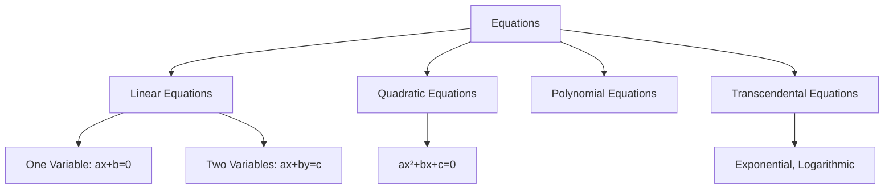

# Equations

## Beginner Level

### What is an Equation?

An **equation** is a mathematical statement asserting that two expressions are equal. The symbol $=$ indicates equality.

$$\text{Left Side} = \text{Right Side}$$

### Types of Equations

### Linear Equations in One Variable

A **linear equation in one variable** has the form:
$$ax + b = c$$

where $a \neq 0$.

**Solution method:** Isolate $x$ by performing the same operation on both sides.

**Example:** Solve $2x + 3 = 7$
$$2x + 3 = 7$$
$$2x = 4$$
$$x = 2$$

#### Checking Solutions

Always verify by substituting back: $2(2) + 3 = 4 + 3 = 7$ ✓

### Quadratic Equations

A **quadratic equation** has the form:
$$ax^2 + bx + c = 0$$

where $a \neq 0$.

#### Quadratic Formula

The solutions to $ax^2 + bx + c = 0$ are:
$$x = \frac{-b \pm \sqrt{b^2 - 4ac}}{2a}$$

The expression $\Delta = b^2 - 4ac$ is called the **discriminant**:
- If $\Delta > 0$: two distinct real solutions
- If $\Delta = 0$: one repeated real solution
- If $\Delta < 0$: no real solutions (two complex solutions)

**Example:** Solve $x^2 - 5x + 6 = 0$

$$x = \frac{5 \pm \sqrt{25 - 24}}{2} = \frac{5 \pm 1}{2}$$

Solutions: $x = 3$ or $x = 2$

#### Factoring Method

If $ax^2 + bx + c = (px + q)(rx + s)$, then solutions are $x = -\frac{q}{p}$ and $x = -\frac{s}{r}$.

**Example:** $x^2 - 5x + 6 = (x - 2)(x - 3) = 0$ gives $x = 2$ or $x = 3$

---

## Intermediate Level

### Systems of Linear Equations

A **system of linear equations** consists of multiple linear equations with multiple variables.

#### Two-Variable System

$$\begin{cases}
a_1x + b_1y = c_1 \\
a_2x + b_2y = c_2
\end{cases}$$

#### Substitution Method

Solve one equation for a variable, substitute into the other equation.

**Example:**
$$\begin{cases}
x + y = 5 \\
2x - y = 4
\end{cases}$$

From the first equation: $y = 5 - x$

Substitute: $2x - (5 - x) = 4 \Rightarrow 3x = 9 \Rightarrow x = 3$

Then: $y = 5 - 3 = 2$

#### Elimination Method

Multiply equations by constants to eliminate variables, then add/subtract.

**Example:** (Same system)
$$\begin{cases}
x + y = 5 \\
2x - y = 4
\end{cases}$$

Add the equations: $3x = 9 \Rightarrow x = 3$, then $y = 2$

### Matrix Solution

A system can be written in matrix form:
$$\begin{bmatrix} a_1 & b_1 \\ a_2 & b_2 \end{bmatrix} \begin{bmatrix} x \\ y \end{bmatrix} = \begin{bmatrix} c_1 \\ c_2 \end{bmatrix}$$

Or $AX = B$, with solution $X = A^{-1}B$ (if $A$ is invertible).

### Polynomial Equations

A **polynomial equation** of degree $n$ has the form:
$$a_nx^n + a_{n-1}x^{n-1} + ... + a_1x + a_0 = 0$$

#### Rational Root Theorem

If a polynomial with integer coefficients has a rational root $\frac{p}{q}$ (in lowest terms), then:
- $p$ divides the constant term $a_0$
- $q$ divides the leading coefficient $a_n$

### Exponential Equations

An **exponential equation** contains variables in the exponent:
$$a^x = b$$

**Solution method:** Take logarithms of both sides.

$$\log(a^x) = \log(b)$$
$$x \log(a) = \log(b)$$
$$x = \frac{\log(b)}{\log(a)}$$

**Example:** Solve $2^x = 8$
$$x = \log_2(8) = 3$$ (since $2^3 = 8$)

### Logarithmic Equations

A **logarithmic equation** contains logarithms:
$$\log_b(x) = c$$

**Solution method:** Convert to exponential form.
$$x = b^c$$

**Example:** Solve $\log_2(x) = 3$
$$x = 2^3 = 8$$

---

## Advanced Level

### Algebraic Equations and Field Extensions

An **algebraic equation** is a polynomial equation:
$$P(x) = 0$$

where $P(x) \in F[x]$ for a field $F$.

An **algebraic number** is a complex number that satisfies some polynomial equation with rational coefficients.

#### Galois Theory

**Galois theory** studies the relationship between polynomial equations and group theory.

For a polynomial $P(x)$ with roots $r_1, ..., r_n$, the **Galois group** is the group of permutations of roots that preserve algebraic relations.

**Key Result:** A polynomial of degree 5 or higher cannot generally be solved by radicals (Abel-Ruffini theorem).

### Diophantine Equations

A **Diophantine equation** is a polynomial equation where we seek integer (or rational) solutions:
$$P(x_1, x_2, ..., x_n) = 0$$

#### Linear Diophantine Equation

$$ax + by = c$$

has integer solutions if and only if $\gcd(a, b) \mid c$.

**Example:** $3x + 5y = 1$ has integer solutions (since $\gcd(3, 5) = 1 \mid 1$)

#### Fermat's Last Theorem

The equation:
$$x^n + y^n = z^n$$

has no positive integer solutions for $n \geq 3$.

Proved by Andrew Wiles in 1995, this was one of the most famous unsolved problems in mathematics.

### Transcendental Equations

**Transcendental equations** involve transcendental functions (exponential, logarithmic, trigonometric):
$$e^x + x = 5$$
$$\sin(x) = x/2$$

These typically cannot be solved in closed form and require numerical methods.

---

## Research Level

### Elliptic Curves

An **elliptic curve** is a smooth projective curve defined by:
$$y^2 = x^3 + ax + b$$

where $4a^3 + 27b^2 \neq 0$ (non-singular condition).

Elliptic curves form an **abelian group** under a geometric operation, making them fundamental in:
- Number theory
- Algebraic geometry
- Cryptography
- Fermat's Last Theorem proof

### Modular Forms and Taniyama-Shimura Conjecture

A **modular form** is a holomorphic function on the upper half-plane with specific transformation properties.

The **Taniyama-Shimura-Weil conjecture** (proved by Wiles) states that every elliptic curve over $\mathbb{Q}$ is modular. This equivalence was crucial for proving Fermat's Last Theorem.

### Transcendental Number Theory

A **transcendental number** is a complex number that is not algebraic.

**Examples:** $\pi$ and $e$ are transcendental (Hermite and Lindemann).

#### Lindemann-Weierstrass Theorem

If $\alpha_1, ..., \alpha_n$ are algebraic numbers that are linearly independent over $\mathbb{Q}$, then $e^{\alpha_1}, ..., e^{\alpha_n}$ are algebraically independent over $\mathbb{Q}$.

This implies:
- $e$ is transcendental
- $\pi$ is transcendental
- $e^\pi$ is transcendental

### Solving Functional Equations

A **functional equation** relates function values at different arguments:
$$f(x + y) = f(x) + f(y)$$

**Cauchy's Functional Equation** (above) has solutions $f(x) = cx$ if $f$ is continuous, but pathological solutions exist without regularity assumptions.

**D'Alembert's Functional Equation:**
$$f(x + y) + f(x - y) = 2f(x)f(y)$$

Solutions include $f(x) = \cos(cx)$ and $f(x) = \cosh(cx)$ under regularity conditions.
