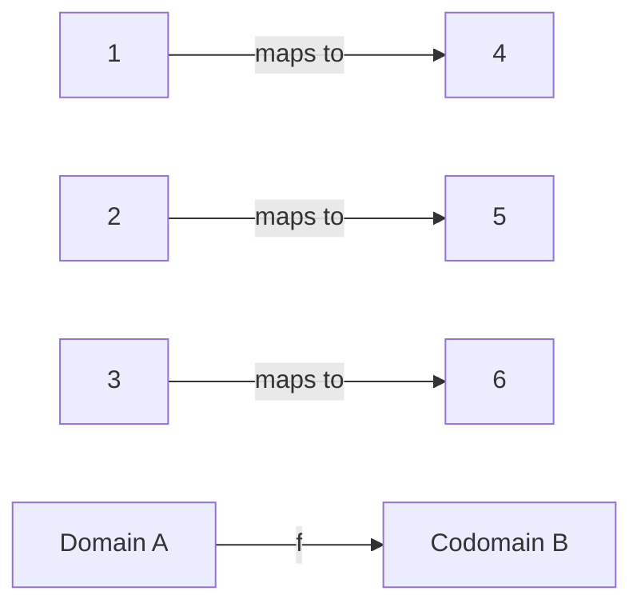

# Functions

## Beginner Level

### What is a Function?

A **function** is a relationship between inputs and outputs where each input has exactly one output.

**Notation:** $f: A \rightarrow B$ means $f$ is a function from set $A$ to set $B$.

For an input $x$, we write $f(x)$ for the output (the **image** of $x$).

- $A$ is the **domain** (all possible inputs)
- $B$ is the **codomain** (set containing all possible outputs)
- The **range** (or **image**) is the set of actual outputs: $\{f(x) \mid x \in A\}$

### Function Notation and Representation

**Algebraic Notation:**
$$f(x) = x^2 + 2x + 1$$

**Ordered Pairs:**
$$f = \{(1, 3), (2, 5), (3, 7)\}$$

**Mapping Diagram:**

### Common Functions

#### Linear Functions
$$f(x) = mx + b$$

- $m$ is the slope
- $b$ is the y-intercept
- Graph is a straight line

**Example:** $f(x) = 2x - 3$

#### Quadratic Functions
$$f(x) = ax^2 + bx + c \quad (a \neq 0)$$

- Graph is a parabola
- Vertex at $x = -\frac{b}{2a}$

**Example:** $f(x) = x^2 - 4x + 3$

#### Polynomial Functions
$$f(x) = a_nx^n + a_{n-1}x^{n-1} + ... + a_1x + a_0$$

where $n$ is the degree (highest power).

#### Rational Functions
$$f(x) = \frac{p(x)}{q(x)}$$

where $p$ and $q$ are polynomials and $q(x) \neq 0$.

### Function Properties

#### Even and Odd Functions

A function $f$ is **even** if:
$$f(-x) = f(x)$$
Even functions are symmetric about the y-axis.

**Example:** $f(x) = x^2$ is even.

A function $f$ is **odd** if:
$$f(-x) = -f(x)$$
Odd functions are symmetric about the origin.

**Example:** $f(x) = x^3$ is odd.

#### Monotonicity

A function $f$ is:
- **Increasing** if $x_1 < x_2 \Rightarrow f(x_1) < f(x_2)$
- **Decreasing** if $x_1 < x_2 \Rightarrow f(x_1) > f(x_2)$

---

## Intermediate Level

### Special Functions

#### Exponential Functions
$$f(x) = a^x \quad (a > 0, a \neq 1)$$

- Domain: all real numbers
- Range: $(0, \infty)$
- Always positive
- Passes through $(0, 1)$

**Example:** $f(x) = 2^x$

#### Logarithmic Functions
$$f(x) = \log_a(x) \quad (a > 0, a \neq 1)$$

- Domain: $(0, \infty)$
- Range: all real numbers
- Inverse of exponential functions

**Key Property:** If $y = a^x$, then $x = \log_a(y)$

#### Trigonometric Functions
$$\sin(x), \cos(x), \tan(x), \cot(x), \sec(x), \csc(x)$$

**Unit Circle Relationships:**
$$\sin^2(x) + \cos^2(x) = 1$$

#### Inverse Functions

If $f: A \rightarrow B$ is a bijection (one-to-one and onto), then $f^{-1}: B \rightarrow A$ is the **inverse function** satisfying:
$$f(f^{-1}(x)) = x \quad \text{and} \quad f^{-1}(f(x)) = x$$

**Example:** $f(x) = 2x + 3$ has inverse $f^{-1}(x) = \frac{x - 3}{2}$

### Function Composition

The **composition** of functions $f$ and $g$, denoted $(f \circ g)(x)$, is:
$$(f \circ g)(x) = f(g(x))$$

Read as "$f$ of $g$ of $x$" or "$g$ followed by $f$".

**Example:** If $f(x) = x^2$ and $g(x) = x + 1$, then:
$$(f \circ g)(x) = f(g(x)) = f(x + 1) = (x + 1)^2 = x^2 + 2x + 1$$

**Note:** Generally, $(f \circ g)(x) \neq (g \circ f)(x)$

### Transformations of Functions

Given $f(x)$, we can create new functions:

#### Vertical Shifts
$$f(x) + c$$ shifts graph up by $c$ units (or down if $c < 0$)

#### Horizontal Shifts
$$f(x - c)$$ shifts graph right by $c$ units (or left if $c < 0$)

#### Vertical Stretch/Compression
$$cf(x)$$ stretches (if $c > 1$) or compresses (if $0 < c < 1$) vertically

#### Reflection
$$-f(x)$$ reflects across the x-axis
$$f(-x)$$ reflects across the y-axis

### Piecewise Functions

A **piecewise function** is defined by different formulas on different intervals:
$$f(x) = \begin{cases}
x^2 & \text{if } x < 0 \\
2x & \text{if } 0 \leq x \leq 2 \\
-x + 6 & \text{if } x > 2
\end{cases}$$

---

## Advanced Level

### Functions in Real Analysis

#### Continuous Functions

A function $f: \mathbb{R} \rightarrow \mathbb{R}$ is **continuous** at $c$ if:
$$\lim_{x \to c} f(x) = f(c)$$

**Equivalent Definition:** For every $\epsilon > 0$, there exists $\delta > 0$ such that:
$$|x - c| < \delta \Rightarrow |f(x) - f(c)| < \epsilon$$

#### Differentiable Functions

A function is **differentiable** at $c$ if the derivative exists:
$$f'(c) = \lim_{h \to 0} \frac{f(c + h) - f(c)}{h}$$

**Rolle's Theorem:** If $f$ is continuous on $[a, b]$ and differentiable on $(a, b)$, and $f(a) = f(b)$, then $f'(c) = 0$ for some $c \in (a, b)$.

**Mean Value Theorem:** If $f$ is continuous on $[a, b]$ and differentiable on $(a, b)$, then:
$$f'(c) = \frac{f(b) - f(a)}{b - a}$$
for some $c \in (a, b)$.

#### Convex and Concave Functions

A function $f$ is **convex** if for all $x, y$ and $\lambda \in [0, 1]$:
$$f(\lambda x + (1-\lambda)y) \leq \lambda f(x) + (1-\lambda)f(y)$$

Geometrically, the graph lies below any secant line.

A function is **concave** if the inequality is reversed.

### Function Spaces

#### Banach Spaces

A **Banach space** is a complete normed vector space. Function spaces like $C[a, b]$ (continuous functions) and $L^p$ spaces are Banach spaces.

#### Hilbert Spaces

A **Hilbert space** is a complete inner product space. Functions in $L^2$ form a Hilbert space with inner product:
$$\langle f, g \rangle = \int_a^b f(x)g(x)dx$$

### Special Functions in Analysis

#### Dirichlet Function
$$D(x) = \begin{cases} 1 & \text{if } x \in \mathbb{Q} \\ 0 & \text{if } x \notin \mathbb{Q} \end{cases}$$

Discontinuous everywhere.

#### Weierstrass Function

A continuous function with derivative nowhere:
$$W(x) = \sum_{n=0}^{\infty} a^n \cos(b^n \pi x)$$

where $a \in (0, 1)$, $b$ is odd, and $ab > 1 + \frac{3\pi}{2}$.

---

## Research Level

### Distributions and Generalized Functions

**Distributions** (in the sense of Schwartz) extend functions, allowing "functions" like the Dirac delta:
$$\delta(x - a) = \begin{cases} \infty & \text{if } x = a \\ 0 & \text{if } x \neq a \end{cases}$$

with property:
$$\int_{-\infty}^{\infty} f(x)\delta(x - a)dx = f(a)$$

### Operator Theory

**Operators** are functions between function spaces. A **linear operator** $T: V \rightarrow W$ satisfies:
$$T(\alpha f + \beta g) = \alpha T(f) + \beta T(g)$$

#### Eigenvalue Problem

For an operator $T$:
$$T(f) = \lambda f$$

$\lambda$ is an **eigenvalue** and $f$ is an **eigenfunction**.

**Spectral Theorem:** For self-adjoint operators on Hilbert spaces, eigenfunctions form an orthonormal basis.

### Holomorphic Functions (Complex Analysis)

A function $f: \mathbb{C} \rightarrow \mathbb{C}$ is **holomorphic** (or **analytic**) if it is complex differentiable.

**Cauchy-Riemann Equations:** If $f(x + iy) = u(x, y) + iv(x, y)$, then $f$ is holomorphic if:
$$\frac{\partial u}{\partial x} = \frac{\partial v}{\partial y}, \quad \frac{\partial u}{\partial y} = -\frac{\partial v}{\partial x}$$

#### Laurent Series

Every holomorphic function in an annulus has a Laurent series expansion:
$$f(z) = \sum_{n=-\infty}^{\infty} a_n(z - z_0)^n$$

#### Residue Theorem

For a closed contour $C$ and holomorphic function except at isolated singularities:
$$\int_C f(z)dz = 2\pi i \sum \text{Residues inside } C$$

### Functional Calculus

For an operator $T$, functional calculus defines $f(T)$ for functions $f$:
- For bounded operators: spectral functional calculus
- For unbounded operators: extended functional calculus
- Applications to quantum mechanics and differential equations

**Example:** If $T$ is self-adjoint with spectrum $\sigma(T)$, we can define $e^{itT}$ as a unitary operator.
