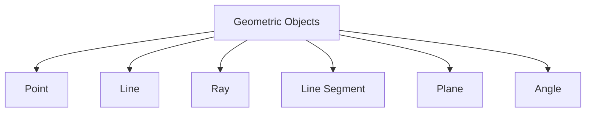

# Geometry

## Beginner Level

### What is Geometry?

**Geometry** is the study of shapes, sizes, positions, and properties of figures in space. The word comes from Greek: "geo" (earth) and "metria" (measurement).

### Basic Geometric Objects

- **Point**: A location with no size or dimension (denoted by capital letters)
- **Line**: A straight path extending infinitely in both directions
- **Ray**: A line segment that extends infinitely in one direction
- **Line Segment**: A portion of a line between two endpoints
- **Plane**: A flat surface extending infinitely in all directions
- **Angle**: The measure of rotation between two rays sharing a common endpoint

### Angles

#### Angle Measure

Angles are measured in **degrees** ($^\circ$) or **radians** (rad).

$$360^\circ = 2\pi \text{ rad}$$
$$1 \text{ radian} = \frac{180^\circ}{\pi}$$

#### Types of Angles

- **Acute Angle**: $0^\circ < \theta < 90^\circ$
- **Right Angle**: $\theta = 90^\circ$
- **Obtuse Angle**: $90^\circ < \theta < 180^\circ$
- **Straight Angle**: $\theta = 180^\circ$

#### Angle Relationships

- **Complementary Angles**: $\alpha + \beta = 90^\circ$
- **Supplementary Angles**: $\alpha + \beta = 180^\circ$
- **Vertical Angles**: Equal angles formed by intersecting lines

### Basic Shapes

#### Triangles

A **triangle** is a polygon with three sides and three angles.

**Triangle Inequality:** The sum of any two sides must be greater than the third side.

**Angle Sum:** $\alpha + \beta + \gamma = 180^\circ$

**Area:** $A = \frac{1}{2} \times \text{base} \times \text{height}$

#### Triangle Types

**By Sides:**
- **Equilateral**: All three sides equal
- **Isosceles**: Two sides equal
- **Scalene**: All sides different

**By Angles:**
- **Acute**: All angles less than $90^\circ$
- **Right**: One angle equals $90^\circ$
- **Obtuse**: One angle greater than $90^\circ$

#### Quadrilaterals

A **quadrilateral** is a polygon with four sides.

**Angle Sum:** $\alpha + \beta + \gamma + \delta = 360^\circ$

**Common Quadrilaterals:**
- **Square**: All sides equal, all angles $90^\circ$, Area = $s^2$
- **Rectangle**: Opposite sides equal, all angles $90^\circ$, Area = $l \times w$
- **Parallelogram**: Opposite sides parallel, Area = $\text{base} \times \text{height}$
- **Trapezoid**: One pair of parallel sides, Area = $\frac{1}{2}(b_1 + b_2) \times h$

#### Circles

A **circle** is the set of all points equidistant from a center point.

**Basic Formulas:**
- **Circumference**: $C = 2\pi r$ or $C = \pi d$
- **Area**: $A = \pi r^2$
- **Arc Length**: $s = r\theta$ (where $\theta$ in radians)
- **Sector Area**: $A = \frac{1}{2}r^2\theta$

where $r$ is radius and $d$ is diameter.

---

## Intermediate Level

### Coordinate Geometry

A **coordinate system** assigns numbers (coordinates) to points in space.

#### Cartesian Coordinates (2D)

A point $P$ is represented as $(x, y)$ where:
- $x$ is the horizontal coordinate
- $y$ is the vertical coordinate

**Distance Formula:** The distance between $P_1(x_1, y_1)$ and $P_2(x_2, y_2)$ is:
$$d = \sqrt{(x_2 - x_1)^2 + (y_2 - y_1)^2}$$

**Midpoint Formula:** The midpoint of segment from $P_1(x_1, y_1)$ to $P_2(x_2, y_2)$ is:
$$M = \left(\frac{x_1 + x_2}{2}, \frac{y_1 + y_2}{2}\right)$$

#### Polar Coordinates

A point is represented as $(r, \theta)$ where:
- $r$ is the distance from the origin
- $\theta$ is the angle from the positive x-axis

**Conversion:**
$$x = r\cos(\theta), \quad y = r\sin(\theta)$$
$$r = \sqrt{x^2 + y^2}, \quad \theta = \arctan\left(\frac{y}{x}\right)$$

### Conic Sections

**Conic sections** are curves formed by intersecting a plane with a cone.

#### Circle

Standard form: $(x - h)^2 + (y - k)^2 = r^2$

Center: $(h, k)$, Radius: $r$

#### Ellipse

Standard form: $\frac{(x - h)^2}{a^2} + \frac{(y - k)^2}{b^2} = 1$

- Center: $(h, k)$
- Semi-major axis: $a$
- Semi-minor axis: $b$ (assuming $a > b$)
- Foci: At distance $c = \sqrt{a^2 - b^2}$ from center

**Area:** $A = \pi ab$

#### Parabola

Standard form (vertex at origin, opening right): $y^2 = 4px$

- Vertex: $(0, 0)$
- Focus: $(p, 0)$
- Directrix: $x = -p$

#### Hyperbola

Standard form: $\frac{(x - h)^2}{a^2} - \frac{(y - k)^2}{b^2} = 1$

- Center: $(h, k)$
- Vertices: $(h \pm a, k)$
- Asymptotes: $y - k = \pm\frac{b}{a}(x - h)$

### Solid Geometry (3D)

#### 3D Coordinates

A point $P$ in 3D space is represented as $(x, y, z)$.

**Distance:** $d = \sqrt{(x_2 - x_1)^2 + (y_2 - y_1)^2 + (z_2 - z_1)^2}$

#### Common Solids

**Sphere:** All points at distance $r$ from center $(h, k, l)$
$$(x - h)^2 + (y - k)^2 + (z - l)^2 = r^2$$
Volume: $V = \frac{4}{3}\pi r^3$, Surface Area: $A = 4\pi r^2$

**Cylinder:** Two parallel circular bases
Volume: $V = \pi r^2 h$, Surface Area: $A = 2\pi r^2 + 2\pi rh$

**Cone:** Circular base tapering to apex
Volume: $V = \frac{1}{3}\pi r^2 h$, Surface Area: $A = \pi r^2 + \pi r\ell$ (where $\ell$ is slant height)

**Rectangular Prism:** Box with rectangular faces
Volume: $V = lwh$, Surface Area: $A = 2(lw + lh + wh)$

### Transformations

**Transformations** are ways of moving or changing shapes.

#### Rigid Transformations (Isometries)

Preserve distances and angles:

- **Translation**: Shift by vector $(a, b)$
- **Rotation**: Rotate by angle $\theta$ about a point
- **Reflection**: Mirror across a line

#### Non-rigid Transformations

Change size or shape:

- **Scaling**: Multiply coordinates by factor $k$
- **Shearing**: Slant transformation

---

## Advanced Level

### Differential Geometry

**Differential geometry** studies curves and surfaces using calculus.

#### Curves

A **parametric curve** is given by:
$$\mathbf{r}(t) = (x(t), y(t), z(t))$$

**Tangent Vector (Velocity):**
$$\mathbf{r}'(t) = \left(\frac{dx}{dt}, \frac{dy}{dt}, \frac{dz}{dt}\right)$$

**Curvature** measures how quickly a curve changes direction:
$$\kappa = \frac{|\mathbf{r}'(t) \times \mathbf{r}''(t)|}{|\mathbf{r}'(t)|^3}$$

#### Surfaces

A **parametric surface** is given by:
$$\mathbf{r}(u, v) = (x(u, v), y(u, v), z(u, v))$$

**Normal Vector:**
$$\mathbf{n} = \frac{\partial \mathbf{r}}{\partial u} \times \frac{\partial \mathbf{r}}{\partial v}$$

**Gaussian Curvature** measures intrinsic curvature of surface:
$$K = \frac{\det(\text{Second Fundamental Form})}{\det(\text{First Fundamental Form})}$$

#### Gauss-Bonnet Theorem

For a closed surface:
$$\int_S K \, dA = 2\pi \chi(S)$$

where $K$ is Gaussian curvature and $\chi(S)$ is the Euler characteristic.

### Riemannian Geometry

A **Riemannian manifold** is a smooth manifold with a metric tensor $g_{ij}$ defining distances.

#### Distance and Geodesics

The distance between infinitesimally close points is:
$$ds^2 = \sum_{i,j} g_{ij} dx^i dx^j$$

**Geodesics** are curves of shortest distance (generalizing straight lines).

#### Riemann Curvature Tensor

$$R^{\rho}_{\sigma\mu\nu} = \partial_\mu \Gamma^{\rho}_{\nu\sigma} - \partial_\nu \Gamma^{\rho}_{\mu\sigma} + \Gamma^{\rho}_{\mu\lambda}\Gamma^{\lambda}_{\nu\sigma} - \Gamma^{\rho}_{\nu\lambda}\Gamma^{\lambda}_{\mu\sigma}$$

measures curvature of the manifold.

### Algebraic Geometry

**Algebraic geometry** studies geometric objects defined by polynomial equations.

#### Algebraic Varieties

An **algebraic variety** $V$ is the zero set of polynomials:
$$V = \{(x_1, ..., x_n) \mid f_1(x_1, ..., x_n) = ... = f_k(x_1, ..., x_n) = 0\}$$

#### Bezout's Theorem

Two algebraic curves of degrees $d_1$ and $d_2$ in the projective plane intersect in exactly $d_1 \cdot d_2$ points (counting multiplicities and points at infinity).

### Non-Euclidean Geometry

#### Hyperbolic Geometry

**Hyperbolic geometry** violates Euclid's parallel postulate. In hyperbolic space:
- **Sum of angles in a triangle** is less than $180^\circ$
- **Parallel lines** diverge
- **Isoperimetric inequality**: $L^2 > 4\pi A$ (where $L$ is perimeter, $A$ is area)

The **Poincaré disk model** represents hyperbolic plane as interior of a unit disk.

#### Elliptic Geometry

**Elliptic geometry** (like a sphere's surface):
- **Sum of angles in a triangle** is greater than $180^\circ$
- **No parallel lines** exist
- Modeled on the sphere $S^2$

#### Curvature Characterization

- **Euclidean**: Gaussian curvature $K = 0$
- **Hyperbolic**: Gaussian curvature $K < 0$ (constant)
- **Elliptic**: Gaussian curvature $K > 0$ (constant)
