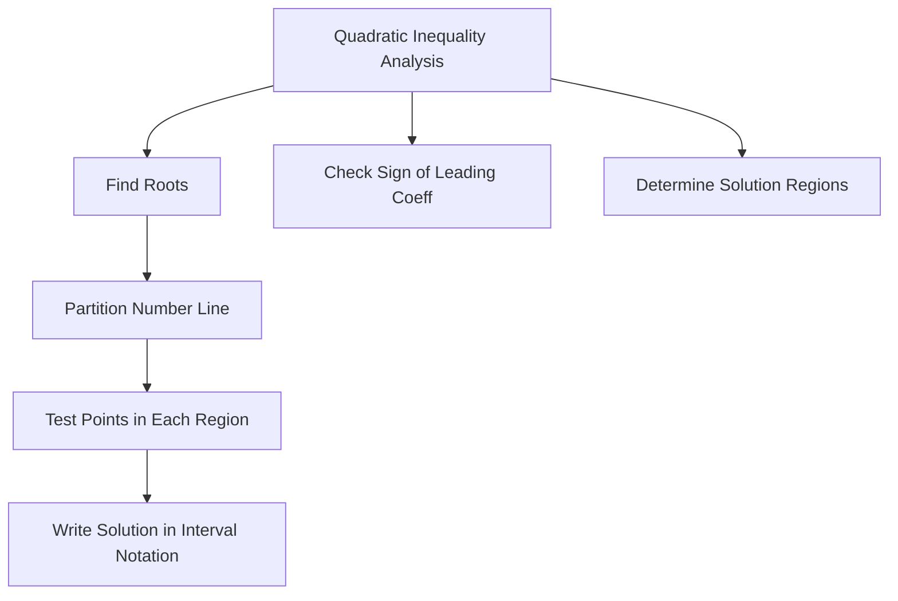

# Inequalities (Inequations)

## Beginner Level

### What is an Inequality?

An **inequality** is a mathematical statement comparing two expressions that may not be equal. Inequalities use relation symbols:
- $>$ (greater than)
- $<$ (less than)
- $\geq$ (greater than or equal to)
- $\leq$ (less than or equal to)

### Linear Inequalities

A **linear inequality in one variable** has the form:
$$ax + b > c \quad \text{or} \quad ax + b < c$$

(or with $\geq$, $\leq$)

#### Solving Linear Inequalities

The solution process is similar to equations, with one key difference:

**When multiplying or dividing by a negative number, flip the inequality sign.**

**Example 1:** Solve $2x + 3 > 7$
$$2x > 4$$
$$x > 2$$

**Example 2:** Solve $-3x + 5 < 11$
$$-3x < 6$$
$$x > -2$$ (inequality flipped!)

#### Solution Sets

The solution to an inequality is typically a range or interval:
- **Interval notation**: $(2, \infty)$ means $x > 2$
- **Set notation**: $\{x \mid x > 2\}$
- **Number line**: An open circle at 2, with arrow pointing right

### Compound Inequalities

A **compound inequality** combines two inequalities:
$$a < x < b$$

means $x > a$ AND $x < b$ (both must be true).

**Example:** $-3 < x \leq 5$ represents all $x$ where $x$ is greater than $-3$ and at most $5$.

### Absolute Value Inequalities

The **absolute value** $|x|$ represents the distance from 0 on the number line.

#### Case 1: $|x| < a$ (where $a > 0$)
$$|x| < a \iff -a < x < a$$

**Example:** $|x| < 3$ means $-3 < x < 3$

#### Case 2: $|x| > a$ (where $a > 0$)
$$|x| > a \iff x < -a \text{ or } x > a$$

**Example:** $|x| > 2$ means $x < -2$ or $x > 2$

#### Case 3: $|x - a| < b$
$$|x - a| < b \iff a - b < x < a + b$$

**Example:** $|x - 3| < 2$ means $1 < x < 5$

---

## Intermediate Level

### Quadratic Inequalities

A **quadratic inequality** has the form:
$$ax^2 + bx + c > 0 \quad \text{(or} < 0, \geq 0, \leq 0\text{)}$$

where $a \neq 0$.

#### Solution Method

1. Find roots of $ax^2 + bx + c = 0$ using the quadratic formula
2. Determine the sign of $a$ (opens up if $a > 0$, down if $a < 0$)
3. Determine where the parabola is above/below the $x$-axis

**Example:** Solve $x^2 - 5x + 6 > 0$

Roots: $x = 2, x = 3$ (from $(x-2)(x-3) = 0$)

Since $a = 1 > 0$ (opens up), the parabola is positive when $x < 2$ or $x > 3$.

**Solution:** $(-\infty, 2) \cup (3, \infty)$

### Rational Inequalities

A **rational inequality** has variables in denominators:
$$\frac{p(x)}{q(x)} > 0$$

#### Critical Points

Critical points occur where:
- Numerator $p(x) = 0$
- Denominator $q(x) = 0$ (undefined, vertical asymptote)

#### Sign Analysis

Test each interval between critical points to determine where the fraction is positive/negative.

**Example:** Solve $\frac{x + 2}{x - 1} > 0$

Critical points: $x = -2$ (numerator zero), $x = 1$ (denominator zero)

| Interval | Test Point | Value | Sign |
|----------|-----------|-------|------|
| $x < -2$ | $-3$ | $\frac{-1}{-4} = \frac{1}{4}$ | + |
| $-2 < x < 1$ | $0$ | $\frac{2}{-1} = -2$ | - |
| $x > 1$ | $2$ | $\frac{4}{1} = 4$ | + |

**Solution:** $(-\infty, -2) \cup (1, \infty)$

### Systems of Inequalities

A **system of inequalities** requires all inequalities to be satisfied simultaneously.

**Example:**
$$\begin{cases}
x + y \leq 5 \\
x - y \geq 1 \\
x \geq 0
\end{cases}$$

The solution is the region where all conditions are met (graphed as overlapping shaded regions).

### Important Inequalities

#### Arithmetic Mean - Geometric Mean (AM-GM)

For positive numbers $a_1, a_2, ..., a_n$:
$$\frac{a_1 + a_2 + ... + a_n}{n} \geq \sqrt[n]{a_1 \cdot a_2 \cdot ... \cdot a_n}$$

with equality if and only if $a_1 = a_2 = ... = a_n$.

#### Cauchy-Schwarz Inequality

For real numbers $a_1, ..., a_n$ and $b_1, ..., b_n$:
$$(a_1b_1 + a_2b_2 + ... + a_nb_n)^2 \leq (a_1^2 + a_2^2 + ... + a_n^2)(b_1^2 + b_2^2 + ... + b_n^2)$$

#### Triangle Inequality

For any real numbers or vectors $a$ and $b$:
$$|a + b| \leq |a| + |b|$$

---

## Advanced Level

### Real Analysis Inequalities

#### Hölder's Inequality

For $p, q > 1$ with $\frac{1}{p} + \frac{1}{q} = 1$:
$$\sum_{i=1}^{n} |a_i b_i| \leq \left(\sum_{i=1}^{n} |a_i|^p\right)^{1/p} \left(\sum_{i=1}^{n} |b_i|^q\right)^{1/q}$$

#### Minkowski's Inequality

$$\left(\sum_{i=1}^{n} |a_i + b_i|^p\right)^{1/p} \leq \left(\sum_{i=1}^{n} |a_i|^p\right)^{1/p} + \left(\sum_{i=1}^{n} |b_i|^p\right)^{1/p}$$

#### Weierstrass's Inequality

For concave functions $f$:
$$f\left(\sum_i w_i x_i\right) \geq \sum_i w_i f(x_i)$$

where $w_i \geq 0$ and $\sum_i w_i = 1$.

### Partial Order and Lattices

A **partial order** $\leq$ on a set $P$ is a relation that is:
1. **Reflexive**: $a \leq a$
2. **Antisymmetric**: If $a \leq b$ and $b \leq a$, then $a = b$
3. **Transitive**: If $a \leq b$ and $b \leq c$, then $a \leq c$

A **lattice** is a partially ordered set where every pair of elements has:
- A **least upper bound** (supremum/join)
- A **greatest lower bound** (infimum/meet)

### Operator Inequalities in Functional Analysis

For bounded linear operators $A$, $B$ on a Hilbert space:

$$\|A + B\| \leq \|A\| + \|B\|$$

#### Spectral Theorem Applications

For self-adjoint operators, inequalities relate:
- Eigenvalues
- Operator norm
- Spectral radius

---

## Research Level

### Variational Inequalities

A **variational inequality** problem seeks $u \in K$ such that:
$$\langle Au - f, v - u \rangle \geq 0 \quad \forall v \in K$$

where $K$ is a convex set, $A$ is an operator, and $f$ is a given element.

Variational inequalities model:
- Contact problems in mechanics
- Obstacle problems
- Optimal control
- Complementarity problems

### Integral Inequalities

#### Jensen's Inequality

For a convex function $\phi$:
$$\phi\left(\frac{1}{b-a}\int_a^b f(x)dx\right) \leq \frac{1}{b-a}\int_a^b \phi(f(x))dx$$

#### Grönwall's Inequality

If $u(t) \leq f(t) + \int_0^t c(s)u(s)ds$ for continuous functions, then:
$$u(t) \leq f(t)e^{\int_0^t c(s)ds}$$

### Differential Inequalities

Inequalities involving derivatives:
$$\frac{d}{dt}u(t) \leq f(u(t))$$

These determine bounds on solutions of differential equations and are fundamental in:
- Stability analysis
- Comparison theorems
- Regularity theory

### Matrix Inequalities

For Hermitian matrices $A$, $B$:

#### Löwner Partial Order

$A \leq B$ if $B - A$ is positive semidefinite.

#### Operator Convexity

A function $f$ is operator convex if:
$$f(\lambda A + (1-\lambda)B) \leq \lambda f(A) + (1-\lambda)f(B)$$

for self-adjoint operators $A$, $B$ and $\lambda \in [0,1]$.

**Example:** $f(A) = A^{-1}$ is operator concave.
