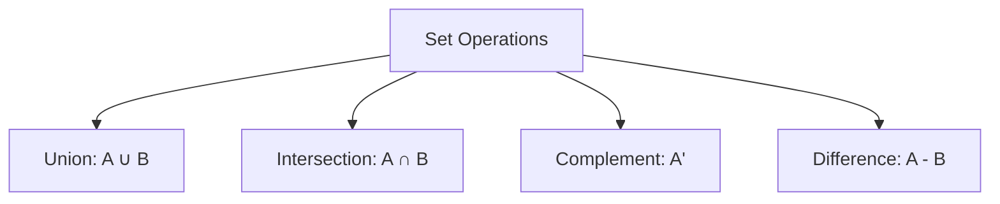

# Set Theory

## Beginner Level

### What is a Set?

A **set** is a collection of distinct objects, called **elements** or **members**. Sets are one of the most fundamental concepts in mathematics.

#### Basic Notation

- Sets are typically denoted by capital letters: $A$, $B$, $C$
- Elements are denoted by lowercase letters: $a$, $b$, $c$
- If $a$ is an element of set $A$, we write: $a \in A$
- If $a$ is not an element of set $A$, we write: $a \notin A$

#### Representation Methods

**Roster Method (Listing Method)**
$$A = \{1, 2, 3, 4, 5\}$$

**Set-builder Notation**
$$A = \{x \mid x \text{ is a positive integer less than 6}\}$$

#### Example Sets

$$\mathbb{N} = \{1, 2, 3, 4, ...\} \text{ (Natural numbers)}$$
$$\mathbb{Z} = \{..., -2, -1, 0, 1, 2, ...\} \text{ (Integers)}$$
$$\mathbb{Q} = \left\{\frac{p}{q} \mid p, q \in \mathbb{Z}, q \neq 0\right\} \text{ (Rational numbers)}$$
$$\mathbb{R} \text{ (Real numbers)}$$

### Basic Set Operations

#### Union
The **union** of sets $A$ and $B$ is the set of all elements that are in $A$ or $B$ or both:
$$A \cup B = \{x \mid x \in A \text{ or } x \in B\}$$

**Example:** If $A = \{1, 2, 3\}$ and $B = \{3, 4, 5\}$, then $A \cup B = \{1, 2, 3, 4, 5\}$

#### Intersection
The **intersection** of sets $A$ and $B$ is the set of all elements that are in both $A$ and $B$:
$$A \cap B = \{x \mid x \in A \text{ and } x \in B\}$$

**Example:** If $A = \{1, 2, 3\}$ and $B = \{3, 4, 5\}$, then $A \cap B = \{3\}$

#### Complement
The **complement** of set $A$ (denoted $A^c$ or $\overline{A}$) is the set of all elements not in $A$:
$$A^c = \{x \mid x \notin A\}$$

#### Difference
The **difference** $A - B$ (or $A \setminus B$) is the set of elements in $A$ that are not in $B$:
$$A - B = \{x \mid x \in A \text{ and } x \notin B\}$$

---

## Intermediate Level

### Set Properties and Laws

#### Cardinality
The **cardinality** of a set $A$, denoted $|A|$ or $\#A$, is the number of elements in the set.

**Example:** If $A = \{1, 2, 3\}$, then $|A| = 3$

#### Special Sets

- **Empty Set** (Null Set): $\emptyset$ or $\{\}$ - the set containing no elements, $|\emptyset| = 0$
- **Finite Set**: A set with a limited number of elements
- **Infinite Set**: A set with unlimited number of elements
- **Subset**: $A \subseteq B$ means every element of $A$ is also in $B$
- **Proper Subset**: $A \subset B$ means $A \subseteq B$ and $A \neq B$

#### De Morgan's Laws

$$(A \cup B)^c = A^c \cap B^c$$
$$(A \cap B)^c = A^c \cup B^c$$

#### Distributive Laws

$$A \cup (B \cap C) = (A \cup B) \cap (A \cup C)$$
$$A \cap (B \cup C) = (A \cap B) \cup (A \cap C)$$

### Power Set

The **power set** of $A$, denoted $\mathcal{P}(A)$, is the set of all subsets of $A$:
$$\mathcal{P}(A) = \{X \mid X \subseteq A\}$$

**Example:** If $A = \{1, 2\}$, then:
$$\mathcal{P}(A) = \{\emptyset, \{1\}, \{2\}, \{1, 2\}\}$$

If $|A| = n$, then $|\mathcal{P}(A)| = 2^n$

### Cartesian Product

The **Cartesian product** of sets $A$ and $B$, denoted $A \times B$, is:
$$A \times B = \{(a, b) \mid a \in A \text{ and } b \in B\}$$

**Example:** If $A = \{1, 2\}$ and $B = \{a, b, c\}$, then:
$$A \times B = \{(1, a), (1, b), (1, c), (2, a), (2, b), (2, c)\}$$

---

## Advanced Level

### Equivalence Relations

A relation $R$ on a set $A$ is an **equivalence relation** if it is:
1. **Reflexive**: $aRa$ for all $a \in A$
2. **Symmetric**: If $aRb$, then $bRa$
3. **Transitive**: If $aRb$ and $bRc$, then $aRc$

#### Equivalence Classes

If $R$ is an equivalence relation on $A$, the **equivalence class** of $a$, denoted $[a]$, is:
$$[a] = \{x \in A \mid xRa\}$$

### Partitions

A **partition** of a set $A$ is a collection of non-empty subsets $\{A_1, A_2, ..., A_n\}$ such that:
- $A_i \cap A_j = \emptyset$ for $i \neq j$ (disjoint)
- $A_1 \cup A_2 \cup ... \cup A_n = A$ (union covers $A$)

---

## Research Level

### Set Theory Axioms (ZFC)

The **Zermelo-Fraenkel with Choice (ZFC)** axioms form the foundation of modern set theory:

1. **Axiom of Extensionality**: Two sets are equal if they have the same elements
2. **Axiom of Empty Set**: There exists an empty set
3. **Axiom of Pairing**: For any sets $a$ and $b$, there exists a set $\{a, b\}$
4. **Axiom of Union**: For any set $A$, there exists $\bigcup A$
5. **Axiom of Power Set**: For any set $A$, there exists $\mathcal{P}(A)$
6. **Axiom of Infinity**: There exists an infinite set
7. **Axiom of Specification**: $\{x \in A \mid P(x)\}$ is a set for property $P$
8. **Axiom of Replacement**: Image of a set under a function is a set
9. **Axiom of Foundation**: Every non-empty set has an element disjoint from it
10. **Axiom of Choice**: For any collection of non-empty sets, a choice function exists

### Countability

A set is **countably infinite** if its elements can be put into one-to-one correspondence with $\mathbb{N}$.

A set is **uncountably infinite** if no such correspondence exists.

**Cantor's Diagonal Argument** proves $\mathbb{R}$ is uncountable: if $\mathbb{R}$ were countable, we could list all reals as $r_1, r_2, r_3, ...$, but constructing the diagonal number $0.d_1d_2d_3...$$ (where $d_i$ differs from the $i$-th digit of $r_i$) gives a real not in the list.

### Large Cardinal Axioms

**Inaccessible Cardinals** extend the notion of "large" cardinals in higher-order set theory and have profound implications for consistency of formal systems.
